The following examples demonstrate how a range of determinations should be entered into MELISR. Because the **Current** check box is automatically ticked when you add a new determination, it is easier to enter the determinations in chronological order.

## MEL 2088758

This sheet has one old label bearing a name and author combination that appears to be an error, plus one MEL annotation from the Foreign Fabaceae Project.

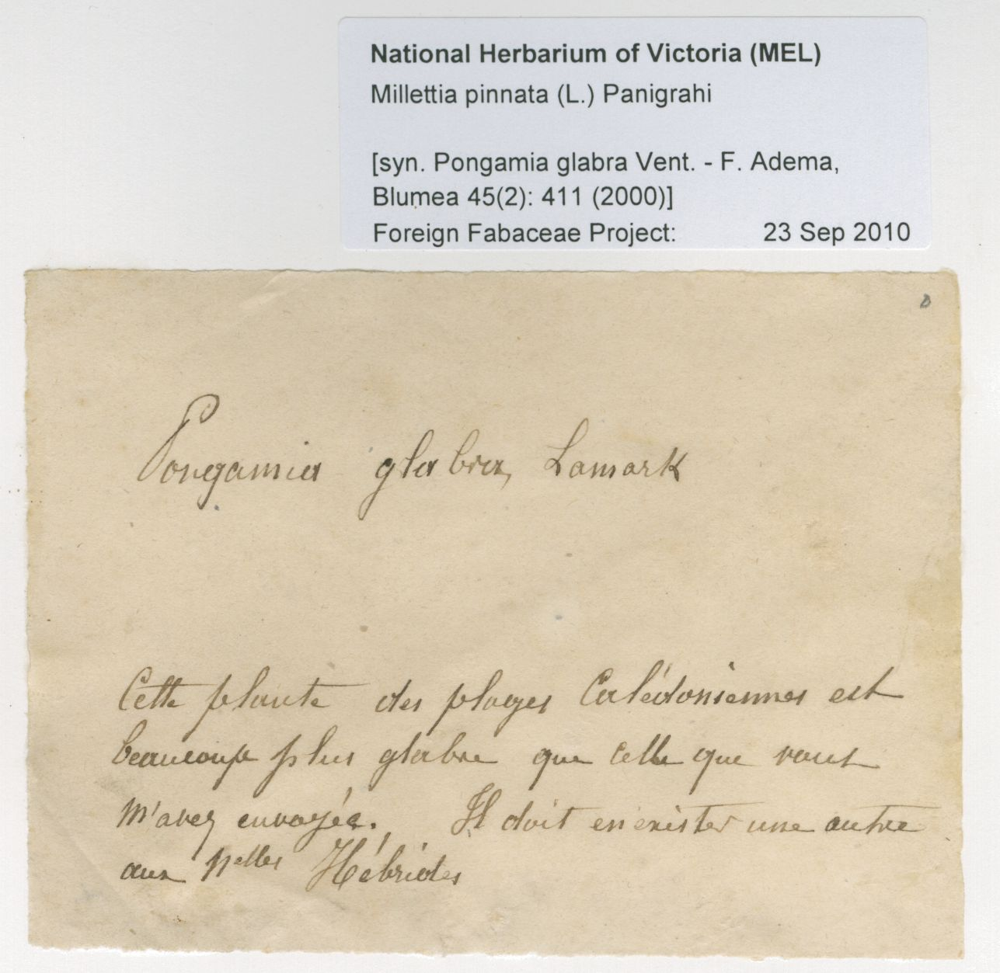

1.  The author of *Pongamia glabra* is Vent.; *Pongamia glabra* Lamarck is not listed in Tropicos, and it is not clear whether it is a homonym, an isonym or an error. Because we know that *Pongamia glabra* Vent. is a synonym of the name to which the specimen is currently determined, *Millettia pinnata*, it’s fairly safe to assume that ‘Lamark’ is just an error. *Pongamia glabra* Vent. can be entered as the **Taxon name**, and *Pongamia glabra* Lamark should be entered in **Det. notes** to record what is actually written on the label:

    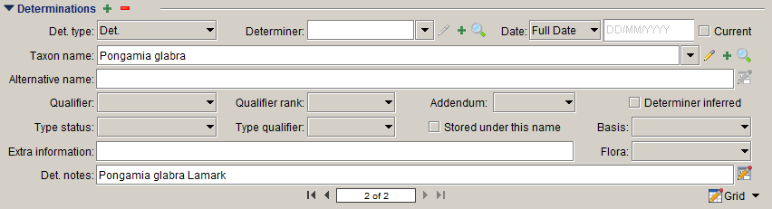

2.  Existing annotations for special projects, such as the Foreign Fabaceae Project, should be entered with ‘Annot.’ in the **Det. type** field and the project name as the determiner, but note that ‘Annot.’ and project names should not be used for new determinations – please always use Det. or Conf. for new determinations:

    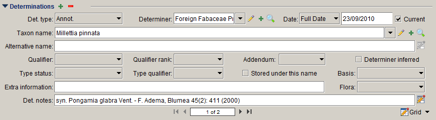

## MEL 2068911

This specimen has three labels that bear names: the original collecting label bearing a taxon name written in F.M. Bailey’s hand; an old MEL label with the same name in Mueller’s handwriting; and a more recent determination on a MEL det. slip that includes extra information about the taxon concept. Even though Bailey and Mueller have given the same name to the specimen, their determinations may be of historical interest and should both be recorded.

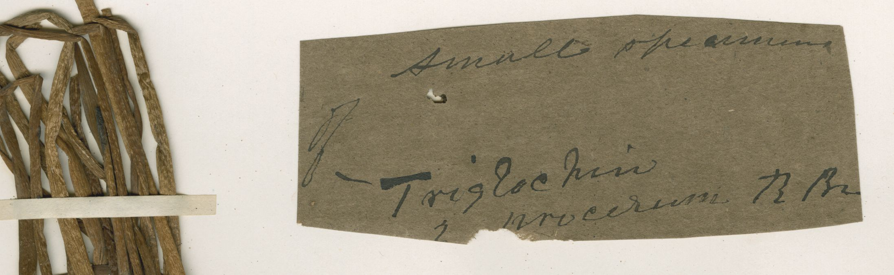

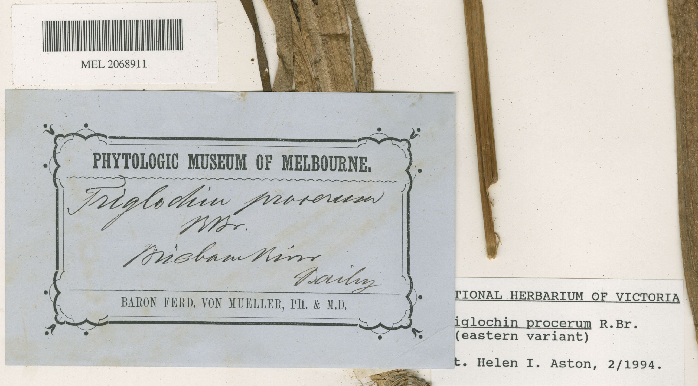

1.  Enter ‘Bailey, F.M.’ as the determiner, and tick the **Determiner inferred** box to indicate that the determiner was inferred from the label:

    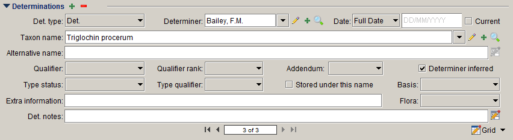

    Note that, if you didn’t recognise the handwriting on the original collecting label, and the taxon name is the same as one of the later determinations, there’s no need to enter it as a separate determination.

2.  Mueller’s determination can be entered in the same way as Bailey’s determination:

    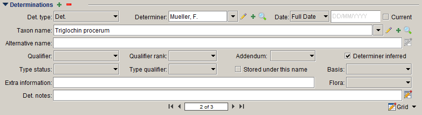

3.  For Helen Aston’s determination (which is partly obscured in the image above), ‘eastern variant’ should be entered in the **Extra information** field:

    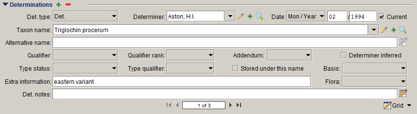

## MEL 2040511

This specimen has an older, typed label that appears to have been taken from a list of exsiccata specimens, plus a name change written directly on the moss packet.

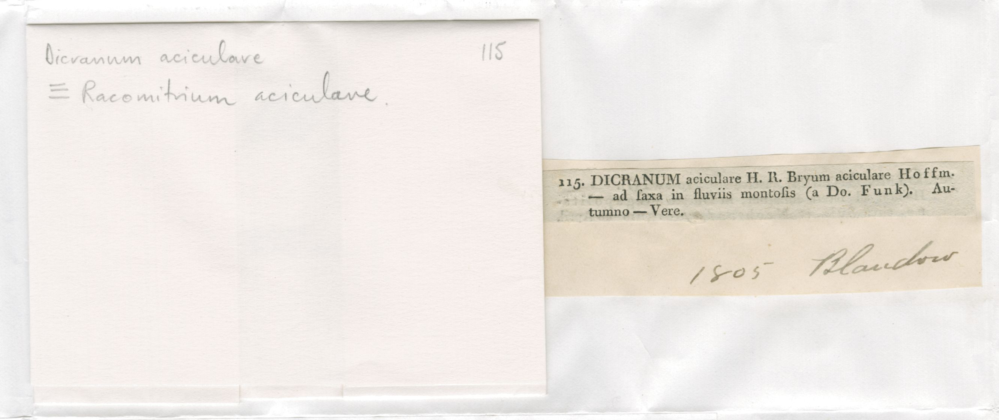

1.  ‘*Dicranum aciculare*’ on the typed label can be treated as the first determination. The author on the label (H. R.) differs from the author given in Tropicos (Hedw.), and a synonym is also given. *Dicranum aciculare* Hedw. should be selected from the **Taxon name** list, and both names and authors on the original label should be entered in **Det. notes**:

    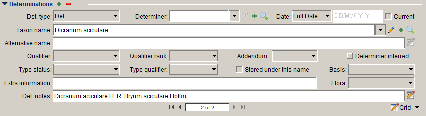

2.  The current determination has not been attributed to a person or a project, so only the **Taxon name** field (and the **Current** box) need to be filled in:

    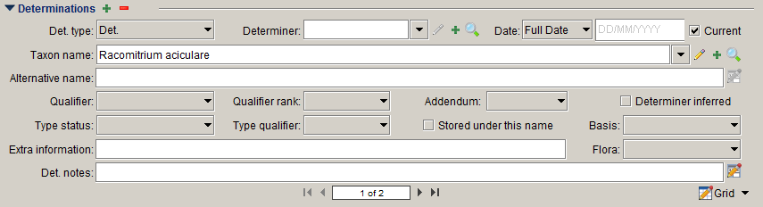

  **MEL 299373**

This specimen bears two names: *Crotolaria* *pterocaule*, which was not in the **Taxon** table, and a recent MEL annotation from the Foreign Fabaceae Project.

    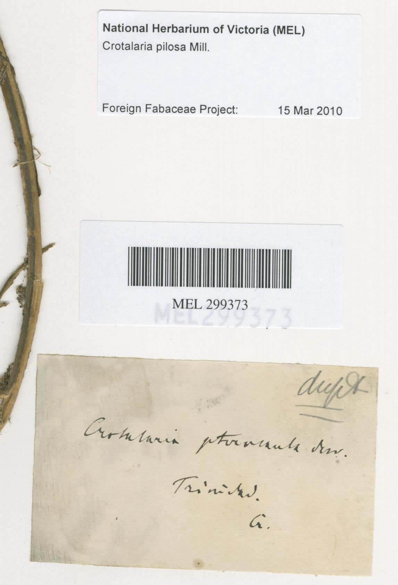

1.  *Crotolaraia pterocaule* is a validly published name, so it can be added to the **Taxon** table, and the determination can be entered without a **Determiner**.

    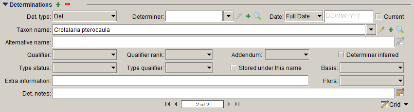
    
    If you are familiar with the handwriting, you could choose to enter the determiner’s name and tick the **Determiner inferred** box.

1.  The current annotation is straightforward:

    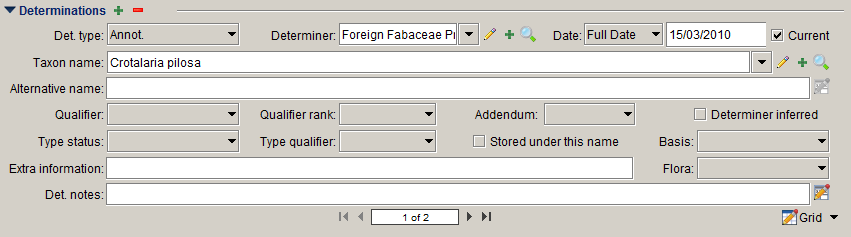

## MEL 590554

This specimen has three labels: an old MEL label with a taxon name in Mueller’s handwriting; an annotation slip with the same name as the blue MEL label, and an uncertain redetermination.

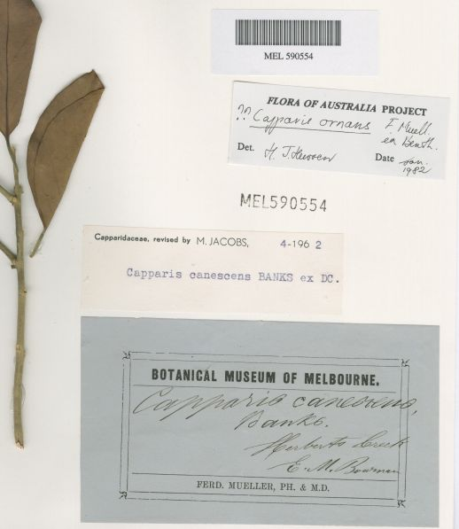

1.  Enter ‘Mueller, F.’ as the determiner, and tick the **Determiner inferred** box to indicate that the determiner was inferred from the label:

    

2.  ‘Capparidaceae, revised by M. Jacobs’ should be entered in the **Det. notes** field, as it provides useful information about the determiner’s knowledge of the family:

    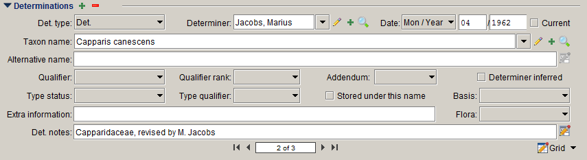

3.  Hewson’s determination has a qualifier before the taxon name. By default, the **Qualifier rank** will be set to the lowest rank to which the specimen has been determined. Because the qualifier on this det. slip appears before the genus, not the species epithet, you need to select ‘genus’ from the **Qualifier rank** pick list. ‘Flora of Australia’ should be selected from the **Flora** pick list:

    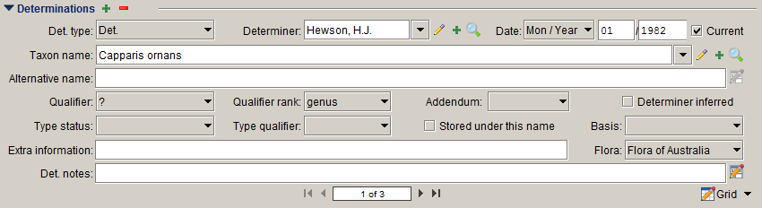

## MEL 2347722

This specimen has one label in the collector’s handwriting that bears two synonyms, and a recent MEL determination slip.

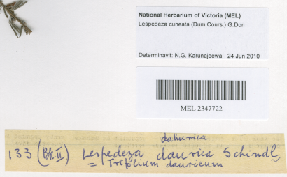

1.  If there is more than one name on a single label, and they are written in the same handwriting, they can be treated as a single determination. In this case, it is not clear whether the name being applied to the specimen is *Lespedeza daurica* or *Trifolium dauricum*. Unless there is reason to think otherwise, assume that the first (and in this case, more prominent) name is the name the specimen is being determined to. On this label, there are two spellings of the species epithet *davurica*, both of which are incorrect. The correct spelling should be selected from the **Taxon name** drop-down list. Enter all the names in the **Det. notes** field to record exactly what appears on the label:

    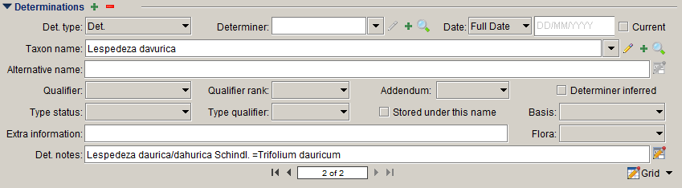

    If you were familiar with the collector’s handwriting, and knew that the label was written by O.W. Borrell, you could choose to enter him as the determiner and tick the **Determiner** i**nferred** box.

    1.  The current determination is straightforward:

        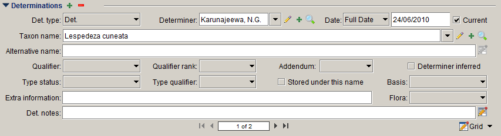

## MEL 248757

There are three taxon names on this sheet: one written directly on the sheet in Steetz’s hand; a small, typed label reading ‘*Psoralea plicata* Del. Aeg. Sup.’; and a more recent determination on a MEL det. slip.

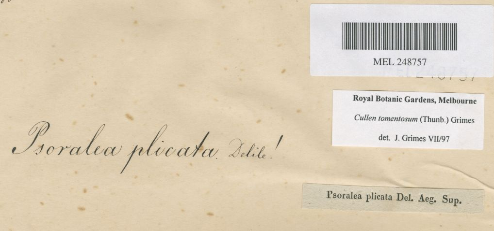

1.  A taxon name written on the sheet in Steetz’s hand can be treated as a determination. ‘Steetz, J.’ should be entered as the determiner, and the **Determiner inferred** box ticked:

    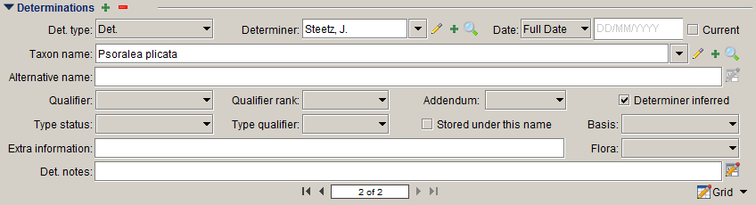

1.  The current determination is straightforward. Note that, if known, the determiner’s full initials should be entered in the **Determiner** field, even if only one initial is given on the det. slip:

    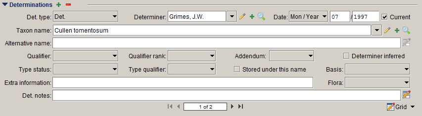

    The ‘*Psoralea plicata* Del. Aeg. Sup.’ label relates to one of Steetz’s collections and should not be treated as a determination. ‘Aeg. Sup.’ can be entered in the **Original collection** field:

    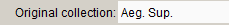

## MEL 2347754

This specimen has three labels with taxon names. Although the first taxon name on the bottom two labels is the same, they should be entered as separate determinations because they contain different nomenclatural information.

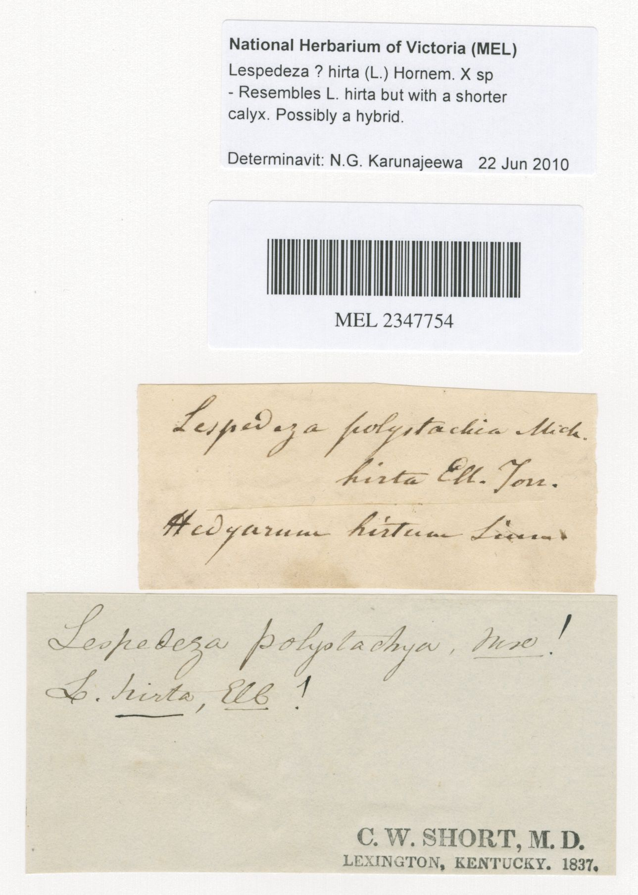

1.  Because we treat the first name on a label as the name the specimen was determined to (unless there is reason to interpret the label differently), this determination would have *Lespedesza polystachya* in the **Taxon name** field, and both names on the label entered in **Det. notes**:

    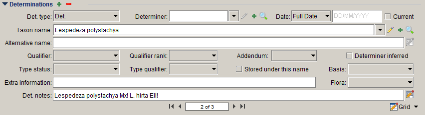

2.  The second label would be entered in the same way (i.e. with the correct spelling of *L. polystachya* in the **Taxon name** field, and the full list of names in **Det. notes**):

    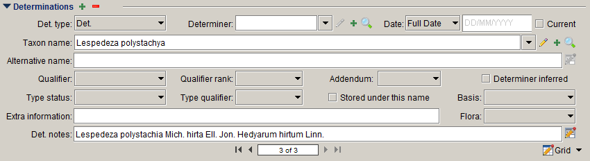

3.  The current determination would be entered as follows:

    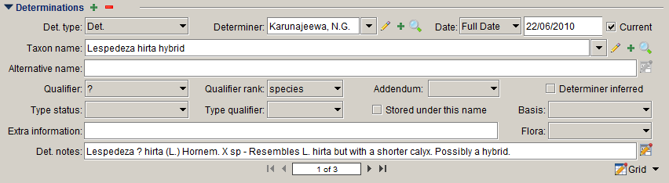

## MEL 2277834

This specimen has four separate determinations. The large, yellowish label at the bottom of the label looks like a herbarium label of sorts, so the names on that label wouldn’t be considered determinations. The oldest determination is on the label in Mueller’s hand, directly above which is a redetermination in someone else’s handwriting. To the right of the specimen is a redetermination by Bentham, and the most recent annotation is a MEL det. slip that indicates the type status of the specimen.

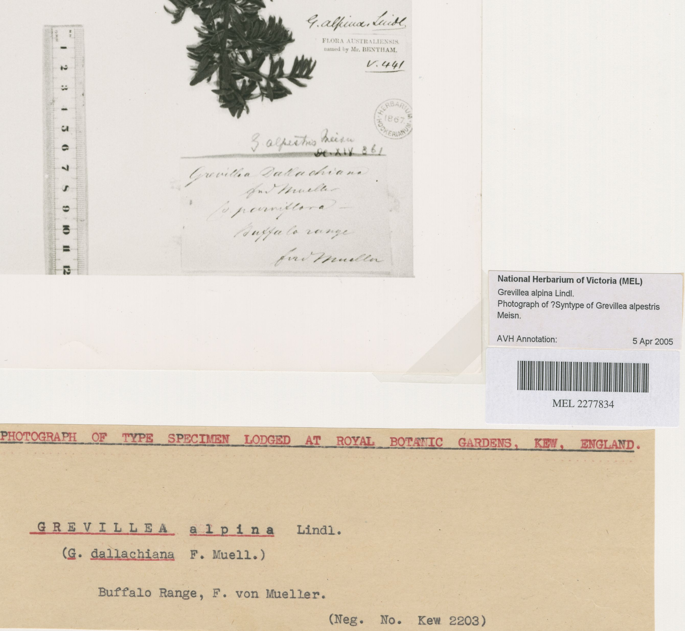

1.  Mueller’s determination should be entered with ‘Mueller, F.’ as the determiner, and the **Determiner inferred** box ticked. Mueller has written ‘*Grevillea dallachiana* Ferd. Mueller \[…\] *parviflora*’ on the label. No infraspecific taxa of *G. dallachiana* have been published, and Mueller listed *G. dallachiana* and *G. parviflora* as distinct taxa in an 1853 report. The best option in this situation is to enter *Grevillea dallachiana* in the **Taxon name** field and enter the names as they appear on the label in the **Det. notes** field:

    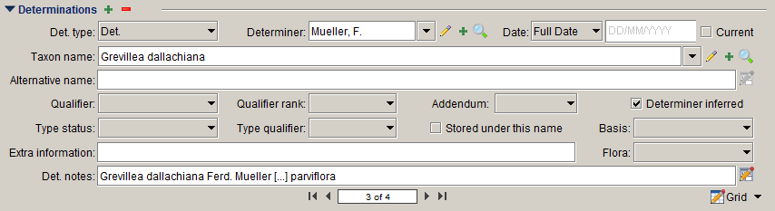

2.  ‘G. alpestris Meisn.’ is written directly above the first determination. This should be entered as a separate determination, with only the **Taxon name** field filled in:

    

3.  The determination bearing the name *G. alpina* indicates that Bentham provided the name, so he can be entered as the determiner. The note below the name should be entered in **Det. notes**:

    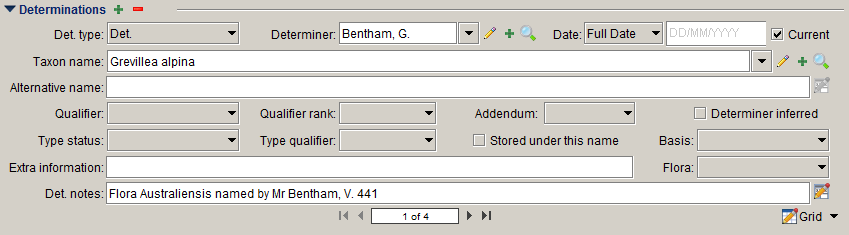

4.  The most recent det. slip is an AVH annotation that repeats the current name and provides the type status. There is no need to include the current name from the AVH annotation as a separate determination, as it doesn’t add any information; it is better to keep Bentham’s determination as the current one, because it is more informative. The type determination needs to be added with the **Det. type** as ‘Type status’ rather than ‘AVH annot.’, and the **Type status** and **Type qualifier** fields filled in. Where the specimen is stored under the typified name, tick the **Stored under this name** field (type specimens are stored under the most recently published name of which the specimen is a type). Make sure that the **Current** box is not ticked for ‘Type status’ determinations:

    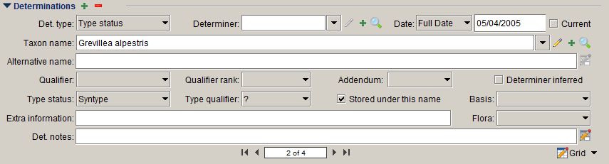

## MEL 524439

There are three labels with names on this specimen. The middle label is very difficult to read, so there’s no need to add it as a determination. The top label is written in A.C. Beauglehole’s hand, and bears the same taxon name as the det. slip at the bottom of the sheet. Whether or not these should be treated as separate determinations is quite subjective. If you consider Beauglehole to be the determiner of the name on the top handwritten label then they should be entered as separate determinations, otherwise a single determination record would suffice.

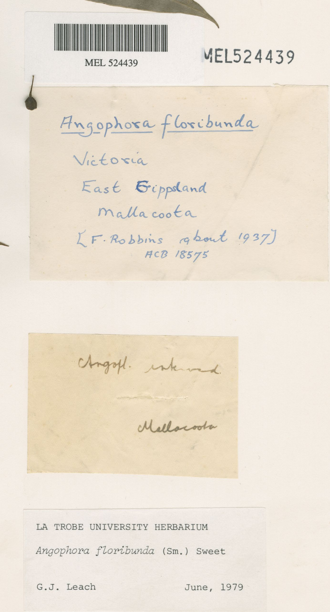

1.  If you are interpreting the taxon name written on the top label by Beauglehole as a determination, enter it with ‘Beauglehole, A.C.’ as the determiner and tick the **Determiner inferred** box:

    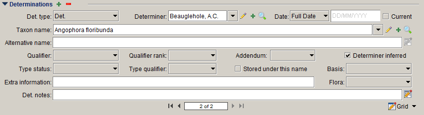

2.  The La Trobe University Herbarium det. slip is straightforward:

    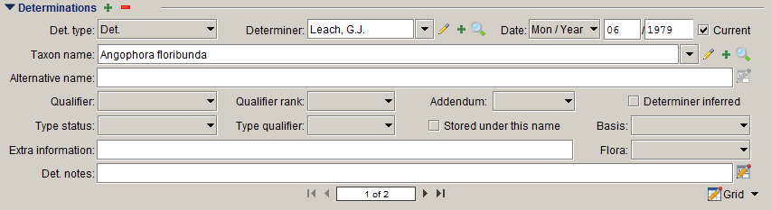