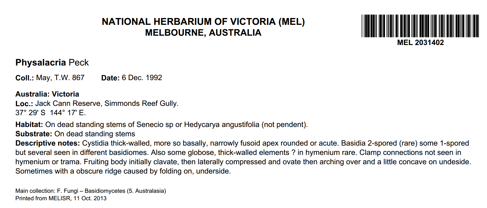

## Labels

The **Labels** page in the MELISR website is used to produce specimen and barcode labels.

The URL for the label printing website is http://melisr.rbg.vic.gov.au/labels.

### Printing labels

Specimen labels and barcode labels can be printed for a record set created from a query in Specify, or you can nominate a single MEL number or a sequence of MEL numbers that you want to print labels for. For Vic. Ref. Set specimens, you can print labels by choosing a record set or MEL numbers for the specimen/s in the main collection that have Vic. Ref. Set duplicates, or you can enter the Vic. Ref. Set catalogue number.

To print labels for a set of specimens:

1.  In Specify, create a record set for the set of specimens you want labels for

2.  In the label interface, select your record set from the drop-down list:

    

    The Specify user name of the person who created the record set appears in brackets next to the record set name.

3.  Select which type of labels you want to print:

    

4.  Select which position on the page you want to start printing at:

    

5.  Click the **Submit** button. A preview of your labels will appear in your browser.

6.  Press **Ctrl+P** to print your labels, or use the printing controls in your PDF viewer.

To print labels for a single record:

1.  In the label interface, enter a MEL number in the **MEL number (start)** field (or a Vic. Ref. Set number in the **Vic. Ref. Set number (start)** field)

2.  Select which type of labels you want to print

3.  Select which position on the page you want to start printing at

4.  Click the **Submit** button. A preview of your labels will appear in the browser window.

5.  Press **Ctrl+P** to print your labels, or use the printing controls in your PDF viewer.

To print a sequence of numbers:

1.  In the label interface, enter the first number in the sequence in the **MEL number (start)** field or the **Vic. Ref. Set number (start)** field

2.  Either enter the total number of MEL numbers or Vic. Ref. Set numbers in the sequence in the **Count** field, or enter the last number in the sequence in the **MEL number (end)** or **Vic. Ref. Set number (end)** field

3.  Select which type of labels you want to print

4.  Select which position on the page you want to start printing at

5.  Click the **Submit** button. A preview of your labels will appear in the browser window.

6.  Press **Ctrl+P** to print your labels, or use the printing controls in your PDF viewer.

### Type of label

#### Standard herbarium sheet label, 4 per page

Used for herbarium sheets.

#### Long label, 2 per page

Used for herbarium sheets where there is too much information to fit on a 4-per-page label.

#### Fungi and lichen packet label, 4 per page

Used for fungi and lichen packets. The difference between this label and the standard herbarium sheet label is that the ‘Storage’ section appears in a set position at the bottom of the label, instead of directly below the last piece of collecting information, ensuring that the labels are a standard length to fit on fungi and lichen packets.

#### Fungi and lichen packet label, 2 per page

Used for fungi and lichen packets where there is too much information to fit on a 4-per-page label.

#### Bryophyte label, 3 per page

Used for bryophyte packets.

#### Bryophyte label, 2 per page

Used for bryophyte packets where there is too much information to fit on a 3-per-page label.

#### Duplicate label, 4 per page

Used for duplicate specimens. The number of duplicate labels that will be printed Is determined by the **Quantity** field in the ‘Duplicate’ preparation.

#### Duplicate label, 2 per page

Used for duplicate specimens where there is too much information to fit on a 4-per-page label.

#### Duplicate label for seed collections, 4 per page

Used for duplicate seed collections, which need to be printed on adhesive paper.

#### Duplicate label for seed collections, 2 per page

Used for duplicate seed collections where there is too much information to fit on a 4-per-page label.

#### Spirit jar label

Used to label spirit jars.

Spirit jar labels should be printed on 30-per-page adhesive label sheets. You can select which position you want to start printing at by entering a number in the **Start printing at label** field in the web interface (the default position is 1).

#### Spirit collection card

Used for spirit collection cards (rather than printing a specimen label on paper and then gluing the label to a spirit card, you can print directly onto the card):

If the label contains more information than will fit on one side of the card, it will overflow to the other side of the card.

#### Spirit collection card (mail area printer)

As above, but formatted to print correctly on the mail area printer.

#### Carpological collection card

Used for carpological collection cards (rather than printing a specimen label on paper and then gluing the label to a carpological card, you can print directly onto the card):

#### Carpological collection card (mail area printer)

As above, but formatted to print correctly on the mail area printer.

#### Silica gel sample label

Used to label silica gel samples.

Silica gel sample labels should be printed on 30-per-page adhesive label sheets. You can select which position you want to start printing at by entering a number in the **Start printing at label** field in the web interface (the default position is 1).

#### Multisheet label

Used for multisheets where a full specimen label does not need to be printed.

Multisheet labels should be printed on 30-per-page adhesive label sheets. You can select which position you want to start printing at by entering a number in the **Start printing at label** field in the web interface (the default position is 1).

#### Type folder label

Used to label type folders.

Labels for Australian type specimens have an ‘A’ on the right-hand side of the label, and labels for foreign-collected type specimens have an ‘F’ on the right-hand side of the label. Twelve type folder labels will print on an A4 label page.

#### Barcode label 

Used to print barcode labels for a set of databased specimens or a sequence of unused MEL numbers:

Barcode labels should be printed on 30-per-page adhesive label sheets. You can select which position you want to start printing at by entering a number in the **Start printing at label** field in the web interface (the default position is 1).

#### Print labels for parts

By default, labels will only be printed for part ‘A’ of mixed collections. If you want to print separate labels for the different components of mixed collections, tick the ‘print labels for parts’ box:

### Annotation slips

#### Sticky labels, 30 per sheet

Annotation slips can be printed for the current determination for each record in a record set:

Annotation slips should be printed on 30-per-page adhesive label sheets. You can select which position you want to start printing at by entering a number in the **Start printing at label** field in the web interface (the default position is 1).

### Vic. Ref. Set

There are three input options for printing Vic. Ref. Set labels:

-   select a record set that includes collection object records in the *National Herbarium of Victoria* collection that have duplicates in the *Victorian Reference Set* collection

-   enter a single MEL number or a sequence of MEL numbers for records that have Vic. Ref. Set duplicates

-   enter a single VRS number or a sequence of VRS numbers.

#### Vic. Ref. Set label, 4 per page

Used for Vic. Ref. Set specimens:

#### Vic. Ref. Set label, 2 per page

Used for Vic. Ref. Set specimens where there is too much information to fit on a 4-per-page label:

#### Vic. Ref. Set barcode

Use to print barcodes for specimens in the Vic. Ref. Set:

Barcode labels should be printed on 30-per-page adhesive label sheets. You can select which position you want to start printing at by entering a number in the **Start printing at label** field in the web interface (the default position is 1).

## Numbers

The **Numbers** page in the MELISR website is used to generate sequences of MEL numbers to assign to undatabased specimens, as well as numbers for new loans and exchange records.

The URL for the **Numbers** website is http://melisr.rbg.vic.gov.au/numbers.

#### MEL numbers

To generate a batch of MEL numbers to assign to undatabased specimens:

1.  Enter the number of MEL numbers that you need in the box (the default is 100 numbers), and click the **MEL number** button. The assigned range of numbers will be displayed.

2.  Enter your name in the **Name** field (please enter both your first name and your last name), and click **Accept**

3.  Either print a list of the MEL numbers (in Excel format) by clicking **print list**, or use the **MELISR** **Labels** web page to print barcode labels for the MEL numbers.

To see a list of who has been assigned which MEL numbers, click on the **Overview of assigned MEL numbers** link. A table displaying the numbers assigned, who they have been assigned to, and the date they were assigned will be displayed:

You can click on the **usage** link at the end of a row to view which numbers from each batch of assigned numbers have been used in MELISR.

## Record set creator

The **Record set creator** page allows curation staff to create record sets by scanning specimen barcodes. You can also create a barcode string to use for querying the database, and check the taxon names of the records in the record set.

The URL for the **Record set creator** is http://melisr.rbg.vic.gov.au/recordset.

To create a record set:

1.  Select your Specify user name from the drop-down list

2.  Enter a name for your record set in the **Record set name** field

3.  Scan barcodes into the **MEL barcodes** text box. Note that each MEL number needs to be on a separate line. If your barcode scanner is not configured to append a carriage return after scanning, use the barcodes on page 162 to change the scanner settings.

4.  Click **Create record set**. When you next open Specify, your record set will be saved in the side bar.

To create a string of barcodes to use in the **Query builder**:

1.  Scan barcodes into the **MEL barcodes** text box. Note that each MEL number needs to be on a separate line. If your barcode scanner is not configured to append a carriage return after scanning, use the barcodes on page 162 to change the scanner settings.

2.  Click **Create barcode string**

3.  Copy and paste the barcode string into the **Barcode** field (in the **Collection object** table) in the **Query builder**. Remember to use the ‘In’ operator with your query.

To check the taxon names in your record set:

1.  Scan barcodes into the **MEL barcodes** box

2.  Click **Check taxon names**. A table displaying the MEL number and corresponding taxon name will appear on the page.

