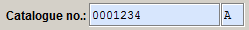
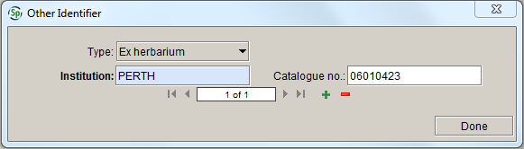
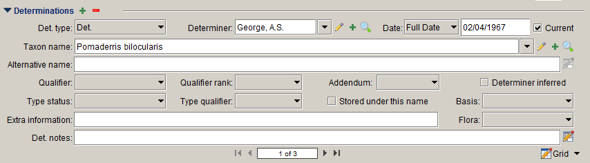
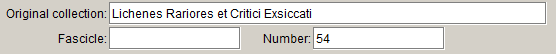
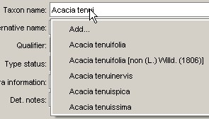
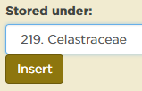
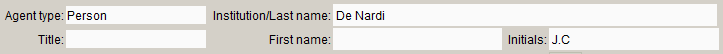
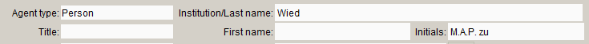
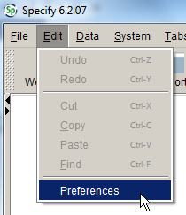
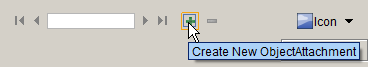

## General conventions

-   Information added or interpreted by data entry staff should be entered in brackets \[ \], unless it is entered in the **Curation** **notes** field or the **Georeferencing notes** field.

-   Include a full stop after information in the following text fields: **Locality**, **Habitat**, **Associated taxa**, **Descriptive notes**, **Collecting notes**, **Miscellaneous notes**, **Ethnobotanical info.**, **Toxicity** and **Curation notes**.

-   Include a space between measurements and the unit of measurement (e.g. ‘4 km’, ‘1500 ft’).

-   Where it is necessary to abbreviate words, use only standard abbreviations (see **Appendix** **1. Abbreviations**).

## Creating and editing records

### Opening a form

To open a blank data entry form:

1.  Click on the **Data** button in the task bar:

    

2.  Select the form that you want to use from the side bar:

    

    To open a new **Collection object** form after saving a record, click on the **Add** symbol at the top of the **Collection object** form:

    

### Adding records to subforms

To add a record to subform of a primary form (e.g. to add a **Determination** record to a **Collection object** record), click on the **Add** symbol in the relevant subform:

If you accidentally add an extra record to a subform, you can delete it by clicking the **Delete** symbol in the relevant subform:

Note that, before you can delete a record in a subform, or add a new record to a subform, the form must contain data in at least one field, and any required fields must be completed.

### Saving a record

To save a record, press **Ctrl+S**, or click the **Save** button at the lower right-hand corner of the form. The **Save** button will not be activated if there are errors in formatted fields or if any required fields have not been completed. Note that, although the record has been saved, it will remain in edit mode unless you click the **View** button, which makes the record read-only (the **View** button appears next to the **Save** button once a record has been saved).

### Editing a record

To edit a record, click the **Edit** button at the lower right-hand corner of the form to change it from view (read-only) mode to edit mode. See **Querying Specify** (p. 153) for instructions on how to query for records and open them in form view.

## Collection object form

A collection object refers to an individual item collected during a collecting event. At MEL, a collection object either comprises an entire sheet, packet etc. for non-mixed collections, or the individual component of the sheet, packet etc. for mixed collections. The **Collection object** form contains (or links to) all the collecting and curatorial information known about the herbarium specimen.

### Catalogue number

The **Catalogue number** is made up of the MEL number and part (see details below):

In order for the transactions to work in Specify, each record needs to have a **Catalogue** number in a standard format consisting of seven digits and one letter. Because not all MEL numbers contain seven digits, MEL numbers less than 1 000 000 need to be padded with leading zeroes. For example, the **Catalogue number** for MEL 1234 A would be 0001234A:

### MEL number

All specimens at the National Herbarium of Victoria should be assigned a unique identification number of up to seven digits. Older specimens often have a MEL number stamped on the sheet. If there is no MEL number assigned to the specimen, assign the next number from your batch of MEL numbers (see the **Numbers** section (p. 197) for details of how to get a new batch of MEL numbers).

MEL numbers are assigned to spirit collections as well as to dry material in sheets or packets. If you come across a spirit collection that has the same MEL number as its corresponding sheet or packet, allocate a new MEL number to the spirit collection (note that only one MEL number should be assigned to the spirit collection, regardless of how many spirit jars there are). Carpological collections, fungal cultures and photographs of specimens held at other institutions all receive a separate MEL number to any corresponding sheet, packet or spirit material.

Microscope slides only receive a unique MEL number if there is no corresponding dry material or spirit collection. Silica gel samples and photographic slides do not receive a MEL number, but are listed as additional preparations of the corresponding sheet, packet or spirit (see **Preparations**, p. 39).

{::options parse_block_html="true" /}

**Note**
Do not reassign MEL numbers from deaccessioned specimens or from specimens that originally had more than one MEL number stamped on the sheet, just in case the specimen (or data associated with it) has been referenced in a publication or in someone's research notes. The only time we should re-use MEL numbers is if the specimen is still in the process of being accessioned into the collection when we decide to discard it, and the number hasn’t been published online or elsewhere.

### Part

MEL accession numbers are appended by a letter, which is used to differentiate between different parts of mixed collections. The default for **Part** is ‘A’. The only instance where anything other than A is entered in this field is where there is more than one component on a herbarium sheet (or in a packet or spirit jar), such as more than one taxon on the sheet, or more than one set of collecting information (note that the host of a parasitic plant should not be entered as a separate record unless there is value in doing so, e.g. if it’s a rare taxon or a new record for an area). Thus, the MEL number always refers to the entire sheet, packet or spirit jar, and the part refers to the individual component.

Only one label is printed for a mixed collection. The MEL number, part and taxon name for parts B, C etc. will automatically be printed at the bottom of the label for part A. Where there is more than one set of collecting information on the sheet, the **Mixed collection notes** can be used to provide a brief indication of how parts B, C etc. differ from part A. If there is more than one taxon on the sheet, but the separate components share the one set of collecting information, there is no need to enter anything in the **Mixed collection notes** field.

When you have databased all components of a mixed collection, indicate in pencil on the specimen which component corresponds to part A, B, C etc. If it is unclear which parts of the specimen belong to which set of collecting information, only label the collecting information.

### Type

This is a read-only field. If the collection object is a type, the **Type** box will automatically be ticked.

### Imaged

This read-only field is used to indicate that a high-quality image of the specimen has been generated at MEL, in accordance with the standards of the GPI project. This field will be populated as soon as practicable after the specimen has been imaged.

### GPI

This read-only field is used to indicate that a high-resolution image of the specimen has been delivered to JSTOR and is available to be viewed on the [Global Plants](https://plants.jstor.org/) website.

### Multisheet

This is a read-only field. If the collection object is part of a multisheet relationship, the **Multisheet** box will automatically be ticked.

### Parts

This is a read-only field. If the collection object is part of a mixed collection, the total number of parts in the mixed collection will be displayed in the **Parts** field.

### Other identifier

The **Other identifier** table is used to record the institution from which incoming exchange specimens were received, and the accession or catalogue number applied to the specimen at the source institution, if known. This table is also used to record the catalogue numbers of duplicates held at other herbaria, where known, and the original herbarium and catalogue number in situations where we have received a duplicate from one herbarium, but they received the original specimen (and duplicate material) from another herbarium.

#### Type

The type of other identifier that is being recorded. The options are:

-   Ex herbarium – where the specimen is known to have been received as a duplicate or donation from another herbarium

-   Duplicate – where the specimen Is known (or has been inferred) to be a duplicate held at another herbarium based on collector, collecting number and collecting date.

-   Original herbarium – the original herbarium and catalogue number where we have received a duplicate from one herbarium, but they received the original specimen (and duplicate material) from another herbarium. If no catalogue number is provided – or if the herbarium is not registered on Index Herbariorum – the original herbarium should be recorded in the **Original collection** field in the **Collection object attribute** table.

#### Institution 

The Index Herbariorum code of the institution from which the specimen was received, for contemporary exchange and donations. If the institution’s accession number is provided, enter it in the **Catalogue no.** field in the **Other identifier** table. If the specimen has come from the private herbarium of an individual collector, or if it is an older specimen that has been purchased or donated rather than received via contemporary exchange, enter that information in the **Original collection** field in the **Collection object attributes** table. Please use the code that the issuing herbarium is using on the specimen. For example, for a specimen from CANB that has the barcode ‘CBG 025665’, enter ‘CBG’ in the **Institution** field and ‘025665’ in the **Catalogue no.** field (or scan the entire barcode in the **Institution** field – see below).

#### Catalogue no.

The catalogue or accession number that was assigned to a specimen (or its duplicate) at the herbarium from which it was received. For example, a duplicate of ‘BRI AQ 814849' would have ‘BRI’ entered in the **Institution** field, and ‘AQ 814849’ entered in the **Catalogue no.** field.

**Barcodes on exchange specimen labels**

You can populate the **Institution** and **Catalogue no.** fields by scanning the barcode on most exchange specimen labels into the **Institution** field:

When you save the **Collection object** record, the herbarium code will be saved in the **Institution** field and the accession or catalogue number will be saved in the **Catalogue no.** field:

Note that DNA barcodes do not include the herbarium code, so you need to scan the barcode directly into the **Catalogue no.** field and type the herbarium code into the **Institution** field. Also, the MEL barcode scanners don’t read the older NT barcodes, so these have to be entered by hand.

### Determinations

Specify supports multiple determinations, which allows the determination history of a specimen to be accurately recorded. The same set of fields is used for all determination types, and the **Det. type** field is used to indicate what type of determination is being recorded.

Records that have a Conf. should always have a Det., even if the original determiner is unknown. For specimens that have a single determination covering both the type status and the current name, the information should be entered as a ‘Det.’ as well as a ‘Type status’ determination.

Older specimens often have handwritten labels bearing more than one name. These should all be treated as determinations, regardless of whether or not the determiner or date of determination is known. If there is more than one name on a single label, and the names are written in the same handwriting, they can be treated as a single determination. Unless there is reason to think otherwise, treat the first or most prominent name on the label as the name the specimen was determined to, and enter all the names that appear on the label in the **Det. notes** field.

Where a specimen of a parasitic plant or fungus bears a separate identification for the host taxon, you can just record the determination in the **Miscellaneous notes** field, instead of creating a separate collection object record.

See **Appendix** **2. Examples of determination records** for specific examples.

#### Det. type

The type of determination. The following values can be selected from the pick list:

-   Acc. name change – Accepted name change

-   AVH annot. – AVH annotation

-   Annot. ­– annotation

-   Conf. – confirmavit

-   Det. – determinavit

-   Type status – type status determination.

If there is an annotation on the specimen that is only there for curation purposes, or is only there to correct the spelling of a taxon name on a previous det. slip, there is no need to enter the annotation in the database. See **Taxon name** (p. 32) for instructions on how to deal with misspelt taxon names in determinations.

#### Determiner

The name of the person who made the determination. Enter the determiner’s name from the **Agent** drop-down list. If the determiner is not in the list, press the **Add** symbol to open the **Agent** form.

Where there is more than one determiner, the agent names will be separated by a semicolon, e.g. ‘Stajsic, V.; Klazenga, N.’. If the combination of determiners is not listed in the drop-down list, it will need to be added to the **Agent** table as a ‘Group agent’.

If the determiner is given as an institution code, e.g. BRI, select the relevant organisation agent from the list (e.g. ‘BRI -- Queensland Herbarium’).

If the determiner’s name is difficult to read and has been interpreted, you can enter details about how it has been interpreted in square brackets in the **Det. notes** field. For example, if the determiner is given as ‘Paul Wilson’, but you have inferred that it is ‘Paul G. Wilson’, select ‘Wilson, Paul G.’ from the **Determiner** drop-down list, and record in Det. notes that ‘\[The determiner is given as ‘Paul Wilson’.\]’:

If you are certain of the identity of the determiner, there is no need to enter a message in the **Det. notes** field.

#### Date

The date of the determination. The determination date can be a full date, a month and year, or just a year. Select the appropriate date type from the **Date** pick list, and then enter the date using the number keys. Note that if you enter a full date, then change the date type to ‘Mon/Year’ or ‘Year’, the month and/or date will revert to ‘01’ if you then change the date type back to ‘Full date’.

#### Current

This field is used to indicate which of the determinations is current, for records that have more than one determination. Tick the **Current** box in the current determination. If there is no current determination, a warning will appear when you try to save the record:

The current determination should never be a ‘Type status’ determination; where a single determination covers both the type status and the current name, the information should be entered as a ‘Det.’ as well as a ‘Type status’ determination. If a specimen has a ‘Conf.’ that is more recent than a ‘Det.’ of the same name, the ‘Conf.’ is the current determination.

The **Current** check box is automatically ticked when you add a new determination. For this reason, it makes most sense to enter determinations in chronological order. If the determination you are adding is not the current determination, uncheck the **Current** box and use the navigation bar to scroll through the other determinations to find the current one:

#### Taxon name

The name of the taxon that the specimen has been determined to. This field links to the **Taxon** table. To look up a name, start typing the taxon name and then press the down-arrow or the **Tab** key to see a list of names that start with the letters you just typed in. It may take several seconds to populate the list if there are a lot of matching names. If the name is not in the list, it will need to be added to the **Taxon** table using the **Taxon** form.

If the name on the label is an orthographic variant of a name already in the **Taxon** table (or is just misspelt), select the correctly spelt name from the **Taxon name** drop-down list, and enter the name as it appears on the sheet in the **Det. notes** field.

If an incorrect author is given, but it’s not clear whether the name is a homonym, an isonym or an error, select the valid name from the **Taxon name** list and enter the name and author combination given on the label in the **Det. notes** field.

#### Alternative name

The **Alternative name** field is used to record unpublished or unofficial names that have previously been applied to the specimen. This field should never be used for current determinations.

Before entering a name in this field, check to see if the name (or a variation of the name) is in the **Taxon** table. If the name is in the **Taxon** table, it should be entered in the **Taxon name** field (even if it is an unofficial or unpublished name). If the name is not in the **Taxon** table, check to see if it is listed in IPNI or Tropicos. If it is listed in either IPNI or Tropicos, add the name to the **Taxon** table. If you cannot find the name in IPNI or Tropicos, or if the name on the sheet has a different author, enter it in this field exactly as it appears on the label.

#### Qualifier

The determination qualifier, for uncertain determinations. The following values can be selected from the pick list:

-   ?
-   aff.
-   cf.

In the past ‘sp. aff.’ has often been used in this field. ‘sp. aff.’ is not a determination qualifier, but indicates a different entity. If a specimen has been determined to ‘*Somegenus* sp. aff. *someepithet*’, then ‘sp. aff. *someepithet*’ needs to be added as a species to the **Taxon** table. 

#### Qualifier rank

The rank at which the determination qualifier applies. Select the appropriate rank from the pick list. By default, the **Qualifier rank** will be set to the lowest rank to which the specimen has been determined. This happens in the background after the record is saved, so you will not be able to see it immediately. You only need to fill in the **Qualifier rank** field if the qualifier is applied to a rank higher than the lowest rank to which the specimen has been determined. For example:

-   ‘?*Eucalyptus camaldulensis*’ – the **Qualifier rank** should be set to ‘genus’

-   ‘*Chamaecrista nomame* var. ?*nomame*’ – the **Qualifier rank** will automatically be set to the lowest rank, so you don’t need to enter anything in this field.

#### Addendum

A suffix added after the name to indicate a concept for that name. The following values can be selected from the pick list:

-   s.l. – *sensu lato*: in a broad sense
-   s.str. – *sensu stricto*: in a narrow sense
-   group
-   intergrade
-   intermediate
-   complex
-   vel aff.

#### Type status

The type status of the specimen, as recorded in the determination. The following type statuses are recognised at MEL:

-   Holotype – the one specimen or illustration used by the author or designated by the author as the nomenclatural type
-   Isotype – a duplicate specimen of the holotype
-   Syntype – any specimen cited in the protologue when there is no holotype, or any of two or more specimens simultaneously designated as types
-   Isosyntype – a duplicate of a syntype
-   Lectotype – a specimen or illustration designated from the original material as the nomenclatural type if no holotype was indicated at the time of publication, or if it is missing
-   Isolectotype – a duplicate specimen of the lectotype, if the lectotype has been chosen from among syntypes (if a lectotype has been chosen from among isotypes, the other isotypes just remain isotypes)
-   Neotype – a specimen or illustration selected to serve as the nomenclatural type if no original material is extant or as long as it is missing
-   Isoneotype – a duplicate specimen of the neotype (again only when the neotype was chosen from among syntypes; isotypes remain isotypes)
-   Paratype – a specimen cited in the protologue that is neither the holotype nor an isotype, nor one of the syntypes if two or more specimens were simultaneously designated as types (*Note:* paratypes need to be cited as paratypes in the protologue; not every specimen cited in a protologue that is not an isotype or a syntype is a paratype)
-   Residual syntype – used for the remaining syntypes when a lectotype has been selected from among syntypes (*Note:* in HISPID the term ‘Paralectotype’ is used for this and that is what goes into the database when ‘Residual syntype’ is selected from the pick list)
-   Paraneotype – used for the remaining syntypes when a neotype has been selected from among syntypes
-   Epitype – a specimen or illustration selected to serve as an interpretative type when the holotype, lectotype, or previously designated neotype, or all original material associated with a validly published name, cannot be identified for the purpose of precise application of the name of a taxon
-   Authentic specimen – the original specimen of an invalid name, i.e. any specimen cited in the protologue of an invalid name
-   Type – used when we know it is a type, but are uncertain of the type status.

#### Type qualifier

The uncertainty of the type status determination, if recorded by the determiner. The options for type status qualifier are ‘probable’, ‘possible’ and ‘?’. If the determiner has included an explanation of why the type status is uncertain, include this in the **Det. notes** field.

#### Stored under this name

For type specimens, this field is used to indicate that the specimen is stored under the basionym. It does not need to be checked for non-type specimens. **Note that, contrary to prior herbarium procedure, if the specimen is a type of more than one name, it should be stored under the most recent basionym (the date of publication can be checked in the** Taxon **table).**

**Stored under this name** must only be ticked in one determination record; if there is more than one type status determination for the name that the specimen is stored under, only tick **Stored under this name** in the most recent (or the most authoritative) determination.

#### Basis

If the determination of a specimen is not based on examination of the actual specimen, but on a duplicate or an image, the basis of determination should be recorded here. The following values are currently in the pick list:

-   Duplicate – we either have the catalogue number of the specimen at the original herbarium in MELISR, or the catalogue number is not available, but the collector, collecting number and collecting date match
-   Image.

If additional values need to be added to the pick list, see the Digital Collections Advisor.

#### Extra information

The **Extra information** field should be used to record recognised form and variant names, or any other information that tells you something about the taxon or group concept, but is not part of the taxon name. For example:

-   ‘alpine form’
-   ‘broad phyllode variant’
-   ‘var. indet.’.

Information entered in the **Extra information** field will be printed on the label directly below the taxon name. Any nomenclatural notes relating to the taxon name (e.g. ‘nom. nud’, ‘nom. inval.’) should be entered in the **Nom. note** field in the taxon name record.

#### Flora

If the det. slip indicates that the specimen was viewed for a flora project, select the flora from the pick list. Do not enter any flora notes from the det. slip (e.g. ‘Seen for Flora of Australia’ or ‘Flora of Australia Project’) in the **Det. notes** field. The **Flora** pick list currently lists ‘Algae of Australia’, ‘Flora of Australia’ and ‘Flora Malesiana’. Additional flora projects can be added if needed. Make sure you only use this field in the determination record that corresponds to the relevant det. slip.

#### Det. notes

**Det. notes** should be used to record additional notes that relate to the determination or the particular specimen, and not to a taxon or group concept. For example:

-   ‘glabrous variant with atypically short phyllodes’
-   ‘form with more or less petalous flowers’
-   ‘primocane’
-   ‘fruit needed for identification to species level’
-   'Determination taken from NSW 574242, Australia's Virtual Herbarium, 30/10/14'.

Lichen chemistry should be recorded in the **Det. notes** field if it is part of a determination. If it was provided by the collector, it should be recorded in **Collecting notes**. For example:

-   ‘TLC in C: salazinic (major), consalazinic, norstictic (faint trace), protocetraric (trace) and usnic acids’
-   ‘P-, K+, yellow, C-, KC-’.

### Taxon names – what goes where?

#### Name usage

Where an observation about the use of a name has been made by data entry staff, it should be recorded as an annotation in the **Determinations** table (i.e. a separate **Determination** record with the **Det. type** set as ‘Annot.’). Examples of observations about the use of a name include:

-   ‘Incorrectly reported from Australia, Checklist of Australian Lichens, Aug 2003’

-   ‘Listed under doubtful and excluded names, Checklist of Australian Lichens, August 2003’

-   ‘Listed under excluded names, Fl. Aust. 55: 162 (1994)’.

But, if an observation about the use of a name is written on a det. slip, then it should be recorded in the **Det. notes** field for that determination.

#### Source of name

An indication of where the name comes from should be entered in the **Det. notes** field. For example:

-   ‘species name taken from I.G. Stone’s red collecting book’.

#### Variants and forms

Short, informal variant or form names should be entered in the **Extra information** field. For example:

-   ‘Brisbane Range variant’
-   ‘Daylesford form’
-   ‘sessile-head variant’.

But, if the variant or form has been listed in VicFlora or APNI, it should be entered in the **Taxon** tree. For example:

-   ‘*Grevillea* aff. *oxyantha* (Mt Burrowa)’
-   ‘*Betula* aff. *pubescens* (Mt Macedon)’.

If the variant or form information is a short description, rather than a short, informal name, it should be entered in the **Det. notes** field. For example:

-   ‘variant with pubescent calyces’
-   ‘variant with short, ovate-obovate leaves’
-   ‘small, dark and short-headed form’.

If you are unsure whether something belongs in **Extra information** or **Det. notes**, enter the information in **Det. notes**.

#### Field names

Field names for fungi that have not been identified to species level should be entered in **Extra information**. For example:

-   *Elaphomyces* ‘yellow crusty’ – only enter ‘yellow crusty’ in the **Extra information** field.

The formal part of the identification (in this example, ‘*Elaphomyces*’) should be entered in the **Taxon name** field as per usual.

#### Informal names

Informal names for current determinations should be entered in the **Taxon** table. There is a CHAH-endorsed format for informal names, but any informal name that is used in a determination may be added to the **Taxon** table. There are many informal names already in the **Taxon** tree, VicFlora, FloraBase and APNI, so please check for variations of the same informal name in the **Taxon** tree and consult the nomenclatural sources before adding a new informal name to the **Taxon** table. If in doubt, enter the informal part of the name in the **Extra information** field.

#### Redeterminations of duplicates

If the determination of a specimen is based on the redetermination of a duplicate specimen held at another herbarium, enter the name of the person who redetermined the duplicate in the **Determiner** field, and select ‘Duplicate’ in the **Basis** field.

If the determination was taken from a duplicate, record an appropriate message in **Det. notes** to make it clear that the determiner hasn’t redetermined our specimen in person, e.g. ‘Determination taken from NSW 574242, Australia's Virtual Herbarium, 30/10/14’. Enter the herbarium code and catalogue number of the inferred duplicate in the **Other identifier** table, recording ‘Duplicate’ in the **Type** field.

#### Nomenclatural notes

Any nomenclatural notes that need to be printed with the taxon name, such as ‘non. R.Br.’, ‘nom. nud.’, ‘nom. inval.’ etc. should be entered in the **Nom. note** field in the taxon name record, not in the determination record.

  

 
#### Batch identify

The **Batch identify** tool in Specify can be used to add new determination records to multiple collection objects at the same time. The newly added determination becomes the current determination, and the previous determinations are retained in the database.

To add a new determination to a batch of records:

1.  Create a record set of the collection objects that you want to redetermine. Make sure that the record set only contains collection objects for which the new determination details are identical, as all the records in the set will get the same details added for the new det.

2.  Select **Batch identity** from the **Data** menu:

    

1.  Select **Record Sets** from the **Choose** window

2.  Select the appropriate record set from the list and click **OK**

    A window with all the determination fields and a summary of the collection objects in the record set will appear. Before redetermining your record set, scroll through the list of records to check for any collection objects that shouldn’t be there.

    

3.  Enter the details of the new determination and click **Identify**. All records will be redetermined, unless you select specific records from the list.

  
### Preparations

The **Preparations** form is a subform of the **Collection object** form. It is used to store information about what type of specimen the collection object relates to (sheet, packet, spirit etc.), where it is stored, and where duplicates are held.

#### Preparation type

The type of preparations belonging to the collection object. The following preparation types are used at MEL:

-   Sheet – a pressed and dried specimen mounted on archival paper and stored in a manila folder

-   Packet – a dried specimen stored in a packet. The majority of fungi, lichen and bryophyte specimens are packet preparations.

-   Spirit – material preserved in ethanol and stored in the Spirit Room

-   Carpological – dried fruiting material that is too bulky to be pressed and mounted as a sheet

-   Microscope slide – a glass slide prepared for microscopic examination of all or part of the specimen

-   Photographic slide – a photographic slide that accompanies the specimen. Photographic slides of entire specimens, with no accompanying herbarium material, should be treated as ‘Photograph of specimen’ preparations and entered in the *Photographs of specimens* collection.

-   Silica gel sample – plant material stored in silica gel to be used for molecular analysis

-   Fungal culture – a dried fungal culture. All fungal cultures are stored in packets within the fungi collection.

-   Display Set – a specimen that is stored in the Display Set on the first floor of the herbarium extension

-   Seed collection – a seed sample, which is stored in the basement and may be used for germination trials or revegetation work

-   Duplicate – duplicate material that is sent to another herbarium

-   Seed duplicate – a duplicate seed collection that is sent to another herbarium

-   Shipping material – a fragment of a specimen that is sent to another herbarium for analysis

-   Vic. Ref. Set – a duplicate specimen that is held in the Victorian Reference Set, and has been curated as part of the separate *Victorian Reference Set* collection

-   Vic. Ref. Set (old) – a duplicate specimen that is held in the Victorian Reference Set, but has not yet been curated in line with the new Vic. Ref. Set procedures

-   Photograph of specimen – a photograph of a specimen held at another institution. Within Specify, all ‘Photograph of specimen’ and ‘Cibachrome’ preparations are recorded in a separate *Photographs of specimens* collection, and not in the main *National Herbarium of Victoria* collection. If a printed photograph accompanies a pressed plant specimen (i.e. a habitat photo), this should be flagged in the **Photograph** field in the **Collection object attributes** table instead.

-   Cibachrome – an image of a specimen from a colour slide that has been reproduced on photographic paper. Within Specify, all ‘Cibachrome’ and ‘Photograph of specimen’ preparations are recorded in a separate *Photographs of specimens* collection, and not in the main *National Herbarium of Victoria* collection.

A single collection object cannot have more than one of the following preparation types: ‘Sheet’, ‘Packet’, ‘Spirit’, ‘Carpological’, ‘Cibachrome’, ‘Photograph of specimen’, ‘Fungal culture’ or ‘Display Set’. The only preparation types that can occur with other preparation types in the one collection object record are ‘Microscope slide’, ‘Photographic slide’, ‘Silica gel sample’, ‘Vic. Ref. Set’, ‘Vic. Ref. Set (old)’, ‘Seed collection’, ‘Duplicate’, ‘Seed duplicate’ and ‘Shipping material’.

#### Quantity

The number of objects of a particular **Preparation type**. The default quantity is ‘1’. The value of this field should only ever be greater than one for those preparation types that do not receive individual numbers for each object (i.e. microscope slides and spirit jars).

For ‘Duplicate’ and ‘Seed duplicate’ preparations, the number in the **Quantity** field should match the number of institutions listed in the **MEL duplicates at** field.

For ‘Vic. Ref. Set’ specimens, the **Quantity** should always be ‘1’.

#### Number

The number assigned to the spirit jar, microscope slide, silica gel sample or Vic. Ref. Set specimen, or the library reference number for a photographic slide.

We have previously used the same numbering scheme for spirit and slide material. From now on, we will use a separate series of numbers for each type of preparation. The next available storage number for a preparation type is automatically generated when you save the record.

If there are multiple photographic slides with a specimen and they have each been assigned a Library reference number, they should be entered as separate preparations with the relevant Library reference number entered in the **Number** field for each preparation record.

Note that only one number is assigned for each spirit collection, regardless of whether or not there is more than one spirit jar in the collection. Likewise, only one number is assigned to microscope slides that belong to the same collection. Where there is more than one spirit jar or microscope slide for the one collection, use the **Quantity** field to indicate how many items there are.

For Vic. Ref. Set specimens, a six-digit number will be assigned when the record is saved. This number will become the **Catalogue number** in the corresponding **Collection object** record in the *Victorian Reference Set* collection.

#### Jar size

The size of the spirit jar (A, B, C or D). A is the smallest jar size, B is the medium jar size and C is the largest jar size. D is used to indicate that the specimen is an algal collection, irrespective of the jar size.

#### On loan

The **On loan** check box will automatically be ticked if a preparation is on loan.

#### Loans

The **Loans** button is a link to the entry in the **Loan** table that relates to the preparation. If a preparation is currently on loan, clicking on the **Loans** button will open the details of the **Loan** in a new tab.

#### Multisheets

Information about multisheet relationships between different specimens. The multisheet message must include the part (A, B, C etc.) after the MEL number to indicate which parts of a mixed collection are involved in the multisheet relationship. All numbers should be spelt out in full, and there should not be a space between the number and the part. For example:

-   ‘Sheet 1 of 3 (MEL 12345A, MEL 12346A)’.

For non-sheet collections or non-packet collections, include the preparation type before the MEL number, followed by a colon. For example:

-   ‘Sheet 1 of 2 (MEL 2142735A, Carpological: MEL 269770A)’

-   ‘Sheet 1 of 3 (MEL 691579A, Spirit: MEL 2040692A)’.

#### MEL duplicates at

The Index Herbariorum codes of the herbaria that duplicates of a MEL specimen were sent to. Institution codes should be separated by a comma and a space, e.g. ‘AD, CANB, HO’; do not enter a full stop at the end of the string.

This field should only be completed for ‘Duplicate’ or ‘Seed duplicate’ preparations. Institutions that hold duplicates of specimens sent to MEL as exchange or donations should be listed in the **Other duplicates at** field in the record for the primary MEL preparation (i.e. ‘Sheet’, ‘Spirit’, ‘Carpological’, ‘Fungal culture’ or ‘Display Set’).

#### Other duplicates at

The Index Herbariorum codes of the herbaria (or the name of other institutions) that also hold duplicates of specimens sent to MEL as exchange or donations. The **Other dupl. at** field should never be filled in for ‘Duplicate’ or ‘Seed duplicate’ preparations. Herbaria that hold duplicates of specimens sent by MEL should be listed in the **MEL duplicates sent to** field for the ‘Duplicate’ preparation type.

#### Orig. herb. (Photographs of specimens collection)

The Index Herbariorum code of the institution where the actual specimen is held, where we have received a photograph or cibachrome of the specimen from a different herbarium. For example, if we receive an image of a type specimen from CANB, but the image is of a specimen held at K, ‘CANB’ would be entered in the **Ex herbarium** field, and ‘K’ would be entered here.

#### Databasing MEL duplicates

##### Duplicate preparations

In Specify, ‘gifts’ (outgoing exchange and donations) are linked to preparations. When a new gift transaction is created, preparations are added to the **Gift** record, creating a register of what duplicates have been sent where. To distinguish between preparations that are held at MEL and those that have been sent to other institutions, any specimen that has duplicates must have a ‘Duplicate’ preparation entry in the **Preparations** table, in addition to the preparation type(s) held at MEL (‘Sheet’, ‘Spirit’ etc.).

A single **Collection object** record should only ever have one ‘Duplicate’ preparation record in the **Preparations** table, regardless of the number of duplicate specimens that have been sent out. The **Quantity** field should be used to indicate the number of herbaria to which a duplicate has been sent. (There is no need to record that more than one ‘sheet’ has been sent to a single herbarium, as we have no guarantee that they will retain all the material.)

The **MEL duplicates at** field is used to list the herbaria that duplicate material has been sent to, and should only be populated for ‘Duplicate’ or ‘Seed duplicate’ (see below) preparation types. Institution codes should be separated by a comma and a space, and full stops should not be used. Do not enter anything in the **MEL duplicates at** field for preparations that are retained at MEL.

##### Duplicates of multisheet collections

Where a duplicate of a multisheet collection has been sent to one or more herbaria, a ‘Duplicate’ preparation should only be added to the **Collection object** record for one component of the multisheet. This will generally be Sheet 1, but in rare cases, it may be Sheet 2 (e.g. if duplicate spirit material is sent of a multisheet collection comprising dry material and a spirit collection).

##### Victorian Conservation Seedbank duplicates

Victorian Conservation Seedbank specimens generally have duplicate herbarium material as well as a duplicate seed collection, which need to be entered as separate ‘Duplicate’ and ‘Seed duplicate’ preparations. Because the duplicate seed sample and duplicate herbarium material are not always sent to the same institutions, the information in the **MEL duplicates at** field for the ‘Duplicate’ and ‘Seed duplicate’ will usually be different.

##### Printing duplicate labels

The number of duplicate labels that need to be printed will be calculated from the **Quantity** fields for preparation types that require duplicate labels.

##### Victorian Reference Set specimens

Specimens in the Vic. Ref. Set are databased in their own collection and also recorded as a ‘Vic. Ref. Set’ preparation in the corresponding MEL specimen record. Each Vic. Ref. Set specimen will be assigned a six-digit VRS catalogue number, which will be stored in the **Number** field when the record is saved. The Vic. Ref. Set specimens all need to have unique VRS catalogue numbers so, if there is more than one Vic. Ref. Set duplicate of a MEL specimen, the MEL record will need to have a separate ‘Vic. Ref. Set’ preparation for each Vic. Ref. Set sheet; the value of the **Quantity** field in a ‘Vic. Ref. Set’ preparation must always be ‘1’.

Once the ‘Vic. Ref. Set’ preparation has been saved in the *National Herbarium of Victoria* collection, a collection object record will be automatically created in the *Victorian Reference Set* collection, with the VRS number as the **Catalogue number**. The *Victorian Reference Set* record will include the most recent determination and all other data (except the preparation records and links to transactions) from the corresponding *National Herbarium of Victoria* record. The *Victorian Reference Set* record should be edited to include any annotations on the Vic. Ref. Set sheet, or to delete any annotations from the *National Herbarium of Victoria* record that don’t relate to the Vic. Ref. Set specimen.

Given that all Vic. Ref. Set specimens are duplicates of specimens in the main collection, they should always be databased via the *National Herbarium of Victoria* collection; records can be edited in, but should not be directly added to, the *Victorian Reference Set* collection.

Vic. Ref. Set specimens will be labelled with distinct labels, and ‘Vic. Ref. Set’ will still appear in the ‘Dupl:’ string on the corresponding MEL label.

##### Storage

The storage system at MEL is quite outdated, and doesn’t reflect current taxonomic knowledge. In Specify, taxon names have been decoupled from the storage system, which allows us to query MELISR by up-to-date higher level taxonomy.

The **Storage** field provides a link to the **Storage** tree, so that changes in taxonomic classification in the **Taxon** tree do not necessarily have to lead to changes in storage. When you add a new taxon record for ranks above species, you also need to define its storage location; see **Adding new genus and higher taxon names** (p. 87) for instructions.

The **Storage** field will be populated when the record is saved. The storage location will be automatically printed on labels, regardless of whether or not the script that populates the **Storage** field has run.

##### Hort. Ref. Set

This field is used to indicate that the specimen is in the Horticultural Reference Set. It is legacy data from MELISR, and probably won’t be used in future. When the rest of the Hort. Ref. Set is databased, it will probably be entered as a separate collection in Specify.

### Collecting event

The **Collecting event** table stores information about when and where the specimen was collected, and who it was collected by.

#### Collectors

All collectors associated with the collecting event should be entered here. Click on the **Add** symbol to open the **Collectors** subform.

If there is no collector’s name on the specimen, do not enter anything in the **Collectors** field. Instead, tick the **Colector unknown** check box in the **Collecting event attributes** form. If the label actually states that the collector is unknown, enter ‘Unknown’ (i.e. without brackets) in the **Verbatim collectors** field. If the collector(s) name is illegible, tick the **Collector illegible** check box in the **Collecting event attributes** form and, if the collector’s name is not on the label but has been inferred from their handwriting or the collecting information, tick the **Collector inferred** check box.

##### Agent

To look up a name, start typing the collector’s last name and then press the down-arrow or the **Tab** key to see a list of matching names. What you type in the field is only matched against the **Last name** field, so don’t type a comma or any initials when you are looking up a collector’s name. Scroll the list of matching names, then press **Enter** or click **OK** when you have found the right agent.

When adding multiple collectors, make sure that the primary collector is listed first (although the order of the collectors doesn’t really matter from a database point of view, entering them in a consistent way will help us detect potential errors in the database). If you need to change the order of collectors, click on the collector’s name that you want to move, then use the up and down arrows at the right-hand side of the **Collectors** grid:

If you have selected the wrong name, press **Esc** to clear the field, then search again.

If the collector’s name does not appear in the list, select ‘Add’ from the drop-down list, or click the **Add** symbol next to the field to add a new agent record.

##### Comments

The **Comments** field can either be used to record collecting numbers assigned by one of the additional collectors, or uncertainty about the interpretation of the collector’s name.

The collecting number for the primary collector(s) (see **Is primary** below) should be entered in the **Collecting no.** field. For example:

-   ‘A.C. Beauglehole 58278 & E.G. Errey 1978’ – ‘1978’ should be entered in **Comments** for E.G. Errey. **Comments** should be left blank for A.C. Beauglehole, and ‘58278’ should be entered in the **Collecting no.** field.

If you are unsure that the collector is the person you have selected from the drop-down list, enter a question mark in this field.

##### Is primary

Where there is more than one collector, the **Is primary** check box is used to indicate which of the collectors are the primary collectors. The **Is primary** check box is ticked by default, so it only needs to be un-ticked for collectors who are not considered to be primary collectors.

The primary collector is the collector whose name appears before the collecting number or ‘s.n.’ (if ‘s.n.’ is recorded in the collecting information). If more than one collector’s name appears before the collecting number (or ‘s.n.’), they can all be considered as primary collectors. If there is more than one collector, but no collecting number or ‘s.n.’, all collectors should all be considered as primary collectors. For example:

-   ‘N.G. Walsh 4901 & F. Anderson’ – N.G. Walsh is the primary collector

-   ‘L.A. Craven & C.R. Dunlop 6663’ – both collectors are primary collectors

-   ‘J.G. & M.H. Simmons s.n. & K.C. Rogers’ – J.G. Simmons and M.H. Simmons are the primary collectors

-   ‘D. Rouse \[JAJ 1301\] & M. Duncan’ – D. Rouse is the primary collector.

Note that these examples are only a guide; feel free to apply your own knowledge of the collectors when assessing which are the primary collectors and which are the additional collectors. For example, Nigel Sinnott labels are sometimes formatted with two collectors listed before the collecting number (e.g. ‘A.E.M. & N.H. Sinnott 2989’), even though the collecting number is from his sequence and he should be considered the only primary collector.

#### Collecting no.

The collecting number of the primary collector(s). If there is no collecting number, type ‘s.n.’ (*sine numero*) in the **Collecting no.** field. The **Collection object** form cannot be saved if this field is left blank.

If the collecting number is prefixed with the collector’s initials, there is no need to enter their initials in the **Collecting no.** field.

If someone other than the listed collectors has assigned a collecting number to an unnumbered collection, enter the number in square brackets in the **Collecting no.** field, preceded by the initials of the person assigning the number. A note explaining who assigned the number should also be entered in **Miscellaneous notes**. For example:

-   ‘D. Rouse \[JAJ 1301\] & M. Duncan’ – ‘\[JAJ 1301\]’ would be entered in the **Collecting no.** field and ‘\[Collecting number assigned by J.A. Jeanes\]’ should be entered in **Miscellaneous notes**.

If someone other than the listed collectors has assigned a collecting number to a specimen that already has a number, enter the primary collector’s number in **Collecting no.**, and record the additional number in **Miscellaneous notes**. For example:

-   ‘F. Robbins 106 (ACB 17097)’ – ‘106’ would be entered in the **Collecting no.** field, and ‘\[A.C. Beauglehole assigned collecting number 17097 to this specimen.\]’ would be entered in **Miscellaneous notes**.

#### Start date

The collecting date, or the earliest date if the collecting date is given as a range. The collecting date can be entered as a full date (day, month and year), a month and year, or a year only. Select the date type from the date drop-down list, then enter the date using the number keys.

If the collecting date is unknown but the collector is known, check that there are biographical notes indicating the collector’s lifespan or period of activity in the **Agent** table.

#### End date

The end date of collection, if the collecting date is given as a range. The collecting date can be entered as a full date (day, month and year), a month and year, or a year only. Select the date type from the date drop-down list, then enter the date using the number keys.

##### Flowering and fruiting dates

###### Specimens with a flowering date OR a fruiting date 

If the collecting notes mention a flowering (or fruiting) date, and the specimen is in flower (or fruit), it is safe to assume that the date corresponds to the date of collection. If the specimen is not in flower (or fruit), enter the flowering (or fruiting) date in the **Collecting notes** field.

###### Specimens with a flowering date AND a fruiting date

If the specimen is in flower, but not in fruit, enter the flowering date as the date of collection, and the fruiting date in **Collecting notes** (or vice versa). You can also add a note in the **Miscellaneous notes** field to explain that a fruiting date is given, but the specimen only bears flowers.

If the sheet contains separate plant specimens, one of which is bearing flowers and one of which is bearing fruit, assume that the flowering and fruiting dates represent the collecting dates of the separate plant specimens, and treat them as a mixed collection.

If the specimen has both flowers and fruits, but it doesn’t appear to be a mixed collection, enter the flowering and fruiting dates in **Collecting notes**.

###### Flowering and fruiting dates without years

If the flowering and/or fruiting dates have been interpreted as collecting dates but do not include the year, enter them in the **Verbatim collecting date** field.

#### Collecting trip

The collecting trip or expedition on which the specimen was collected, e.g. ‘Victorian Exploring Expedition’, ‘Mueller Commemorative Expedition’. Select the relevant collecting trip from the drop-down list. To see a list of all the collecting trips in the **Collecting trip** table, enter a wildcard (\*) in the query combo box and press the down-arrow:

If the collecting trip is not there, add it in the **Collecting trip** form.

#### Geography

This is a read-only field that displays the **Geography** full name string, if it has been entered in the **Locality** form. The geography details will not display in this field until the record has been saved.

#### Locality

The locality description, as provided by the collector. Click on the **Add** icon to open the **Locality** form.

You will see that the locality field has a drop-down list that allows you to select a locality that has already been entered, but this must be used with great caution. Only use an existing locality record if ALL of the details in the **Locality** form (and the associated **Locality details** and **Geocoordinate details**) are EXACTLY the same. If a **Locality** record is shared between two or more **Collection object** records then subsequently edited, the locality will be edited in *all* the **Collection object** records that share that locality, not just in the **Collection object** record that is open when the **Locality** record is edited. If the locality is similar to a previous record, use the **Clone** feature outlined below.

If there are no locality details provided, DO NOT select ‘No details given’ from the drop-down list, as many of the records with ‘No details given’ in the **Locality** field have data in other fields in the **Locality** and **Geography** tables that will not correspond to the specimen you are databasing.

If you use **Carry forward** for the **Collecting event** information, the **Locality** query box in the new record will contain the locality of the previous record. Do not **Edit** this **Locality** record unless to correct an error, as it will change the locality for all records you entered before that use the same **Locality** record. If the specimen you are databasing was collected in the exact same spot (including at the same altitude) as the specimen you databased previously, you can use the same **Locality** record and don’t have to do anything. If some, but not all, of the locality information is the same as in the previous record, you can use the **Clone** button – the stamp symbol just to the right of the **Add** icon. This will create a new **Locality** record with all the locality information from the previous record, so you can just change in the **Locality** form what needs to be changed. It will almost always be safer to **Clone** an existing **Locality** record than to **Edit** it.

#### Habitat

A general description of the habitat that the plant, alga or fungus was growing in. Lists of associated taxa should be entered in the **Associated taxa** field in the **Collecting event attributes** table if they are given as a distinct list prefixed by ‘associated species’, ‘in association with’, or similar text.

#### Collecting notes

Any notes provided by the collector that do not belong in other fields (e.g. information about distribution or abundance). Annotations made by someone other than the collector and notes made by data entry staff should be entered in either the **Miscellaneous notes** or **Curation notes** fields.

Annotations made by people other than the collector, such as Nancy Burbidge or Jim Willis, should be entered in the **Curation notes**, **Miscellaneous notes** or the **Georeferencing notes** field. For example:

-   ‘Field label removed to handwriting file J.H. Willis 15/5/1961.’ should be entered in **Curation notes**

-   ‘No. 88 from J.H. Willis to G.O.K. Sainsbury.’ should be entered in **Miscellaneous notes**

-   A comment about the collecting locality by J.H. Willis, e.g. ‘Not Kallista, but could be Monbulk’, should be entered in **Georeferencing notes**

-   ‘Common in lawns of Melbourne Botanic Gardens. J.H. Willis.’ should be entered in **Miscellaneous notes**.

Notes on the sheet by curators of personal herbaria (such as Steetz or Sonder) should be entered in the **Miscellaneous notes** field.

#### Habitat or Associated taxa?

{: .table .table-condensed .table-bordered }
| **Collecting information** | **Data entry** | **Comments** |
|----------------------------|----------------|--------------|
|Growing in a dry creek bed in dry sclerophyll forest on the property of Bush Hide-a-way Log Cabins, in association with *Poa sieberiana* var. *sieberiana*. | **Habitat:** Growing in a dry creek bed in dry sclerophyll forest on the property of Bush Hide-a-way Log Cabins.   **Associated taxa:** *Poa sieberiana* var. *sieberiana*. | |
|Growing in creek bed with rather coarse sand and broken shells on surface. In association with *Asphodelus fistulosus, etc. | **Habitat:** Growing in creek bed with rather coarse sand and broken shells on surface.  **Associated taxa:** *Asphodelus fistulosus*.||
| Growing on sand in association with Ecdeiocolea monostachya, amongst mallee eucalypts of a yellow sand-plain. |  **Habitat:** Growing on sand in association with Ecdeiocolea monostachya, amongst mallee eucalypts of a yellow sand-plain.  **Associated taxa**: *Ecdeiocolea monostachya* | *Ecdeiocolea monostachya* can be entered in Associated taxa, but should also be left in the habitat description so the original description is not corrupted. |
| Interdunal low-reddish, loamy, non-calcareous sands with *Eucalyptus oleosa*, mallee, *Casuarina*, *Heterodendrum* open woodland and sparse shrubs and *Spinifex*. | **Habitat:** Interdunal low-reddish, loamy, non-calcareous sands with *Eucalyptus oleosa*, mallee, *Casuarina*, *Heterodendrum* open woodland and sparse shrubs and *Spinifex*.  **Associated taxa:** | In this description ‘*Eucalyptus oleosa*, mallee, *Casuarina*, *Heterodendrum*’ is describing the woodland, rather than associated taxa. |
| Button grass plain, head of Melaleuca Inlet. Grows on recently burnt areas of plain. In Jungle thicket in Horizontal Scrub areas. Usually in association with Bauera. | **Habitat:** Button grass plain, head of Melaleuca Inlet.  **Collecting notes:** Grows on recently burnt areas of plain. In Jungle thicket in Horizontal Scrub areas. Usually in association with Bauera. | It’s not clear whether the three sentences that follow the habitat description apply only to the specimen in question or if they are a general description of where the taxon grows, so it’s better to enter that information in the **Collecting notes** field, rather than in **Habitat** and **Associated taxa**. |
| In deep sand in association with *Casuarina paludosa*. | **Habitat:** In deep sand.  **Associated taxa:** *Casuarina paludosa*. | |
| Located in dry sclerophyll forest, by the roadside. In association with Eucalyptus sieberi and other eucalypts which are dominant. | **Habitat:** Dry sclerophyll forest, by the roadside. In association with Eucalyptus sieberi and other eucalypts which are dominant.  **Associated taxa:** *Eucalyptus sieberi*. |	Only taxon names should be entered in the **Associated taxa** field.
| Below the south facing cliffs of the wall of a large gully on the west side of a large hill. Soil: red-brown pebbly-rocky loam amongst boulders. *Eucalyptus leucophloia*, *Acacia rhodophloia*, *A. aneura* low woodland over *Eremophila* sp. high open shrubland over *Ptilotus obovatus* low shrubland over *Polectrachne* sp. Mt Ella, *Triodia pungens* open hummock grassland. Associated species: *Rhodanthe margarethae*, *Taplinia saxatilis*, *Sida* aff. *filiformis*, *Chenopodium saxatile*, *Oxalis* aff. *corniculata*, *Canthium latifolium*, *Astrotricha hamptonii* (on the cliffs), *Lobelia* sp., *Eriachne mucronata*, *Cheilanthes humilus*?. | **Habitat:** Below the south facing cliffs of the wall of a large gully on the west side of a large hill. Soil: red-brown pebbly-rocky loam amongst boulders. *Eucalyptus leucophloia*, *Acacia rhodophloia*, *A. aneura* low woodland over *Eremophila* sp. high open shrubland over *Ptilotus obovatus* low shrubland over *Polectrachne* sp. Mt Ella, *Triodia pungens* open hummock grassland.  **Associated taxa:** *Rhodanthe margarethae*, *Taplinia saxatilis*, *Sida* aff. *filiformis*, *Chenopodium saxatile*, *Oxalis* aff. *corniculata*, *Canthium latifolium*, *Astrotricha hamptonii* (on the cliffs), *Lobelia *sp., *Eriachne mucronata*, *Cheilanthes humilus*?. | Taxa that are describing the habitat should not be entered in the Associated taxa field. |

#### Collecting event attributes

The **Collecting event attributes** subform is used to enter additional information about the collecting event, including plant origin, host and substrate.

#### Collecting event attachments

Any attachments that relate to the collecting event, such as habitat photos or a photo of the plant at the collecting site.

### Descriptive notes

A description of the specimen provided by the collector. **Descriptive notes** includes information about the habit of the specimen, as well as information such as flower colour, the shape and size of leaves, and other features.

Descriptive notes that were written by someone other than the collector should generally be entered in the **Det. notes** field in the **Determination** form. As an exception, if the descriptive notes have been written by an Identifications Botanist, who has seen the fresh material and clearly indicates that this should be databased as a descriptive note, not a det. note, it can be added in this field, but the author and date of the descriptive notes should be provided in brackets. For example:

-   ‘Skin very thin, egg very soft, gleba jelly-like, phallus firmer textured. Eggs to 35 x 20 mm, mature phalli to 70 x 24 mm, generally cylindrical, straight or often curved to some degree. White rhizomorphs. Smell is similar to rotting bananas. \[Description by V. Stajsic, 15/6/2012.\]’.

### Miscellaneous notes

Any notes relating to the specimen or collecting event that are not provided by the collector. Notes provided by the collector should not be entered here, but should go in **Collecting notes**. This field can be used for any annotations or curatorial comments about the specimen that may be of interest to anyone using the specimen data. This includes comments about how specimen information has been interpreted, and notes authored by curators of personal herbaria (such as Steetz or Sonder). If the annotation appears on the specimen, it doesn’t need to be enclosed in brackets, but if it’s entered at the time of data entry, it should be enclosed in brackets (this will help us distinguish one annotation from the next). For example:

-   ‘\[There are two labels on the sheet but only one specimen.\]’

-   ‘\[Extract from letter from H.I. Ashton to R.O. Belcher, 6 July 1981 which explains collecting information is attached to sheet.\]’

-   ‘Donated by Miss Lecky, May 1931. ‘

-   ‘misit amicus Dr. Short, 1843’.

-   ‘\[Collecting no. above represents Whinray's despatch no. to MEL. Duplicates of this collection sent to other herbaria may have different despatch nos.\]’

-   ‘\[The original label says 'Portland V. May 1931 (Miss Lecky) ... Miss M. Wise Sept. 1895'. Miss May Wise collected in 1895, but not at Portland. Miss Lecky did collect at Portland. It's probable that either Miss Wise did not collect the specimen, or the specimen is not from Portland. It's also possible that there are two separate collections represented on the sheet. -- A.C. Vaughan, Oct. 2013\]’.

-   ‘Collected under the auspices of the Maude Gibson Trust of the Melbourne Botanic Gardens and National Herbarium’.

-   ‘\[Collecting number assigned by A.C. Beauglehole.\]’.

Where annotations involve matters of interpretation, they should always include the author of the annotation and the date, and any relevant sources. Preface the name of the person who authored the annotation with a double hyphen and space (as in the last example above).

Information about projects that the specimen has been used or collected for should also be entered in **Miscellaneous notes**. For example:

-   ‘Sampled for the Victorian Conservation Seedbank’

-   ‘Seen by Bentham’.

Note that information on exchange labels that relates to the curation or use of a duplicate specimen held at another herbarium (e.g. ‘Spirit material at BRI’; ‘Voucher for DNA sample’, ‘Voucher for essential oils analysis…’) should not be entered in the MEL collections database.

In future, details of projects for which the MEL specimen is a voucher will be recorded in a separate table. In the meantime, information about projects should be entered in the **Miscellaneous notes** field (and never in **Collecting notes**). Note that information about destructive sampling should be entered in the **Conservator description** table.

### Collection object attributes

The **Collection object attributes** table records additional information that is specific to the **Collection object**, including phenology, label data, curation notes and other information.

### Conservator description

The **Conservator description** table is used to record information about damage to specimens.

### Collection object attachments

Any attachments that relate to the collection object, such as images of letters or illustrations associated with the specimen, or a digital image of the specimen.

### Label printing information

#### Label code

This field can be used to flag records that you want to print labels for, in order to make it easier to query for them when making record sets for label printing (but the field does not need to be populated in order to print labels for that record). It is purely an administrative field, and there are no restrictions on what can be entered.

#### Mixed collection notes

The **Mixed collection notes** field allows you to enter brief details of the different parts of a mixed collection, so that they appear on the printed MEL label. You only need to use this field for new collections that don’t have original collecting labels.

Only one label is printed for a mixed collection. The **MEL number**, **Part** and **Taxon name** for parts B, C etc. will automatically be printed at the bottom of the label for part A. If there is more than one taxon on the sheet, but the separate components share the one set of collecting information, there is no need to enter anything in the **Mixed collection notes** field. Where there is more than one set of collecting information on the sheet, the **Mixed collection notes** can be used to provide a brief indication of how parts B, C etc. differ from part A, as follows:

-   If there is more than one collector on the sheet, enter the collector’s name (initials and last name), preceded by ‘Leg.’, e.g. ‘Leg. C. Stuart’

-   If there is more than one collecting locality, enter a very brief description of the locality, e.g. ‘Mt Buffalo’, ‘near Halls Gap’

-   If there is more than one collecting date on the sheet, enter the date

-   If there is more than one collecting number on the sheet, enter the collecting number preceded by the collector’s name or initials. Never enter a collecting number in this field without including the collector’s name or initials.

Only enter locality or date information if there is more than one specimen from the same collector on the sheet:

## Collecting trip form

### Trip name

The name of the collecting trip, or expedition.

### Start date

The start date of the collecting trip or expedition, or the earliest date if a range is given. The collecting trip start date can be entered as a full date (day, month and year), a month and year, or a year only. Select the date type from the drop-down list, then enter the date using the number keys.

### End date

The end date of the collecting trip or expedition if the date is given as a range. The collecting trip end date can be entered as a full date (day, month and year), a month and year, or a year only. Select the date type from the date drop-down list, then enter the date using the number keys.

### Verbatim start date

If the collecting trip start date is given in a format that cannot be entered in the **Start date** field, it should be entered here (e.g. ‘late March’, ‘Spring’, ‘Christmas 1912’). If the collecting trip start date is given in a non-standard form but includes a year, or a year and a month, the date should also be entered in the collecting trip **Start date** field.

### Verbatim end date

If the collecting trip end date is given in a format that cannot be entered in the **End date** field, it should be entered here (e.g. ‘late March’, ‘Spring’, ‘Christmas 1912’). If the collecting trip end date is given in a non-standard form but includes a year, or a year and a month, the date should also be entered in the collecting trip **End date** field.

### Sponsor

The sponsor of the collecting trip or expedition, e.g. ‘Australian Geographic’, ‘Churchill Fellowship Trust’.

### Comments

Any additional information about the collecting trip that does not fit in the above fields.

## Collecting event attributes form

### Label data

#### Verbatim collectors

The collector(s) name(s) exactly as they appear on the label, without interpretation. If the label contains a collector’s name, you only need to complete this field if the names entered in the **Collectors** field have been interpreted, or if the name on the label is spelt differently or provides additional information, including honorifics (Miss, Mrs, Prof., Dr, Mr etc.). By recording the collector(s) name(s) verbatim, it is much easier to correct this information where the original interpretation of a name was incorrect, and it’s also enormously useful for historical research. Do not include collecting numbers in the **Verbatim collector** field.

If there is no collector’s name on the specimen, tick the **Collector unknown** box, but if the label actually states that the collector is unknown, enter ‘Unknown’ in the **Verbatim collector** field.

If there is more than one collector, but only one of the collectors’ names has been interpreted, you should still enter them both in the **Verbatim collector** field. For example, if the collectors were given as ‘Mr & Mrs T.P. Richards’, you would enter the collectors as ‘T.P. Richards’ and ‘A.F. Richards’, and the verbatim collectors would be recorded as ‘Mr & Mrs T.P. Richards’, not just ‘Mrs T.P. Richards’.

A guide to when the name on the label should be recorded in the **Verbatim collectors** field is provided below:

{: .table .table-condensed .table-bordered }

| **Name on label**   | **Collectors**     | **Record verbatim collector(s)?** |
|---------------------|--------------------|-----------------------------------|
| Chas. Walter        | Walter, C.         | No – there is no interpretation, and the additional information on the label is not particularly important |
| Mrs T.P. Richards   | Richards, A.F.     | Yes – the name in the **Collector** field has been interpreted |
| O. Tepper           | Tepper, J.G.O.     | Yes – the name in the **Collector** field has been interpreted |
| Sir W. McGregor     | MacGregor, W.      | Yes – the name on the label is spelt differently to the interpreted name in the **Collector** field, and includes an honorific |
| Rev. J. Chalmers    | Chalmers, J.       | No – there is not really any interpretation of the name here. ‘Rev.’ will be recorded as the **Title** in the **Agent** record for James Chalmers. |
| Th. Kotschy         | Kotschy, C.G.T.    | Yes – the name in the **Collector** field has been interpreted |
| Dr Hooker           | Hooker, J.D.       | Yes – the name in the **Collector** field has been interpreted |
| Bowm.               | Bowman, E.         | Yes – the name in the **Collector** field has been interpreted |
| Fr. Nicolas         | Nicolas, G.        | Yes – ‘Fr.’ has been interpreted as a title, rather than an abbreviated first name |
| Thwaites            | Thwaites, G.H.K.   | Yes – the initials have been inferred |

#### Collector inferred

If the collector has been inferred, tick the **Collector inferred** check box. Information about how the collector has been inferred can be entered in the **Miscellaneous notes** field, along with any relevant sources.

#### Collector unknown

If there is no collector’s name on the sheet, and the collector cannot be inferred, tick the **Collector unknown** check box. ‘However, if the collecting label says ‘Unknown’, enter ‘Unknown’ in the **Verbatim collectors** field.

#### Collector illegible

If the collector’s name is on the sheet, but is illegible, tick the **Illegible** check box.

#### Verbatim collecting date

If the collecting date is given in a format that cannot be entered in the date field, it should be entered here (e.g. ‘late March’, ‘Spring’, ‘Christmas 1912’). If the collecting date is given in a non-standard form but includes a year, or a year and a month, the date should also be entered in the collecting date fields (**Start date** and **End date**).

#### Date inferred

If the collecting date has been inferred, tick the **Date inferred** check box. Do not infer collecting dates from other database records; collecting dates should only be inferred from published sources, such as expedition journals, exsiccata lists or other publications.

Information about the source of an inferred date can be entered in the **Miscellaneous notes** field; however, if the date has been inferred from the collector’s lifespan or known period of activity, enter that information in the **Agent** table instead.

### Plant origin

#### Introduced status

The introduced status of the specimen at the collecting locality. This information will either be provided by the collector, in the exchange data, or assessed by a botanist at a later date. Data entry staff do not need to assess introduced status. Where this information is provided by the collector or in the exchange data, enter the exact wording in the **Collecting notes** field, and select the corresponding category from the pick list. The following values can be selected from the pick list:

-   Native – the taxon is native to the collecting locality

-   Not native – the taxon is not native at the collecting locality

-   Unknown – the introduced status of the taxon at the collecting locality is unknown.

If the **Introduced status** field is filled in, the introduced **Source** field must also be completed.

#### Introduced source

The source of the introduced status. The following values can be selected from the pick list:

-   Collector – the introduced status was provided by the collector

-   Exchange data – the introduced status was provided in the exchange data

-   JCR – the introduced status was assessed by John Reid

-   Label data – the introduced status appears on the original label, but it’s not clear that it was provided by the collector

-   NGW – the introduced status was assessed by Neville Walsh

-   VS – the introduced status was assessed by Val Stajsic.

If other values need to be added to the pick list, please see the Digital Collections Advisor.

#### Introduced status date

The date that the introduced status was assessed, if known.

#### Cultivated status

The cultivated status of the specimen at the collecting locality. This information will either be provided by the collector, in the exchange data, or assessed by a botanist at a later date. Data entry staff may also make an assessment of whether the specimen was ‘Presumably cultivated’ or ‘Possibly cultivated’ if the collecting information is ambiguous, but do not need to assess the cultivated status otherwise. Where this information is provided by the collector or in the exchange data, enter the exact wording in the **Collecting notes** field, and select the corresponding category from the pick list. The following values can be selected from the pick list:

-   Cultivated – the specimen is known to have been grown in cultivation at the collecting site

-   Presumably cultivated – the specimen is presumed to have been cultivated, based species distribution, collecting information (e.g. ‘Ex. horto bot. Berolinensi’) or other information

-   Possibly cultivated – the specimen is thought to have possibly been cultivated, based on species distribution or collecting information

-   Not cultivated – the specimen is known to have not been cultivated

-   Unknown – the cultivated status of the specimen is unknown.

If the **Cultivated status** field is filled in, the cultivated **Source** field must also be completed.

Note that if a plant was collected from the wild and grown on for a brief period of time until it developed features needed for identification, then it should not be considered cultivated. For example, if a liverwort is collected and then left on a windowsill for a week until it has formed antheridia, or if a flowering plant is left in water for a week until its flowers open, then they should not be considered cultivated. Details about how the specimen was treated after being collected from the wild should be entered in the **Collecting notes** field, if provided by the collector, or in the **Miscellaneous notes** field if inferred by the data entry person.

#### Cultivated source

The source of the cultivated status. The following values can be selected from the pick list:

-   Collector – the cultivated status was provided by the collector

-   Data entry person – the cultivated status was assessed by the data entry person

-   Exchange data – the cultivated status was provided in the exchange data

-   Label data – the cultivated status appears on the original label, but it’s not clear that it was provided by the collector

-   Other – the cultivated status was assessed by someone else.

#### Cultivated status date

The date that the cultivated status was assessed, if known.

#### Provenance

The provenance details for cultivated specimens, if provided by the collector. Always enter the site of cultivation as the collecting locality for records of cultivated plants.

### Habitat

#### Associated taxa

A list of other plants, algae or fungi growing in association with the specimen. If the collector has provided a distinct list of associated taxa, enter it in the **Associated taxa** field, rather than in the **Habitat** field; if the associated taxa are listed as part of the general habitat description, they can be entered in **Associated taxa**, but should also be included in the full habitat description to avoid losing meaning or context. Where genus names have been abbreviated, and it is clear which genus is being abbreviated, spell them out in full in order to facilitate querying. Any associated species that are included as part of the general habitat description should not be listed in this field. If in doubt, only enter associated taxa if the collector has prefaced the list with ‘associated species’, ‘growing in association with’ or similar wording. Examples of what should be entered in the **Habitat** and **Associated taxa** fields are provided on page 49.

#### Host taxon

The taxon name of the host of the specimen, if known. The **Host taxon** field will eventually be linked to the **Taxon** table, but, for now, simply enter the taxon name as a string of text. If the collector has only provided a common name, only add the taxon name if it is unambiguous and easy to determine.

*Note:* If the specimen bears a separate identification for the host taxon of a parasitic plant or fungus, you can just record the determination in the **Miscellaneous notes** field, instead of creating a separate collection object record.

#### Common name

The common name of the host, if provided by the collector. Sometimes a brief description of the host will be provided (e.g. ‘some sort of caterpillar’); this information can also be entered in the host **Common name** field.

#### Substrate

Information about what the specimen is growing on, if provided by the collector. This field should only be used to record the microhabitat that a cryptogam is growing in; descriptions of the soil or underlying geology of the collecting locality should be included in the habitat description. Examples of what should be entered in the **Habitat**, **Host** and **Substrate** fields are provided below.

#### Habitat, Host or Substrate?

{: .table .table-condensed .table-bordered }

| Collecting information | Data entry | Comments |
|------------------------|------------|----------|
| On moss on granite outcrop in scrub. | **Habitat:** On moss on granite outcrop in scrub.  Substrate: moss | Moss needs to be put in the Habitat field as well as in the Substrate field to make it clear that the specimen is not growing directly on the granite outcrop.
| On old bark at base of tree in eucalypt woodland. | Habitat: At base of tree in eucalypt woodland.  Substrate: old bark | It is not clear if the tree is a eucalypt, so don't record eucalypt as the Host common name.
| Beneath leaf litter under Quercus. | Habitat: Beneath leaf litter under Quercus. | An example would be Amanita phalloides growing under an oak. The fungus is mycorrhizal with oak, but mycorrhizal associations should not be recorded in the Host field.
| On the ground amongst litter. | Habitat: On the ground amongst litter. | Ground, or soil, is not a substrate.
| In Eucalyptus woodland, fruiting body growing out of roots of Eucalyptus baxteri. | Habitat: In Eucalyptus woodland.  Substrate: roots
| Host taxon: Eucalyptus baxteri | 
| Growing out of Witchety Grub in Acacia root. | Habitat: In Acacia root.  Host taxon: Xyleutes  Host common name: Witchety Grub | The substrate is what it is growing on, so in this case it could be dead caterpillar, or part of the caterpillar, such as arising from head of caterpillar. Only enter the Host taxon name if there is no ambiguity about what taxon the common name is referring to.
| Growing on Eucalyptus polyanthemos in open eucalypt woodland with grassy understory. | Habitat: Growing on Eucalyptus polyanthemos in open eucalypt woodland with grassy understory.  Host taxon: Eucalyptus polyanthemos | If a plant is parasitic, its host should be recorded in the Host taxon field, not in Substrate.
| Growing on sandy soil derived from granite. | Habitat: Sandy soil derived from granite. | Soil information should not be included in substrate.

## Collection object attributes form

The **Collection object attributes** table records additional information that is specific to the **Collection object**, including phenology, label data, curation notes and other information.

### Phenology

If the specimen has flowers, fruits, buds, or is leafless, fertile or sterile, enter a ‘1’ in the appropriate boxes. Note that the ‘1’ is only used to indicate the presence of features; it is not used to indicate how many flowers, fruit etc. there are on the sheet. Only enter a ‘1’ if you are absolutely sure of the presence or absence of these features.

### Label data

#### Ethnobotanical info.

Notes about the ethnobotanical usage of the plant, alga or fungus, if provided by the collector. For example:

-   ‘Bark and roots used as fish poison’

-   ‘Incolis medicamentum \[?=used as medicine\]’

-   ‘Before the introduction of cats natives used a piece of the root – squeezing sap into food & placing it near their feet to be eaten by rats & mice & in the morning these would be found dead. The mice have a particular liking for the soles of the feet – hence their placing the poison near their feet’.

Data entered in this field will be printed on MEL labels, so do not repeat any ethnobotanical information in other fields.

#### Toxicity

Information about the toxicity of the specimen, if provided by the collector. For example:

-   ‘When fed to horses, produces fatal results’

-   ‘Poisonous to cattle’.

Longer descriptions about a poisoning case should also be entered here, rather than in **Collecting notes**. For example:

-   ‘Dog from this locality very sick and thought to have ingested this fungus. Dog from same locality died same time last year. Severe gastro-intestinal irritation, damage to wall of bowel. Specimen of fungus brought in by vet.’

Data entered in this field will be printed on MEL labels, so do not repeat any toxicity information in other fields.

#### Common name

Any vernacular name for the plant, alga or fungus, if provided by the collector. For example:

-   ‘Common Broom’

-   ‘Kodhiro’

-   ‘Sikat’.

This field has a limit of 50 characters (including spaces).

#### Usage

Any remarks about the usage of the common name, such as the language in which the common name is given, or the ethnic group who uses the name. This field can also be used to record information about the appearance of the common name on the collecting label. For example:

-   ‘Enga language’

-   ‘This is called the Cardwell plum here’

-   ‘Name followed by a word in non-Latin script’

-   ‘Local name’.

In the second example, ‘Cardwell plum’ would also be entered in the **Common name** field. This field has a limit of 64 characters (including spaces).

#### Label language

This field is used to record the language(s) that the original specimen data is written in. Recording this information allows records to be queried by label language for the purpose of translating collecting information. Separate multiple languages with a comma and a space, e.g. ‘Spanish, German, English’.

#### Translation confidence

This field is used to indicate the level of confidence applied to the translation of collecting information into English. The following values can be selected from the pick list:

-   Native or bilingual proficiency – translated by someone whose speaks, reads and writes the language with a proficiency equivalent to that of an educated native speaker

-   Full proficiency – translated by someone who is able to use the language fluently for most purposes

-   Limited proficiency – translated by someone who has enough knowledge of the language to translate collecting information without the aid of a dictionary or translation service

-   Bilingual dictionary – translated with the aid of a bilingual dictionary (printed or electronic)

-   Online translation service – translated using an online translation service (such as Google Translate).

#### Translated by

The person who provided the translation and the date provided, if known. Enter names and dates in the following format:

\[initials\] \[preposition\] \[last name\] \[suffix\], \[dd\] \[mmm\] \[yyyy\]

For example:

-   ‘D. Sinkora, 12 Dec 1977’

-   ‘B. Meurer-Grimes, Feb 2001’.

### Data entry notes

#### Curation notes

Notes about the specimen that are only of relevance for internal curation purposes, e.g. missing specimens, notes about MEL numbers being reassigned. Data in this field will not be delivered to the Australasian Virtual Herbarium (AVH).

-   ‘Specimen could not be located, April 2014.’

-   ‘Extracted from Victorian Reference Set and returned to the main collection, 12/11/2013.’

Annotations made by people other than the collector or data entry staff, such as Nancy Burbidge or Jim Willis, should be entered in the **Miscellaneous** **notes** (unless they relate to the collecting locality, in which case they should be entered in **Georeferencing notes**). For example:

-   ‘Field label removed to handwriting file J.H. Willis 15/5/1961.’ should be entered in **Curation notes**

-   ‘No. 88 from J.H. Willis to G.O.K. Sainsbury.’ should be entered in **Miscellaneous notes**

-   A comment about the collecting locality by J.H. Willis, e.g. ‘Not Kallista, but could be Monbulk’, should be entered in **Georeferencing notes**

-   ‘Common in lawns of Melbourne Botanic Gardens. J.H. Willis.’ should be entered in **Miscellaneous notes**.

#### Curation sponsor

The organisation or individual who sponsored the curation of the specimen, e.g. CASS Foundation. Only the sponsor’s name should be entered in this field; a script will prefix the sponsor’s name with ‘The curation of this specimen was generously sponsored by’ when printed on the specimen label.

### Other

#### Original collection

Information about the personal herbarium, exsiccata series or other collection from which the specimen originates. For example:

-   ‘Herbarium O.W. Sonder (1812–1881)’

-   ‘Lichenes Rariores et Critici Exsiccati’

-   ‘Plantes des Tunisie’

-   ‘Plantae Mexicanae’

-   ‘Plantes d’Espagne’.

If the specimen has come from more than one collection (e.g. via both Steetz’s and Sonder’s personal herbaria), enter all the information in this field, and use a pipe (‘|’) to separate the different collection names. If it does not all fit, it can be abbreviated to ‘Ex Herbarium Steetz, Ex Herbarium Sonder’, etc.

If there is more than one original collection, and one or more of them has a number, enter the number next to the collection name in the **Original collection** field instead of the **Number** field, to avoid confusion:

#### Fascicle

The fascicle number in an exsiccata series.

#### Number

The specimen number in an exsiccata series or a number within a personal herbarium. For example:

If there is more than one original collection, and one or more of them has a number, enter the number next to the collection name in the **Original collection** field instead of the **Number** field, to avoid confusion:

#### Illustration

This field is used to indicate that there is an illustration associated with the specimen.

#### Photograph

This field is used to indicate that there is a printed photograph accompanying a specimen, such as a habitat photo. If the specimen is a photograph of a specimen held at another institution, it should be databased as a ‘Photograph of specimen’ preparation in the *Photographs of specimens* collection, and not in the *National Herbarium of Victoria* collection.

The existence of high-resolution digital images created for the GPI project will be flagged in the **GPI** field, and does not need to be recorded here; high-res digital images (of GPI quality) that are taken for other purposes will be flagged in the **Imaged** field. Other digital images relating to the specimen should be attached the relevant table (see **Attachments**, p. 98).

#### Spore print

This field is used to indicate that there is a spore print with a fungi specimen.

## Conservator description form

The **Conservator description** table is used to record information about destructive sampling and damage occurring to specimens.

### Preparation

Select the preparation type that has been damaged or destructively sampled. If more than one preparation type of a specimen has been damaged or sampled from, a separate **Conservator description** will need to be entered for each preparation.

### Event type

Select the event type; the following values are currently available in the pick list:

-   Destructive sampling

-   Damage to specimen.

If a specimen has been subjected to more than one event type (i.e. has been both destructively sampled from *and* damage has occurred), a separate **Conservator description** record will need to be entered for each event.

### Events

The **Events** section of the **Conservator description** form is used to record the details of a single instance of damage or destructive sampling of a preparation. If the preparation has been damaged or sampled more than once (and if it is possible to distinguish between the different damage events), each instance of damage or destructive sampling should be treated as a separate event. The form is split into three sections: fields relevant to ‘Destructive sampling’ events, fields relevant to ‘Damage to specimen’ events, and fields relevant to both event types.

#### Researcher

The name of the person who has carried out the destructive sampling or on whose behalf destructive sampling was undertaken by a staff member.

#### Sampling date

The date the destructive sampling occurred. The sampling date can be entered as a full date (day, month and year), a month and year, or a year only. Select the date type from the date drop-down list, then enter the date using the number keys.

#### Purpose

The intended purpose of the destructive sampling (e.g. DNA sequencing, pollen sample, leaf cuticle analysis).

#### Results

A statement of the results of destructive sampling (e.g. whether DNA was successfully extracted). Information about DNA sequences (e.g. GenBank accession numbers) will be recorded in the **DNA sequence** table.

#### Cause of damage

The organism or event that damaged the specimen. The following values are currently available in the pick list (if another value needs to be added, see the Digital Collections Advisor):

-   beetle

-   cigarette beetle

-   fire

-   human

-   inadequate packaging

-   insect

-   mould

-   psocid

-   silverfish

-   unknown

-   water.

Where more than one option applies, always choose the most descriptive term, e.g. ‘silverfish’ rather than ‘insect’.

#### Severity

The severity of the damage to the specimen. The following values are available in the pick list:

-   minor

-   moderate

-   severe.

If different parts of the specimen have received different levels of damage (e.g. minor damage to stem and moderate damage to leaves), only enter the most severe category of damage present. If additional information about the severity of damage needs to be recorded, enter it in the **Comments** field.

#### Verbatim date noticed

If the date damage was noticed is given in a format that cannot be entered in the date field, it should be entered here (e.g. ‘late October’, ‘summer of 1964’). If the date noticed is given in a non-standard format but includes a year or a year and a month, the date should also be entered in the **Date noticed** field.

#### Date noticed

The date damage to the specimen was noticed. The date can be entered as a full date (day, month and year), a month and year, or a year only. Select the date type from the date drop-down list, then enter the date using the number keys.

#### Assessed by

The staff member who assessed the damage to a specimen.

#### Date assessed

The date on which damage to a specimen was assessed by a staff member. The date assessed can be entered as a full date (day, month and year), a month and year, or a year only. Select the date type from the date drop-down list, then enter the date using the number keys.

#### Treatment report

Information about the treatment provided to the specimen, such as the names of the agents or organisations providing the treatment, when the treatment occurred, a description of the treatment, and any notes about how the damage to the specimen has been documented.

#### Part of specimen

The part/s of the specimen that have been destructively sampled from or damaged. The value of the field can be one or more of the following (if more values need to be added, please see the Digital Collections Advisor):

-   alga

-   fungus

-   lichen

-   liverwort

-   moss

-   buds

-   inflorescence

-   fruit

-   cone

-   leaves

-   rhizome

-   roots

-   stem

-   bark

-   label

-   seeds

-   sori.

If more than one part of the specimen has been damaged, separate each part with a comma and a space, e.g. ‘stem, leaves’.

#### Comments

Any additional information about destructive sampling or damage to the specimen.

#### Conservator event attachments

Any attachments documenting the damage to the preparation.

## Locality form

### Locality

The **Locality** form contains all the details of the collecting locality. It contains two subforms: **Locality details** and **Geocoordinate details**.

##### Geography

The higher level geography for the collecting locality. If the geography is unknown, enter ‘Earth’ in this field (this will allow us to tell the difference between records where the geography is unknown, and where it has been accidentally omitted). There are four levels of geography in the **Geography** table: **Continent**, **Country**, **State** and **County**.

Start typing the country, state or county name, then press the down-arrow to see a list of corresponding entries. Note that there are no county names for Australia in the **Geography** tree.

If any of the four levels is selected from the list, the parent geography will be automatically filled in, so enter the most specific information possible. For example, if you look up the state ‘Victoria’ in the query combo box, the full name will include the country (‘Australia’) and continent (‘Australasia’):

The continent number and name come from the *World Geographic System for Recording Plant Distributions* (WGS). The continent names and numbers are used in the storage system for specimens collected outside Australia

The country, state and county names in the **Geography** tree come from the International Organization for Standardization (ISO 3166 standard), and many may have unfamiliar spellings. If you can’t find the place name you are looking for in the drop-down menu, browse the **Geography** tree to see if you can find it. For example, Burma is listed by its official name, Myanmar, so a search for ‘Burma’ in the **Geography** drop-down list won’t return any results:

If you browse the **Geography** tree, you will see that it is listed as Myanmar:

Specify allows for entries in the **Geography** tree to be synonymised, which means that a query on either name in a **Collection object** query will return the same results. See **Search synonyms** (p. 158) for more information. If you would like a synonym of a place name to be added to the **Geography** tree, please see the Digital Collections Advisor.

Note that, in WGS, Russia occurs in Europe as well as in Asia – Temperate. If the collecting locality only gives ‘Russia’ as the collecting locality, select ‘Russia, Europe’ from the **Geography** drop-down list.

Be aware that countries that have dependencies in other continents will also be listed under more than one continent. For example, France is in Europe, but it also has a dependency in Southern America (Clipperton Island):

The option ‘France, Southern America’ should never need to be selected, because if the label has enough information for you to know that the specimen was collected in a French dependency in Southern America, then it probably also gives you enough information to select the relevant entry from the **State** level in the **Geography** tree.

Note that it is not possible to enter a combination of geographic place names. If the collecting locality traverses two or more regions, enter the next region in the hierarchy. For example, if the collecting locality is given as ‘Murray River’ (which borders New South Wales and Victoria, and flows through South Australia), ‘Australia, Australasia’ should be selected from the **Geography** drop-down list.

**Cultivated plant records**
Cultivated plant specimens were previously databased with ‘Cultivated’ in the geography fields instead of the geographic place names. This practice is no longer used at MEL. Cultivated plant records should be databased with the geographic hierarchy entered in the **Geography** field, and other relevant details entered in the **Locality** form. The **Collecting event attributes** subform contains fields to record the **Cultivated status** and the **Source** of the cultivated status.
  

##### Locality 

The description of where the specimen was collected, as provided by the collector. No punctuation is added to labels, so include a full stop after the locality, even if it is not a proper sentence.

If there are absolutely no locality details provided (and thus ‘Earth’ has been entered in the **Geography** field), enter ‘\[No details given\]’ in the **Locality** field. If the there is no description of the locality other than what has already been entered in the **Geography** field, repeat the lowest ranked place name in the **Geography** name in the **Locality** field. For example, if the collecting locality is only given as ‘Victoria’, ‘Victoria’ should be entered in the **Locality** field as well as in the **Geography** field:

If the only description of the collecting locality is UTM coordinates, a map reference, a botanical region or a Victorian grid reference, enter it in the **Locality** field, as well as in the field where it belongs:

If only altitude or latitude and longitude have been provided, enter them in the relevant fields, and enter ‘\[No details given.\]’ in the **Locality** field:

Minor corrections to, or interpretations of, the locality description should be entered in brackets in this field. For example:

-   ‘Balarrat \[=Ballarat\].’

-   ‘6 m\[iles\] west of Horsham’.

Any comments about the locality description or an explanation of why the locality could not be georeferenced should be entered in the **Not geocoded because** and **Georeferencing notes** fields in the **Geocordinate details** form.

Locality information should be entered exactly as it appears on labels (unless the description exceeds the field size – see below). Do not convert miles to kilometres. If the unit of distance has been given as ‘m’ and you suspect that it refers to miles rather than metres, append the m with ‘\[iles\]’ to make it clear that only ‘m’ has been given on the label; do not write ‘miles’.

The **Locality** field has a limit of 255 characters (including spaces). If the locality description exceeds the field length, first check if there is information in the locality description that belongs in other fields, such as map references or original uncertainty values. If necessary, the locality description can be shortened by using standard abbreviations in place of whole words. Refer to the list of abbreviations in **Appendix** **1. Abbreviations** (p. 210) for the correct formatting.

If the locality description still exceeds 255 characters, if possible, ask the collector to shorten the description, or shorten it at your own discretion. Locality descriptions that are particularly long may need to be split between the **Locality** field and the **Collecting notes**. In this case, ensure that the most important locality information is in the **Locality** field.

##### Latitude and longitude

Geocodes can be entered in one of the following formats:

-   Decimal degrees – e.g. 37.8272°

-   Degrees and decimal minutes – e.g. 37° 49.629′

-   Degrees, minutes and decimal seconds – e.g. 37° 49′ 37.74″

Select the lat/long type from the drop-down list, and enter the latitude and longitude in the fields provided.

The lat/long type is set to default to ‘Degrees, minutes and decimal seconds’, and the hemisphere fields are set to default to ‘S’ and ‘E’. The default preferences can be changed by clicking on the **Information** symbol at the right of the lat/long form. Note that the changes will only come into effect after the current **Collection object** record has been saved. Changing the default preferences will only affect your own user account.

Once the geocode has been entered, you can convert it to the different lat/long types using the drop-down list. The original geocode format is recorded in the database (and is visible on the form), and is used as the source for conversions between geocode formats. Note that editing the geocode will overwrite the source geocode.

Geocode information can be entered as a point, line or polygon. For botanical specimens, latitude and longitude are generally provided for a single point, but if the collector has provided line data (i.e. two sets of latitude and longitude that define a line between two places), or polygon data (i.e. three or more points that define a polygon around a certain area), these can be entered by selecting the line or polygon button.

If the collector has only provided UTM coordinates, you can choose to leave the **Latitude and longitude** fields blank (but note that the record cannot be mapped unless the latitude and longitude are provided).

##### Datum

The geodetic datum of the geocode.

The datum refers to how the earth is modelled and affects where exactly lines of latitude and longitude occur on the ground. There are a number of different datums in use and each results in a slightly different latitude and longitude grid. **Datum** should be recorded where the geocode was determined by the data entry person, if the geocode was determined by GPS, or if the collector has indicated which datum was used. Note that MGA94 is a UTM projection of GDA94 coordinates; if the collecting label states ‘MGA94’, select ‘GDA94’ from the pick list.

Where the **Protocol** is ‘GEOLocate’, ‘GeoNames’ or ‘Google Earth’, the **Datum** will be automatically set to ‘WGS84’ when the record is saved. Where the **Protocol** is ‘GA gazetteer’, the **Datum** will be set to ‘GDA94’.

A guide to determining which datum was used is provided below.

-   **GPS readings**
    Most GPS units are set to use the WGS84 datum by default but, if the datum has not been recorded, check with the collector if possible.

-   **Google Earth and Google Maps**
    Google map products use the WGS84 datum.

-   **Australian map references**
    Maps could be based on any datum. Newer maps will probably be based on GDA94 and older maps will be AGD66 or AGD84. Check near the title of the map for the datum and/or coordinate system used. If the coordinate system is AMG66, then the datum is AGD66. If it is a newer map the coordinate system might be MGA94, in which case it the datum is GDA94. Most of the maps in the Royal Botanic Gardens Library use AGD66.

-   **Reader’s Digest Atlas of Australia**
    The Reader’s Digest *Atlas of Australia* (1994) is assumed to be in AGD66.

-   **Melway**
    *Melway* directories up to edition 30 use AGD66. From edition 31 (2004) onwards, the datum is GDA94.

-   **VicRoads State Directory**
    VicRoads used AGD66 up to edition 4. From edition 5 onwards, the datum is GDA94.

##### Source

The source of the geocode. The following values are available in the pick list:

-   Collector
-   Data entry person
-   Exchange data.

##### Protocol

The method by which the geocode was determined. The following values are available in the pick list:

-   AMG conversion – the geocode was converted from an AMG reference that was provided by the collector
-   GA gazetteer – the geocode was found on the Geoscience Australia place names of Australia gazetteer
-   GEOLocate – the geocode was determined using GEOLocate
-   GeoNames – the geocode was found on the GeoNames website
-   Google Earth – the geocode was determined using Google Earth
-   GPS – the geocode was determined by GPS
-   Map or atlas.

If the **Source** is ‘Exchange data’, you don’t need to fill in **Protocol** unless it’s provided in the exchange data. Where GeoLocate is used to georeference the locality, **Protocol** and **Source** will be automatically filled in.

Note that *Melway* references should not be converted to latitude and longitude due to the differences in *Melway* references between editions.

##### Uncertainty

The level of uncertainty in the geocode. The following categories of geocode uncertainty apply:

-   1\. 0 – 50 m
-   2\. 50 m – 1 km
-   3\. 1 – 10 km
-   4\. 10 – 25 km
-   5\. > 25 km.

##### Collector’s uncertainty

If the collector has provided an uncertainty value with the geocode, this should be entered here, along with the units in which the uncertainty is given.

##### Min. altitude

The altitude, if provided by the collector. If altitude is given as a range, enter the lower value here. If the altitude is provided in feet, enter it in feet, rather than converting it to metres.

If the altitude is given as a range, enter the lower value here. If the altitude is provided as less than a certain value, e.g. ‘&lt;1200 feet’, enter the measurement in **Max. altitude**, leave **Min. altitude** blank, and enter the verbatim text in **Verbatim altitude**.

##### Max. altitude

If the altitude is given as a range, enter the higher value here. If the altitude is provided as less than a certain value, e.g. ‘&lt;1200 feet’, enter the measurement here, leave **Min. altitude** blank, and enter the verbatim text in **Verbatim altitude**.

##### Unit

The units in which the altitude is provided (metres or feet).

##### Altitude method

The method by which the altitude was determined. The pick list contains the following values:

-   Altimeter
-   Altimeter (corrected)
-   DEM \[digital elevation model\]
-   Field estimate
-   Google Earth
-   GPS
-   Map
-   Unknown.

##### Verbatim altitude

If the altitude is provided in a format that can’t be unambiguously recorded in the other altitude fields, enter it here as it appears on the label (but record relevant parts of the altitude in other fields as well). For example:

-   ‘&lt;500 ft’ (also enter ‘500’ in **Max. altitude** and ‘feet’ in **Unit**)
-   ‘c. 5 m’ (also enter ‘5’ in **Min. altitude** and ‘metres’ in **Unit**)
-   ‘about sea level’ (also enter ‘0’ in **Min. altitude**).

##### GEOLocate

Clicking the **GEOLocate** button launches the GEOLocate georeferencing service. GEOLocate uses the **Locality** description and geographic location to find latitude and longitude coordinate data for specimen records. See the **Plugins** section (p. 200) for more information.

##### Display in World Wind

Clicking the **Display in World Wind** button will open the World Wind application. The link to World Wind is available in the **Locality** form at any time. See the **Plugins** section (p. 200) for more information. 

##### Display in Google Earth

Clicking the **Display in Google Earth** button will map the current record in Google Earth. The record must have a latitude and longitude for the **Display in Google Earth** button to become active.

##### Locality attachments

Any attachments that relate specifically to the collecting locality (and not to the specimen itself), such as a map of the locality.

### Locality details

##### Island group

The name of the island group where the specimen was collected. For example:

-   ‘Furneaux Group’
-   ‘Cocos (Keeling) Islands’.

See the **Island group, Island and Water body** usage notes below for more information.

##### Island

The name of the island where the specimen was collected. For example:

-   ‘New Guinea’
-   ‘Flinders Island’
-   ‘Tierra del Fuego, Isla Grande de’.

See the **Island group, Island and Water body** usage notes below for more information.

##### Water body

The name of the water body the collecting site is in. Use for things collected on islands (especially small ones) or in the water. For example:

-   ‘Port Phillip Bay’
-   ‘Bass Strait’
-   ‘Indian Ocean’.

See the **Island group, Island and Water body** usage notes below for more information.

**Island group, Island and Water body**

Please note that **Island group**, **Island** and **Water body** are interpreted fields, and that the entire verbatim location should still be entered in the **Locality** field. These fields will not be printed on labels, but are delivered to the AVH, where they will (at some point in the future) be able to be queried on. Use these fields if you think it adds information to the record. Good examples are:

-   Specimens collected from Borneo or New Guinea where it is unknown in which part of the island (and in which country) the collection was made

-   Specimens collected from Macquarie Island. or Lord Howe Island. – these cannot be queried in the AVH and they are often missed when querying by coordinates, as small errors in the coordinates could land the collecting location in the sea.

When using these fields, please use names from a controlled vocabulary, such as the *Gazetteer of Australia* (<http://www.ga.gov.au/placename>) or *Getty Thesaurus of Geographic Names* (<http://www.getty.edu/research/tools/vocabularies/tgn/>). These fields can be quite easily populated retrospectively for places of interest from the **Locality** field, so don’t worry too much about filling in these fields if you are uncertain of what to fill in.

##### Min. depth

The depth that the specimen was collected at. If depth is given as a range, enter the shallower value here. Enter the depth in the units it was provided; do not convert depth values to metres.

##### Max. depth

If depth is given as a range, enter the deeper value here. Enter the depth in the units it was provided; do not convert depth values to metres.

##### Depth unit

The units of measurement in which the depth is given. The values in the pick list are:

-   fathoms
-   feet
-   metres.

##### UTM Grid

The grid system used for the UTM coordinates, if known. The pick list currently includes the following values:

-   AMG – Australian Map Grid
-   MGA – Map Grid of Australia
-   UTM – Universal Transverse Mercator.

If other entries need to be added to the pick list, please see the Digital Collections Advisor.

##### UTM Zone

The zone for UTM coordinates. In the UTM system, the world is divided into 60 zones (numbered 1–60), each of which is six degrees of longitude wide. UTM zones are sometimes followed by a letter that indicates the Military Grid Reference System (MGRS) Zone, e.g. ‘55H’. If provided, MGRS Zones should also be entered here.

##### UTM Easting

The easting is a measure of how far east the location is within the zone. Easting values should be six digits long.

##### UTM Northing

The northing is a measure of how far north the location is within the zone. Northing values should be seven digits long.

##### Map reference

If a map reference has been provided, such as the mapsheet on which the easting and northing are based, or a reference from a street directory, enter it here. For example:

-   ‘Melway ref. 211 K8’
-   ‘Eltham mapsheet’
-   ‘AMG – (Lerderderg 7722-1-2 map, 1:25000) 726-248’
-   ‘Wimmera Study Area Sector: f, Sub-block: 37f’.

Exchange labels from BRI often include a numerical map reference after the AMG coordinates (e.g. ‘7867-764725’), which can also be entered in this field.

If the edition of a street directory or the date of publication of a map is provided, make sure it is recorded in the database.

##### Botanical region

The botanical region in which the specimen was collected, if provided by the collector or recorded on an exchange label. If the collector has recorded an IBRA region, there is no need to record it in this field.

##### Gazetteer

The place name in the gazetteer that is the source of the geocode. This information is useful when the locality provided on a label is quite detailed but, because the exact locality cannot be found on a map, the geocode assigned may be less precise than the locality description would lead you to think. Recording which gazetteer entry the geocode is based on will give an indication of the uncertainty of the geocode. For example:

-   ‘Sugarloaf Mountains, track from Tale River Valley, S of Wapenamanda’ – **Gazetteer**: Wapenamanda
-   ‘Cometville’ – **Gazetteer**: Comet
-   ‘King Leopold Range, Diamond Gorge Road, 15 km E of Fitzroy River, c. 170 km WNW of Halls Creek, c. 70 km NE of Fitzroy Crossing’– **Gazetteer**: Diamond Gorge.

In Texpress, this information was often entered as a note in the **Locality** field, for example, ‘Yandarlo via Wilcannia, Darling River. \[Lat/long is for Wilcannia.\]’.

### Geocoordinate details

The **Geocoordinate details** form provides additional information about the locality, and how (or why) the geocode was (or was not) determined.

##### Georeference date

The date the specimen was georeferenced. This field will be automatically filled in when the record is saved. Where the geocode **Source** is ‘Collector’, the **Georeference date** will be the same as the date of collection. Where the geocode **Source** is ‘Data entry person’, the **Georeference date** will be the date of record creation. Where the geocode **Source** is ‘Exchange data’, the **Georeference date** will be left blank.

##### Geocode source

The source of the geocode, if it has been taken from an obscure source. For example:

1.  ‘Western Australian Phytogeographic Regions map, 1980’
2.  ‘Ampol Road Map, Queensland’
3.  ‘Uncommon locality index’.

This field has a limit of 64 characters (including spaces).

##### Georeferencing notes

Any notes about how the locality information has been interpreted, why a particular geocode was assigned, or any extra information about why a geocode was not assigned. For example:

-   ‘Lat/long taken for Cobar, as collector was in this area on this date.’
-   ‘Collector was known to be in Western Australia at this time.’
-   ‘There are several Bluff Mountains. Coordinates are for the Bluff Mountain closest to Tenterfield, as Stuart was known to be in that area on this date.’
-   ‘There are three Herbert Creeks in Queensland. It is unclear which Bowman collected at.’
-   ‘Locality not found on any maps or gazetteers.’
-   ‘There are several Mount Mitchells in New South Wales.’

Annotations about the collecting locality made by people other than the collector or data entry staff should also be entered in the **Georeferencing notes** field. For example:

-   A comment about the collecting locality by J.H. Willis, e.g. ‘Not Kallista, but could be Monbulk, J.H. Willis.’.

Notes that only indicate which locality has been selected, and not why it has been selected, (e.g. ‘Lat/long is for Rockingham’) should not be entered here. Instead, ‘Rockingham’ should be entered in the **Gazetteer** field.

##### Verified status 

**Verified status** is used to indicate whether the geocode of a record has been verified, or if it is awaiting verification. The values in the pick list are:

-   Requires verification
-   Verified by collector
-   Verified by curator.

This field has been populated with ‘Requires verification’ for specimen records that have been identified as outliers in the AVH. If anyone from MEL verifies or corrects a georeference, the value should be changed to ‘Verified by collector’ or ‘Verified by curator’, depending on who verified the georeference.

##### Not geocoded because

If you have attempted to assign a geocode to the locality, but were not able to, select one of the following values from the pick list:

-   Locality ambiguous – e.g. there multiple localities with the same name and it is unclear which one the collector was at
-   Locality not found – the locality name could not be located on maps or in gazetteers.

Any additional explanation of why the collecting locality could not be geocoded should be entered in the **Georeferencing notes** field.

If the locality is obviously vague (e.g. ‘South-eastern Australia’, ‘China’), it is not necessary to explain why a geocode was not assigned to the record.

### Administrative fields

The following fields are automatically completed and cannot be edited.

##### Created by

The person who created the database record.

##### Created

The date the record was created.

##### Last edited by

The person who last edited the record.

##### Last edited

The date the record was last edited.

## Geography form

The **Geography** form is used to enter geographical information at the continent, country, state and county levels. The data in the **Geography** table should be complete, so please see the Digital Collections Advisor before adding or editing any records in the **Geography** form.

### Parent

To enter a new geographical area name, you need to indicate what place name the new name sits under in the **Geography** tree. For example, the parent of ‘Victoria’ is ‘Australia’, and the parent of ‘Australia’ is ‘Australasia’.

### Geographic rank

The rank of the geographic place name. The rank must be one of the following:

-   Continent – the continent number and name from the World Geographic System for Recording Plant Distributions (WGS). The continent names and numbers are used in the storage system for specimens collected outside Australia.
-   Country – the ISO standard country name. There are also some WGS place names at this level, where the WGS name could not be mapped to an ISO country name (e.g. ‘Indian Subcontinent’, ‘Southwestern Pacific’).
-   State – the ISO standard state or province name
-   County – subdivisions of the state or province.

### Name

The name of the continent, country, state or county.

### Name on label

The geographic name, including diacritical marks. The name field (which does not include diacritical marks) will be used for querying and data entry, and this field will be used to record the geographic place name with diacritical marks, as it should appear on the label.

### Comments

Any comments about the usage of the place name, or the history of the place. For example:

-   ‘Previously part of the Netherlands Antilles, which were dissolved in 2010.’
-   ‘Istria was part of Italy between 1919 and 1947.’

### Subdivisions

The **Subdivisions** section lists the geographic place names that occur below the geographic place in the **Geography** tree.

### Name

The name of the geographic subdivision.

## Taxon form

The **Taxon** form is used to enter new taxon names. In Specify, taxa or taxon names are stored in a taxon tree (or classification) with the genus, species, subspecies, variety and forma parts of the taxon name stored as individual records, which are linked through parent–child relationships.

### Parent

The name of the parent taxon. For species names, this is a genus name; for genus names, a family name, etc. If a parent name is not in the drop-down list, it needs to be added using the **Taxon** form. If a parent of a family or higher rank is not in the drop-down list, it is probably easier to look up the lowest ranked ancestor in the **Taxon** tree and then open the **Taxon** form to enter the new names.

### Rank

The rank of the taxon: genus, species, etc. Select the appropriate name from the drop-down list. Only ranks below the rank of the parent taxon to the next mandatory rank are available in the list.

### Name

For names of taxa above the species level this is the taxon name; for species names it is the species epithet; and for names of infraspecific taxa, it is the infraspecific epithet. See **Formatting taxon** **names** (p. 88) for information on what to enter in this field for infraspecific names, hybrid names, cultivar names, and intergrades and intermediates.

### Author

The author of the name, formatted according to the standard abbreviations listed in [IPNI](http://www.ipni.org/ipni/authorsearchpage.do). The **Author** field should be completed for genus and higher taxon names, as well as for species and infraspecific taxa.

Where the author of the taxon is different to the author of the publication in which the name is published, the author of the publication may be included in the **Protologue** field (see below).

### Protologue

The original article the name was published in. This is compulsory for basionyms of which MEL holds a type, and is optional for other names.

The protologue string should include the following elements:

-   the standard abbreviation of the article or book in which the name was published
-   the volume of the book or journal, if relevant
-   the issue of the journal, in parentheses (note that the issue is only required if the page numbers are not contiguous between different issues in the same volume)
-   the page number separated by a colon and the year the name was published.

For publications whose author is different to that of the name, the author of the publication may be preceded by ‘in’. As this is the author of a publication rather than a name, author names should not be abbreviated here. The ‘in’ is important to make sure the protologue string prints correctly on labels.

### Year

The year of publication of the protologue. This must be entered for taxon names for which MEL holds a type specimen, but can also be entered for other taxon names.

### ms

If the taxon name has not yet been published, enter ‘ms’ in this field. Names flagged with ‘ms’ will be reported on periodically to check if the name has been published.

### Full name

The full taxon name. This is a read-only field, and is automatically filled once the record is saved.

### Nom. note

This field should be used to record nomenclatural notes that need to be printed with the taxon name, such as ‘non. R.Br.’, ‘nom. nud.’, ‘nom. inval.’ etc.

If the name is illegitimate, the preference is to indicate the correct authorship instead of using ‘nom. illeg.’, e.g. Acacia tenuifolia F.Muell. non (L.) Willd. (1806) would be entered as follows:

If the nomenclatural status has been filled in, it will be appended to the full name that appears in the **Taxon** name drop-down list, so that homonymous names can be distinguished.

If there are multiple homonyms for a name, include the author of the homonym in the **Nom. note** field so the different entities can be distinguished in the pick list:

### Is hybrid

This box needs to be ticked to indicate a hybrid or intergrade. Ticking this box will enable the **Hybrid parent** fields.

### Hybrid category

This field is a pick list that lists the hybrid categories. The items in this list are:

-   Hybrid name
-   Hybrid formula
-   Intergrade or intermediate.

If ‘Hybrid name’ is selected, a multiplication sign (‘×’) will print in front of the name or epithet.

### Hybrid rank

The rank at which the hybrid flag applies for hybrid names (e.g. ×*Glossadenia tutelata* vs. *Potamogeton* ×*sparganiifolius*). The items in this pick list are:

-   genus
-   species
-   infraspecific taxon.

### Hybrid parent 1

The first parent of a hybrid or intergrade. To avoid having more than one entry in the **Taxon** table for hybrids, intermediates or intergrades between the same taxa, hybrid parents should always be entered in alphabetical order, regardless of how they are listed on the det. slip. If the order of the names on the det. slip is deemed important, it can be recorded in the **Det. notes** field.

### Hybrid parent 2

The second parent of a hybrid or intergrade.

### Comments

Any additional comments about the taxon name.

### Child taxa

This subform lists the child taxa of the current taxon. If the current taxon is a genus, for example, the child taxa are species.

### Full name

The full name of the child taxon.

### Attachments

### Taxon attachments 

Any attachments that relate to a taxon name, such as PDFs of publications.

### Adding new genus and higher taxon names

Because the higher classification is decoupled from the MEL storage location in MELISR, when you add a new taxon record for ranks above species, you also need to define its storage location. The storage location is updated in the **Genus and higher taxon** **storage** page of the MELISR website: melisr.rbg.vic.gov.au/genusstorage. If you add a new genus or higher taxon name that will be used in a **Collection object** record, it’s best to define its storage location straight away, so that the storage location can be printed on the MEL label.

To enter the storage location of a new genus or higher taxon:

1.  Click **Add** next to the taxon name you just entered:

    

    The higher classification for the taxon name will be displayed:

    

2.  In the **Stored under** drop-down list, select the MEL storage location (family or other grouping) for that taxon:

    

3.  Click the **Insert** button:

    

### Formatting taxon names

In Specify taxa or taxon names are stored in a taxon tree (or classification) with the genus, species, subspecies, variety and forma parts of the taxon name stored as individual records, which are linked through parent–child relationships. Taxa at supra- and infrageneric ranks are stored the same way.

One advantage of this is that taxa may be determined to any level in the **Taxon** tree, so if a specimen has only been identified to, say, order, you can just enter the name of the order in the **Determination** form.

#### Hybrid names

Hybrid names are written with a multiplication sign (‘×’) in front of the name or epithet. In order for the name to show in the right position in the drop-down list in the **Determination** form, and to avoid duplication of the same name with and without the multiplication symbol, the multiplication symbol is not entered in the **Taxon** table, but will appear automatically on the label if ‘Hybrid name’ has been selected from the **Hybrid category** pick list. This allows us also to deal correctly with infraspecific hybrid names. Such names do not have multiplication symbols, but have ‘notho’ prefixed to the infraspecific rank prefix.

#### Hybrid formulae

Hybrid formulae have the format *Parent 1* × *Parent* 2, e.g. *Eucalyptus baxteri* × *Eucalyptus obliqua*. In order to print the formula correctly on the label, ‘Hybrid formula’ has to be selected from the **Hybrid category** pick list and the **Hybrid parent 1** and **Hybrid parent 2** entered. Both parents need to be in the **Taxon** tree. In accordance with the recommendation in ICBN, we enter the parents in alphabetical order. In order for the hybrid formula to show in the drop-down list in the **Determination** form, the formula also needs to be entered correctly in the **Name** field. For ease of data entry and reliability of queries we use a lower case ‘x’ in the **Name** field.

Hybrid formula are entered at the rank to which the first parent is identified, so the above example is entered as a species with parent *Eucalyptus* and ‘*baxteri* x *Eucalyptus obliqua*’ in the **Name** field. *Eucalyptus camaldulensis* var. *camaldulensis* × *Eucalyptus viminalis* will be entered as a variety with the **Name** ‘*camaldulensis* x *Eucalyptus viminalis*’ and **Parent** ‘*Eucalyptus camaldulensis*’. For clarity and unambiguity we do not abbreviate or leave out any parts of the parents’ names:

We cannot deal with uncertainty in hybrid parents, so, if one of the parents is uncertain or unknown, only add **Hybrid parent 1** and write ‘&lt;Parent1&gt; hybrid’ in the **Name** field:

The full identification as written on the det. slip can be entered in **Det. notes**:

#### Cultivar names

Registered cultivar names should be entered in quotation marks in the **Name** field, following the specific epithet. The **Author** field should be left blank.

If the species is not known, or not given, leave out the epithet:

If the specimen has only been identified to genus, but is recorded as a cultivar, e.g. ‘*Gaillardia* cv.’, the specimen should be databased with *Gaillardia* in the **Taxon name** field, and ‘cv.’ in **Extra information**.

You can check if a cultivar name has been registered on the Royal Horticultural Society website: (<http://apps.rhs.org.uk/horticulturaldatabase/>. If the name is not listed there, check with one of the Horticultural Botanists. Unregistered ‘cultivar’ names should be entered in **Det. notes**.

When databasing cultivars, remember to flag the **Cultivated status** and/or **Introduced status** fields as appropriate.

#### Intergrades and intermediates

Intergrades and intermediates are dealt with in a similar way to hybrid formulae and have the format *Taxon 1* – *Taxon 2*. ‘Intergrade/intermediate’ should be selected in the **Hybrid category** pick list and Taxon 1 and Taxon 2 are entered in the **Hybrid parent** fields. Like in hybrid formulae, the taxa between which the plant is intermediate are entered in alphabetical order (if considered important, the names of the taxa can be written in the order they are on the herbarium sheet or det. slip in the **Det. notes** field in the **Determination** form):

‘Intergrade’ or ‘intermediate’ should be selected from the **Addendum** field in the **Determination** form to indicate which term was used by the determiner.

Intermediates between infraspecific taxa of the same species are far from uncommon (that’s why they’re infraspecific taxa, not species) and adding them to the taxon tree should be avoided. For such determinations the species name should be entered in the **Taxon name** field in the **Determination** form, while the information about the intergradedness between the infraspecies can be entered in the **Extra info.** field

### Administrative fields

The following fields are automatically completed and cannot be edited.

#### Created by

The person who created the database record.

#### Created

The date the record was created.

#### Last edited by

The person who last edited the record.

#### Last edited

The date the record was last edited.

## Agent form

The **Agent** form is used to record information about people and organisations who are involved in the collection, determination or curation of specimens. Note that when the **Agent** form is opened from within the **Collection object** form (i.e. when adding a new collector), you may not be able to see the **Agent attachment** icon at the bottom of the form, depending on the size of your screen. If you wish to add (or view) an **Agent** attachment, click the **Collapse** symbol next to the **Agent geographies** heading to collapse that subform.

### Agent type

The type of agent. **Agents** can be one of the following:

-   Person: an individual botanist, collector, student or data entry person
-   Organisation: an institution or organisation that acts as a collector (e.g. ‘Ballarat Field Naturalists Club’) or that is involved in transactions (e.g. ‘National Herbarium of New South Wales’)
-   Group: more than one individual who act together as, for example, determiners
-   Other: any other type of agent (it is unlikely that we will need to use this category).

### Institution/Last name

The last name (for a ‘Person’ agent), the organisation/institution name (for an ‘Organisation’ agent), or the combination of agent names (for a ‘Group’ agent). See **Formatting agent names** (below) for information on how to enter ‘Group’ agents, foreign names, name variants and names of registered herbaria.

### Formatting agent names

#### ‘Group’ agents

While the **Collector** table allows you to add multiple individuals as collectors, some tables in Specify only allow you to enter a single agent for a task that may have been performed by more than one person (e.g. **Determiner**, or **Prepared by**). In order to record all the people involved in the task, they will need to be entered as ‘Group’ agent. Note that, before creating a new ‘Group’ agent, each individual needs to have a ‘Person’ agent record in the **Agent** table.

To create a new ‘Group’ agent, select ‘Group’ from the **Agent** type pick list, then enter the names of the people in the group in the **Last name** field. Names should be formatted as follows:

\[last name\], \[initials (separated by full stops)\] \[preposition (where applicable)\]; last name\], \[initials (separated by full stops)\] \[preposition (where applicable)\] (etc)

Use the form controls under the **Groups** subform to add the individual agents to the group.

#### Names with prepositions 

If the agent’s last name consists of a preposition and a substantive, as in many European names (e.g. C.G.G.J. van Steenis), then the preposition is in lower case and should be entered in the **Initials** field:

If the name has been anglicised the preposition is treated as part of the substantive, and should be entered in the **Last name** field:

#### Arab names

Arabic surnames prefixed by *al* or *el* (the) are alphabetised under the element following the article; the article is treated like *de* in French names:

Names beginning with *Abu*, *Abd* and *Ibn* \[or *Bin/bin*\], elements as integral to the names as *Mc* or *Fitz*, are alphabetised under those elements:

The following website is quite informative if you want to read more about Arab names: <https://duncanflfh.wordpress.com/2013/02/11/no-one-is-called-abdul-a-guide-to-arab-names/>.

#### Variants of agent names

It is sometimes difficult to determine the correct format of an agent’s name, especially where variants exist on labels or in the literature. In these cases, it’s worth adding the variant name as a separate agent record, and cross-referencing it to the preferred name. For example, Ilias bin Paie (see example above) is listed in the Harvard Botanists Index – and potentially on some herbarium labels – as ‘Paie, Ilias bin’. Adding an entry for ‘Paie, Ilias bin’, with a note to use the ‘bin Paie, Ilias’ record will direct other database users to the preferred agent entry, ensuring that all specimens collected or identified by him can be retrieved in a single query:

#### Names of registered herbaria

If the agent is an organisation that is involved in loan or exchange transactions with MEL, prefix the organisation name with the Index Herbariorum acronym, and use two hyphens with a space either side to separate it from the institution name:

Prefixing the institution name with the herbarium code makes it much easier to look up an institution in the gift and loan forms. It is important that two hyphens are used as the separator, as that is what the transaction paperwork program uses to identify which part of the name to print on reports and labels.

### Title

The agent’s salutation or honorary title (for a ‘Person’ agent). If a title is not in the pick list, see the Digital Collections Advisor.

### First name

The agent’s first name (for a ‘Person’ agent). Entering data in the **First name** field is not as important as entering data into the **Initials** field.

### Initials

The agent’s first and middle initials. If the first name needs to be spelt out to avoid ambiguity, it should be repeated here (as well as being entered in the **First name** field). For example:

-   Paul G. \[Wilson\]
-   Peter G. \[Wilson\]
-   Stephen \[Johnson\]
-   Sidney \[Johnson\].

If a person’s name includes a preposition that has not been anglicised, e.g. ‘de’, ‘van’, ‘zu’, it should be entered after the initials:

If the preposition has been anglicised (and thus capitalised), it should be included as part of the **Last name**.

### Abbreviation

The Index Herbariorum code for the organisation agent, or for the institution that an agent works for.

### E-mail

The agent’s e-mail address.

### Job title

The agent’s job title (for a ‘Person’ agent).

### CITES no.

The CITES permit number of an organisation agent involved in transactions. Note that the **CITES no.** field is only activated when the **Agent type** is set to ‘Person’. If you need to edit an existing ‘Organisation’ record to add a CITES no., change the **Agent type** to ‘Person’ while you edit the form, then change it back to ‘Organisation’ once you’ve finished.

### Date type

Different types of date ranges can be entered in the **Agent** record, depending on the type of agent and/or the information available. The following date types can be selected from the drop-down list:

-   **Birth/Death** – the birth and/or death dates of a person agent
-   **Collected** – the period of activity for a collector (either a person or an organisation)
-   **Received specimens** – the period during which an organisation agent received specimens on loan or exchange.

### Start date

The earliest date corresponding to the date type, i.e. the agent’s date of birth (for a ‘Person’ agent), the earliest date of a period of collecting activity, or the earliest date that an organisation received specimens. The **Start date** can be entered as a full date, a month and year, or a year only.

### End date

The latest date corresponding to the date type, i.e. the agent’s date of death (for a ‘Person’ agent), the latest date of a period of collecting activity, or the latest date that an organisation received specimens. The **End date** can be entered as a full date, a month and year, or a year only.

### Comments

Any comments about the agent, such as period of collecting activity (for people agents, if the date entered in the **Start date** and **End date** fields is ‘Birth/Death’) or history of the institution (for organisation agents).

### Web link

A link to a website about the agent (whether a ‘Person’ agent or an ‘Organisation’ agent). The web link must include the protocol (i.e. ‘http://’).

### Recording incorrect or misinterpreted versions of agent names

Sometimes collectors’ names have been recorded incorrectly on herbarium labels, or are frequently misinterpreted, for example, Jessie Spencer, who Mueller mostly referred to as Mrs F. Spencer (he mistook her initial for an F, and it can also be hard to tell the difference between Mueller’s capital I, T, J and F). Jessie was also incorrectly referred to as ‘Mrs G.L. Spencer’ in a 19th-century newspaper, and Jim Willis has pencilled those initials on some specimens. In cases such as this, it is useful to add the incorrect version of the name to the **Agent** table, with an indication of which name should be used instead. For example:

The correct version of the name should be recorded in the **Initials** field so it shows up in the agent list:

Make sure you include enough information to distinguish the name from other collectors with the same name: in the above example, the ‘Qld, 1880s’ is important in case we ever come across a collector whose initials and last name actually are ‘F. Spencer’.

Please always include an explanation of why the name has been assumed to be incorrect or misinterpreted, and references to the evidence that backs up your interpretation.

***Note:* You should never select one of these entries from the agent list; always use the entry it refers you to, and record the name as it appears on the label in the** Verbatim collector **field:**

 <!-- /.well -->

### Addresses

Multiple addresses can be entered for a single agent. If more than one address is entered, use the **Is current** check box to indicate the primary (or current) address, which will be used on mailing labels.

#### Attn:

The person or position to whom correspondence should be forwarded (for ‘Organisation’ agents).

#### Address

The organisation and/or street address of the agent.

#### City

The city that the agent resides or works in.

#### State

The state or province that the agent resides or works in.

#### Post code

The postal code of the city that the agent resides or works in.

#### Country

The country that the agent resides in.

#### Phone

The agent’s primary telephone number.

#### Fax

The agent’s fax number, if known.

#### Is current 

The **Is current** field is used to record which of the agent’s addresses is current. An agent can only have one current address.

#### Start date

If an agent has more than one address, the date at which MEL started using a new address should be entered in the **Start date** field. The **Start date** will default to the date that a new address record was added.

#### Exchange

This is a read-only field that is used to indicate whether or not MEL has an exchange agreement with an institution agent. Changes to this field can only be made by a database administrator.

#### Loan paperwork

The e-mail address of the person to whom loans paperwork should be sent.

#### Exchange paperwork

The e-mail address of the person to whom exchange paperwork should be sent.

#### Data format

The institution’s preferred format for exchange data.

### Agent geographies

#### Region

The geographical region of interest to the agent, e.g. the region in which the agent collected or conducted research. This field links to the **Geography** tree, so only places listed in the **Geography** tree can be entered.

#### Comments

Enter any comments about the agent’s interest in the geographic region (e.g. whether they collected in the region, or if it was a topic of research).

### Attachments

#### Agent attachments

Any attachments that relate to the agent, such as images of handwriting samples, letters, or PDFs of articles about the agent.

### Administrative fields

The following fields are automatically completed and cannot be edited.

##### Created by

The person who created the database record.

##### Created

The date the record was created.

##### Last edited by

The person who last edited the record.

##### Last edited

The date the record was last edited.

## Attachment forms

Specify allows many types of files to be attached to various tables. It’s important that attachments are properly curated so they can be effectively queried and can be made available to external researchers and projects such as the Australasian Virtual Herbarium (AVH), and not just used internally by herbarium staff. The requirements for curating non-image attachments (such as Word documents, PDF files and spreadsheets) are fairly straightforward, but the metadata requirements for curating images are more complex.

**Images should be only attached to specimen records if they augment the specimen data and are of sufficient quality and relevance to be of interest to other data users.** Once the mechanisms are in place for delivering images to the AVH, certain categories of images attached to specimen records will be delivered to the AVH by default.

**Please ensure images have the correct orientation before importing them into MELISR; you cannot alter the orientation once they’ve been imported, and we don’t want to deliver sideways images to the AVH or other services.**

### Attachment file formats

The following file formats can be attached to records in Specify:

-   JPEG
-   GIF
-   PNG
-   TIFF
-   PDF
-   CSV

Do not attach Word or Excel files to records. Note that Specify will not generate a thumbnail image for TIFF files. Avoid creating new TIFF images to attach to MELISR records, but if you are provided with TIFF images by a collector, don’t change them to another format.

### Types of attachments

Attachments can be added to the following forms:

-   **Collection object** – attachments that relate to the collection object, e.g.

    -   images of the specimen in the field (but not general habitat photos)
    -   images of the specimen in the lab (e.g. prior to being curated)
    -   images of the pressed or dried specimen (whether or not it has been mounted or curated)
    -   letters associated with herbarium specimens
    -   illustrations associated with herbarium specimens

-   **Collecting event** ­– attachments that relate to the collecting event more broadly, rather than to the individual specimen (or specimen-to-be), e.g.

    -   general habitat images (as opposed to a photo focussing on the specimen-to-be in the field; if in doubt, add the image as a **Collection object attachment**)
    -   a photo of the collector/s in the field

-   **Locality** – attachments that relate specifically to the collecting locality (and not to the specimen itself), e.g.
    -   a map of the collecting locality

-   **Agent** – attachments that relate to an agent, e.g.
    -   images of handwriting samples
    -   portraits
    -   letters (if a letter is from a herbarium specimen, add it as a **Collection object attachment**)
    -   PDFs of papers about the agent

-   **Conservator event** – attachments that relate to a conservator event, e.g.

    -   images of damage to a preparation
    -   treatment reports

-   **Taxon** – attachments that relate to a taxon name, e.g.

    -   PDFs of publications

-   **Loan** – attachments that relate to a loan, e.g.

    -   preparation lists for loans of unaccessioned material
    -   import permits

-   **Exchange** – attachments that relate to an exchange transaction, e.g.

    -   species lists for consignments of shipping material without preparations

-   **Permits –** attachments that demonstrate permission to collect, e.g.

    -   official collecting permits
    -   copies of correspondence permitting collection on private land.

#### Collection object attachment or Collecting event attachment?

An image of the habitat in which the specimen was growing, or of collectors at the collecting site, should be added as a **Collecting event attachment**. An image of the specimen, either before or after it was collected, should be added as a **Collection object attachment**. Sometimes an image of the plant, alga or fungus in the field will show habitat detail as well as the specimen itself. Use your own judgment to decide whether the main subject of the image is the specimen (or specimen-to-be), or the habitat. If in doubt, make the image a **Collection object attachment**.
  

### Attachment metadata

Two tables are used to record information about attachments. The first is the **Attachment** table, which is used to record some of the technical, content and curatorial metadata. A second table, **Additional metadata**, is used to record additional metadata that mostly relates to image attachments.

Attachment metadata can either be added and edited within Specify, or, for attachments that have already been uploaded into Specify, you can add or edit metadata using the **Attachment metadata workbench** (see p. 106).

### Attachment storage location

When you first install Specify, the attachment storage location will default to your local drive. Before adding any attachments in Specify, the attachment storage location needs to be set; if you don’t change it, your attachments won’t be available to anyone else, and you won’t be able to view attachments added by other users. To set the storage location:

1.  Go to **Preferences** under the **Edit** file menu:

    

2.  Under the **Attachments** tab, set the attachment storage location as `S:\\General\\Specify Attachments`:

    

    Note that the file path is not case-sensitive on Windows computers.

### Attachment

#### Original file name

The original file name of the attachment. The **Original file name** will be automatically taken from the file being uploaded.

#### Title

The title of the attachment (the **Original file name** without the file path). The title will be automatically filled in from the **Original file name**; the **Title** does not have to be meaningful.

#### Subject

The subject of the attachment. There is no need to repeat information that is elsewhere in the record, such as **Catalogue number**, **Taxon name** or **Collector**.

Examples of **Subject** for specimen-related images include:

-   ‘Part of inflorescence’
-   ‘Testa surface’
-   ‘Ascus with imm. spores’
-   ‘Whole plant’
-   ‘Internal view of spadix’
-   ‘Young fruit capsules’
-   ‘Flower’
-   ‘Fruiting body’.

If the attachment is a PDF of a published article, enter its title here. If a non-specimen-image attachment does not have a formal title, enter a brief description of it here. For example:

-   ‘Letter from McHard to Mueller, dated 1885’
-   ‘2014-0008 preparations list’.

#### Image creation date

The date an image attachment was created (creation date is not required for non-image attachments such as PDF or csv files).

#### Copyright holder

The person or organisation who owns copyright in an image. The **Copyright holder** will default to the photographer (in the **Image attributes** table), if left blank. Where the photographer was a member of staff at the time the photograph was taken, the **Copyright holder** should be entered as ‘RBG Victoria’.

#### Copyright date

The date that copyright in the image was asserted.

#### Restrictions on use

Any restrictions on use of the image instructed by the copyright holder or photographer (such as an embargo period). If a **Licence** has been provided and there are no restrictions on use entered, we will assume that we can use the image for any purpose that fits within the **Licence**.

#### Attribution

How the image should be attributed.

### Additional metadata

The **Additional metadata** table contains additional metadata that is mostly only used for images, however, the **Category** field should be used for non-image attachments if there is a relevant category in the pick list (e.g. ‘Notes’ for a PDF of notes provided by the collector).

#### Photographer

The name of the person who took the photograph. There is currently no link within Specify between the attachment metadata tables and the **Agent** table, so the photographer’s name will need to be entered by hand. We will make our own link between the **Photographer** field and the **Agent** table so we can properly attribute images when used outside of MELISR. For this to work, photographers’ names need to be entered in a standard format, as follows:

\[last name\], \[initials (separated by full stops)\] \[preposition (where applicable)\]

e.g. ‘Ratkowsky, D.A.’, ‘Heul, T. van der’

Make sure that there’s an entry for the photographer in the **Agent** table, and check that their **First name** has been entered there, if known.

#### Image type

The method by which the image was produced. The values in the pick list are:

-   SEM
-   Light microscope image.

More terms can be added to the pick list as needed.

#### Category

The **Category** field is used to indicate the broader subject of the image (more detail must be provided in the **Subject** field). These categories will allow us to determine which attachments are appropriate for different uses (e.g. which are suitable for sending to the AVH, which could be used for VicFlora, which could be used in an online database of collectors). There is some overlap in the categories (e.g. ‘Label’ is part of a ‘Herbarium specimen’); where more than one **Category** option applies, always use the more specific term.

The values currently in the pick list are:

-   Habitat – an image of the general habitat in which the plant, alga or fungus was growing (as opposed to an image of the specimen while still in the field) (used for **Collecting event** **attachments**)
-   Handwriting – a handwriting sample attached to an agent record (used for **Agent attachments**)
-   Herbarium specimen – all or part of a dried or pickled specimen that is (or will become) a herbarium specimen, regardless of whether or not it has been mounted or curated yet (used for **Collection object** **attachments**)
-   Illustration – an illustration associated with a herbarium specimen (used for **Collection object attachments**)
-   Label – detail of one or more labels on a herbarium specimen (used for **Collection object** **attachments**)
-   Letter – a letter attached to a herbarium specimen (if a **Collection object** attachment), or a non-specimen-related letter (if attached to an **Agent** record) (used for **Collection object** **attachments** or **Agent attachments**)
-   Notes – an image of any notes accompanying the specimen, such as lengthy notes with fungi, descriptions by Mueller, or Sonder’s diagnoses (used for **Collection object** **attachments**)
-   Person/s – a photo of a person or persons involved in a collecting event (used for **Collecting event** **attachments**, if relevant, or **Agent attachments**)
-   Specimen in field – all or part of the specimen in the field (i.e. an image of the individual specimen taken in the field, as opposed to a general habitat photo) (used for **Collection object** **attachments**)
-   Specimen – an image of all or part of the specimen taken somewhere other than in the field or once it has been curated, e.g. in the lab prior to being pressed and/or dried; use this category if you are unsure where the image was taken or whether or not it has been preserved yet (used for **Collection object** **attachments**).

#### Magnification

The magnification of images taken under a microscope. Magnification should only be included for images that have a scale bar. You do not need to include the magnification symbol (×). Be careful not to confuse the size of the scale bar with the magnification.

#### Licence

The licence under which an image can be used. The pick list has the following values:

-   CC BY
-   CC BY-SA
-   CC BY-ND
-   CC BY-NC
-   CC BY-NC-SA
-   CC BY-NC-ND
-   Unknown.

If the licence is unknown, please select ‘Unknown’ in the pick list, rather than leaving this field blank.

#### Comments

Any additional remarks about the attachment.

### Adding attachments

To add an attachment to a record:

1.  Click on the attachment symbol in the relevant form:

    

2.  Click on the **Add** symbol at the bottom of the **Attachment** form:

    

3.  Navigate to the file that you want to attach to the record (if the file browser window doesn’t open automatically, click the **Browse** button)

4.  Enter as much metadata as you can about the image (see field descriptions above)

5.  Click **Done** to save the **Attachment** record.

## Attachment metadata workbench

The **Attachment metadata workbench** allows you to easily add and edit metadata for attachments without opening each attachment in Specify. You can download a metadata spreadsheet for a batch of attachments, add missing metadata and/or edit existing metadata, then upload the metadata into MELISR. Note that you cannot use the **Attachment metadata workbench** to add new attachments to MELISR; they must have already been uploaded.

The URL for the **Attachment metadata workbench** is http://melisr.rbg.vic.gov.au/imagemetadata.

### Downloading attachment metadata

To download metadata for a batch of attachments:

1.  Select your Specify user name from the drop-down list

2.  In the **Attachments added since** and **Attachments added before** fields, enter the date span in which the attachments requiring metadata were added to MELISR

    -   You can limit your attachment records to those with insufficient metadata to be used for anything other than viewing in MELISR by ticking the **Check for all attachment records with insufficient metadata** box
    
    -   Alternatively, you can limit your records to those missing certain pieces of metadata using the **Filter by attachment records with missing values in** option (selecting multiple fields will include records with no data in one or more of the fields selected)
    
    -   You can include other fields from the specimen record in your metadata file for reference by selecting them in the **Extra fields** box. Hold the **Ctrl** key down to select more than one field. Note that these will all be ignored when the file is uploaded, so you can’t use the **Attachment metadata workbench** to edit data in these fields.

3.  Select the **Output format**. HTML table will provide a preview of the results in your browser.

4.  Click **Get attachment metadata** to download the metadata file.

### Editing attachment metadata

To edit the metadata file:

1.  Open the attachment metadata file from within Excel or another text editor; don’t open the file from the file manager. **If you open the file from the file manager, any special characters (umlauts, accents etc.) will be corrupted in Excel.**

    -   If the file doesn’t appear in the file browser, check that it is looking for all files, not just Excel files:
    
        
    
    -   In the **Text Import Wizard**, ensure that ‘Delimited’ is selected, and change the **File origin** to UTF-8 (this will preserve any special characters in the metadata):
    
        
    
2.  Add or edit the metadata fields. Refer to the instructions for entering metadata in the **Attachment** (p. 102) and **Additional metadata** (p. 103) tables, and take careful note of the following:

    -   You can change an attachment from a **Collection object attachment** to a **Collecting event attachment** (and vice versa) by changing the table name in the **Table** column. Make sure you spell the table name correctly, and use maximal capitals, i.e. ‘Collection Object’, ‘Collecting Event’.
    
    -   Do not edit the **GUID** column as it is used to match the rows in the spreadsheet to records in the database
    
    -   Data in the **CatalogNumber**, **MimeType**, **AttachmentLocation**, **Title**, **Created** and **CreatedBy** columns will be ignored when the file is uploaded, so those columns should not be edited
    
    -   The **Modified** and **ModifiedBy** values will be automatically updated when the metadata is uploaded, so there’s no need to edit those columns
    
    -   If you delete data from a field for an individual record, the value of that field will be cleared when the metadata file is uploaded.

3.  Save the file once you’ve finished editing the metadata.

### Uploading attachment metadata

To upload the edited metadata into MELISR:

1.  On the **Attachment metadata workbench** page, click on **Upload file with attachment metadata**. This will open the **Upload attachment metadata** page.

2.  Select your Specify user name from the drop-down list

3.  Click on **Choose file** and navigate to the metadata file you wish to upload

4.  Click **Submit** to load the file

    -   A record set will be created for the records in the upload file (if you’re already logged in to Specify when you upload the file, you’ll need to log out and back in before you can see the record set).

## Attachment tools

The **Attachment tools** in Specify allow you to view all attachments in the workspace, open associated specimen records in form view, and import either single attachments or multiple attachments in a single action.

Open the **Attachment tools** by clicking the **Attachment** button on the task bar.

Four functions appear on the side bar:

-   Show all attachments

-   Show all images

-   Import attachments

-   Import attachment mapping file.

### Show all attachments/Show all images

Click **Show all attachments** (or **Show all images**) in the side bar to browse thumbnail representations of all attachments (or just the image attachments) relevant to the current collection.

*Note:* Thumbnails are created for JPEG and PNG files and most PDFs. Other file types are represented by a default thumbnail based on their file type.

#### Image viewing controls

The following controls are available in the **Attachments** results view:

| **Symbol** | **Location** | **Action** |
|------------|--------------|------------| 
|  | next to thumbnail | Displays information about the associated record, and allows the record to be opened in form view |
|  |  next to thumbnail | Opens the associated record in form view. Also indicates the table to which the attachment is linked. |
|  |  bottom of workspace | Displays some of the associated record information and displays the latitude and longitude from the associated **Locality** record on a map |
|  | bottom of workspace | Displays attachment metadata from the original file when available. *Note:* Metadata captured at the time a digital photo is taken may include the date, and latitude/longitude. The metadata information may be stripped from the file when the image is loaded into an outside program such as a web-based image storage facility. Some file types such as PNG, BMP and GIF contain little or no metadata. |
|  | bottom of workspace | Opens the Specify Help page for the **Attachment tools** |

#### Viewing attachments

To display a larger version of the image within Specify:

-   Double-click an individual image thumbnail to display it in a new tab in the workspace

To open an image in an image viewer :

1.  Double-click an individual image thumbnail to display it in a new tab in the workspace

2.  Right-click on the image and click **Open in external viewer**. The image will either open in your default image-viewing program, or you will have the option of selecting an external viewer from the file manager.

To open a non-image file in its native program:

-   Double-click a non-image file to open it in its native program.

#### Exporting attachments

To export an attachment:

1.  Right-click on the thumbnail and click **Export attachment**

2.  Navigate to the folder you want to export the attachment to, and click **Save**.

### Import attachments

The **Import attachments** tool allows multiple attachments to be associated to records by matching attachment names within a directory to a unique field within an existing record. For example, attachments can be linked to records within the **Collection object** table by giving the attachment files names that correspond to the **Catalogue number** or the **MEL number**. The **Import attachment** tool also gives you the option of linking files to records by ‘Field number’ (**Collecting number**), but these are not unique within MELISR, so cannot be used for this purpose. You can also link attachments to **Taxon** records by using the taxon **Full name**.

{: .table .table-condensed .table-bordered }

| **Table **          | **Unique field value**   | **File name example**                |
|---------------------|--------------------------|--------------------------------------|
| Collection object   | Catalogue number         | 2374514A.jpg                         |
| Collection object   | MEL number               | 5142.jpg                             |
| Taxon               | Full name                | Crowea exalata subsp. magnifolia.png |

Multiple attachments can be associated to the same record by adding a number to the end of the **Catalogue number** in the file name. Note that you can’t add multiple attachments to the same record if you are using **MEL number** as the unique field value.

{: .table .table-condensed .table-bordered }

| **Unique field value** | **Example of file names for multiple attachments** |
|------------------------|----------------------------------------------------|
| Catalogue number       | 2374514A1.jpg, 2374514A2.jpg, 2374514A3.jpg        |

#### Importing attachments

To import attachments:

1.  Click **Import attachments** in the side bar

2.  Select the table that you want to link attachments to, and the unique field value that you’ve used for the file name, in the **Choose attachment destination** window:

    

3.  Click **OK**

4.  In the **Choose attachment upload method** window, choose whether you want to upload an entire directory of attachment files, or if you want to select individual files:

    

    Note that you can select more than one file if you choose ‘Individual files’.

5.  Navigate to the files or folder that you want to upload and click **Open**.

    Specify will display a message once the upload is complete, and details of any file upload issues will be reported in a browser window.

### Import attachment mapping file 

The **Import attachment mapping file** tool allows multiple files to be attached to **Collection object** records in Specify by associating the files with the **Catalogue number** or **MEL number**, or to **Taxon** records by associating the files with the taxon **Full name.** Unlike the **Import attachment** option described above, the file names don’t have to be meaningful, thus this method of importing of multiple attachments is the preferred option when the attachment files have not been pre-named with the **Catalogue number** or **MEL number**. The **Import attachment mapping file** tool also gives you the option of linking files to records by ‘Field number’ (**Collecting number**), but these are not unique within MELISR, so cannot be used for this purpose.

An image mapping file is used to create the association between the attachment file and the unique field value. Note that you can only map to one field in each mapping file (i.e. either **Catalogue number**, **MEL number** or taxon **Full name**), and not to a combination of fields. The file must first be created in a spreadsheet program, then saved as either a tab-delimited or CSV file.

The mapping file must contain two columns: the first column records the unique field value within a record (i.e. **Catalogue number** or **MEL number**), and the second column includes the name of the attachment file:

The unique field value and file names must match the respective field values and file names exactly, and the mapping file must be located in the same directory as the attachment files. More than one attachment can be associated with the same unique identifier, and the same attachment can be added to more than one record.

#### Importing attachments via a mapping file

To import an attachment mapping file:

1.  Click **Import attachment mapping file** in the side bar

2.  Select the table that you want to link attachments to, and the unique field value that you’ve used for the file name, in the **Choose attachment destination** window:

    

3.  Click **OK**

4.  Navigate to the attachment mapping file in the file manager and click **Open** (remember that the attachment files must be in the same directory as the mapping file). Specify will display a message once the upload is complete, and details of any file upload issues will be reported in a browser window.

