## Uploading DNA sequences

DNA sequences for both MEL specimens and specimens from other herbaria can be uploaded into MELISR using a comma-delimited text (CSV) file by going to http://melisr.rbg.vic.gov.au/dnasequence in your browser.

The DNA sequence data is added to two tables: **Preparation** and **DNA sequence**.

### The CSV file

CSV files are most easily created and edited in a spreadsheet program like Microsoft Excel or LibreOffice/OpenOffice Calc. A CSV file for uploading sequences into MELISR at a minimum consists of a column with catalogue numbers, **Catalogue number**, and one or more columns (one column for each marker) with **GenBank accession numbers**.

#### Standard columns

If you want to include data in the following columns, the column headers have to exactly match those listed below. Any other column headers will be interpreted as markers (see below). Note that the **Catalogue number** column is mandatory, but the other columns are optional. If you need additional columns for your own use, please let the Biodiversity Informatics Developer know; additional columns can be added easily enough, but we need to make the upload script ignore them so they don’t add to the processing time.

##### CatalogNumber

The **Catalogue number** or barcode. For MEL specimens, use the MEL number – i.e. without the suffix for the part. Make sure you have a space between the ‘MEL’ prefix and the number, as it is needed to recognise it as a MEL collection (and not a MELU one, for example). For collections of other Australian herbaria, it is best to use the catalogue numbers used in the AVH.

##### SampleNumber 

The number of your DNA sample. If this has been filled in, a ‘Molecular isolate’ **Preparation** record will be created. You can already upload the **Preparation** record when you don’t have sequences yet by leaving the marker fields blank.

##### PreparedBy 

The name of the person who prepared the DNA sample. This is not a required field, but since the DNA samples are curated by yourself and the numbers are your own, it is strongly recommended for the benefit of other Specify users and the Collections Branch. You can enter a default value in the next step, so you don’t need to have it in your CSV file.

##### PreparedDate 

The date the DNA isolation was done.

##### Sequencer

The name of the agent responsible for the sequence. This is more important for records of GenBank accession numbers we receive with returned loans. For these records it is probably best to enter the name of the institution the loan is returned from, rather than the person who did the sequencing. Also for this field a default value can be entered in the next step and, as with all **Agent** fields, a group of names can be entered – see **‘Group’ agents** (p. 92).

##### Project

The name of the project for which the sequence was made. Sequences don’t have to belong to a project, but adding it to a project will be nice for future reference (and for other users) and will make it easier to retrieve your sequences from MELISR in a search. Projects need to be created in MELISR first before you can add sequences to them – see **Adding a new project** (p. 149).

##### BOLDSampleID

The identifier for the sample as used in the Barcode of Life Database (BOLD). This is your sample number with a suffix added by BOLD. This field will be useful mainly while we don’t have a BOLD barcode yet.

##### BOLDBarcodeID

The BOLD ID for the DNA barcode.

##### TaxonName

The taxon name. This is for your own use only.

#### Marker columns

Any column header that is different to those listed above will be considered a marker and the column will be expected to contain GenBank accession numbers.

You can have multiple columns with **GenBank accession numbers**, one column for each marker. You can also have an ‘unknown’ marker, if the marker has not been supplied – which will mostly be the case for GenBank accession numbers that come with returned loans. If there is more than one sequence for the same marker and the same specimen, just create a new row for each sequence. Multiple columns with the same header will create an upload error. You can also use multiple rows for the same **Catalogue number** if the data in any of the other columns is different.

When uploading the data from the CSV file, the content of the marker columns (or columns assumed to be markers) are tested against GenBank, and the data won’t be uploaded if they are not valid GenBank accession numbers.

#### Adding new data to the CSV file

**Preparation** and **DNA Sequence** records will only be created once, so you can keep re-uploading the same CSV file over and over when new information is added. This means you can add data as it becomes available, rather than waiting until it is all ready (e.g. you can add a **Sample number** before you have sequences, or a **GenBank accession number** before you have a **BOLD barcode**). Also, if you have made an error in one of the non-identifier columns (i.e. any column other than **Catalogue number**, **Sample number**, **BOLD sample ID** or **BOLD barcode ID**), you can just change it in the CSV file and upload the file again.

### Uploading DNA sequence data

The upload process consists of two steps.

#### Step 1

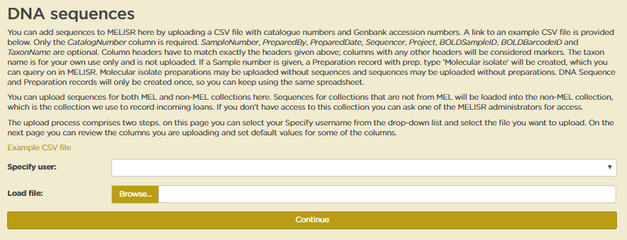

In the first upload step, apart from the CSV file, you also need to select a **Specify user**. Just select your username from the dropdown list. You do need a Specify user account to be able to upload sequences into MELISR, but you do not need editing privileges.

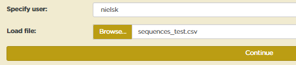

When both fields have been filled in, you can hit **Continue**.

#### Step 2

When a sequence file is uploaded, the first thing the script does is parse and analyse the first row of the spreadsheet to establish what information it should get from which columns. The results of this are given back to the user to verify in Step 2.

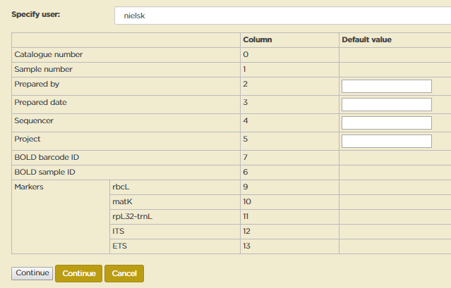

The table in the form at Step 2 indicates what information is found in which column (columns are numbered from 0).

As indicated above, any column header that is not recognised by the script is considered to be a marker. MELISR has a pick list with DNA markers. If a marker is not in the pick list, it will be indicated in the table. You can safely upload sequences with markers that are not in the pick list, as long as you have established that it is indeed a new marker, but a marker won’t display in the Specify form and you won’t be able to query for it unless it is in the pick list. You can add a new marker to the pick list on the [**Markers**](http://melisr.rbg.vic.gov.au/dnasequence/markers) page. See **Adding a new marker** (p. 148) for more details.

You can enter default values for the **Prepared by**, **Prepared date**, **Sequencer** and **Project** columns. Default values will be used when a column is not in the spreadsheet or when a cell in a column is empty. Agent names – **Prepared by** and **Sequencer** – need to be spelt exactly as in the **Agent** table. No special code has been written yet to convert dates, so the only dates that can be uploaded for **Prepared date** are complete dates in ISO date format (‘yyyy-mm-dd’).

Sequences – or the **Collection objects** sequences are derived from, rather – can be added to a sequencing **Project**. **Collection object** records can only be linked to a **Project** if the project is already in the database. You can check what projects are in the database and add new projects on the [**Projects**](http://melisr.rbg.vic.gov.au/dnasequence/projects) page. See **Adding a new project** (p. 149) for more details.

When you are satisfied that you are loading the correct data, hit **Continue**.

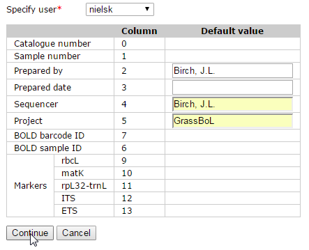

Now the real work starts for the upload script. The script will do the following for each row in the spreadsheet:

1.  First, the script will look up the **Catalogue number** in MELISR. If a MEL number can’t be found an error will be recorded and the script will move on to the next row. If a **Catalogue number** of a non-MEL collection can’t be found a new **Collection object** record will be created in the *Non-MEL loans* collection and a warning will be recorded.

2.  If a **Sample number** has been provided, the script will look for a **Preparation** with the same **Sample number** for the same **Collection object** (**Sample numbers** do not have to be unique across the database). If such a **Preparation** cannot be found, a new ‘Molecular isolate’ **Preparation** record will be created. If a **Preparation** already exists, the script will update the **Prepared by** and **Prepared date** fields if required.

3.  For each **GenBank accession number** the script will look if a **DNA sequence** record already exists. If it does, the script will check if any of the **Sequencer**, **BOLD sample ID** or **Bold barcode ID** fields need to be updated.

    If a **DNA Sequence** record does not already exist, the script will try to retrieve the sequence from GenBank, using one of the GenBank web services. A new **DNA sequence** record will only be created if a sequence can be retrieved from GenBank. If the sequence cannot be retrieved, a warning will be recorded.

4.  If a **Project** has been provided, the script will try to link the **Collection Object** record to a **Project**. The **Project** has to exist in MELISR. If the **Project** does not exist a warning will be recorded.

When the script has finished, a report of all the errors and warnings recorded during the running of the script and all the actions undertaken will be displayed on screen. For initial uploads of largish data sets this may take a while because of the GenBank requests.

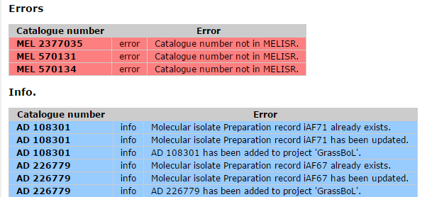

### Adding a new marker

New markers can be added to the pick list on the **[Markers](http://melisr.rbg.vic.gov.au/dnasequence/markers)** page, http://melisr.rbg.vic.gov.au/dnasequence/markers.

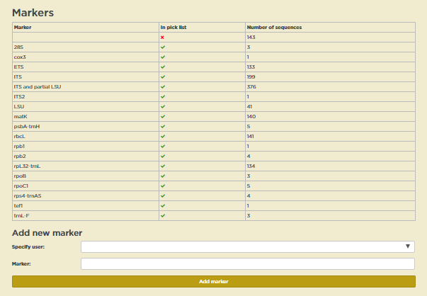

First on the page is a table showing how many sequences are in the database for each marker and whether the marker is in the pick list.

To add a new marker, just select a **Specify user** from the drop-down list and enter the name of a marker in the **Marker** field in the form under **Add a new marker**. Click **Add** when you are done. The new marker will show in the table immediately.

### Adding a new project

New projects can be added to MELISR on the [**Projects**](http://melisr.rbg.vic.gov.au/dnasequence/projects) page, http://melisr.rbg.vic.gov.au/dnasequence/projects.

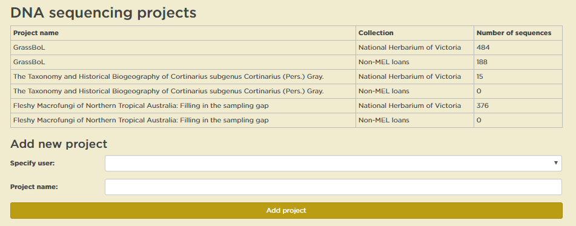

As on the **Markers** page, there is first a table with projects and the number of sequences belonging to each project. These numbers won’t be entirely accurate if the same specimen has been sequenced for multiple projects.

You can add a new project by filling in the fields in the form below and clicking **Add**. The new project will show in the table immediately.

## Working with sequences in Specify

### Finding sequences

#### Simple search

You can configure **Simple search** to find DNA sequences by **GenBank accession number** or **BOLD barcode ID**. To do so, open the **Simple search** configuration window by clicking on the down arrow in the **Simple search** box in the top right-hand corner of your screen and select ‘Simple Search Config’ from the list, as shown below.

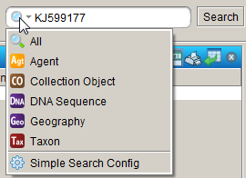

In the window that appears (see below), select ‘DNA Sequence’ in the **Available Tables** pane, tick the fields you want the **Simple search** to be able to search on under **Search Fields** and additional fields you want to be displayed in the result under **Display Fields**. There are no **Related Searches** for **DNA Sequence**s, so if you want to find sequences by a particular person, or of a particular taxon or from a geographic region, you have to use the **Query builder**.

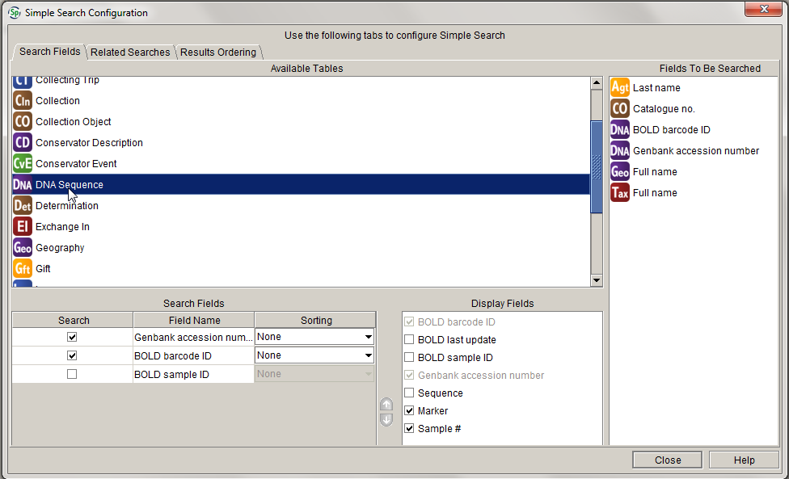

#### Query

The **Querying** section of the MELISR Manual (p. 153 onwards) details how to use the query in Specify. The best way to query for sequences in MELISR is as a **Collection object** query:

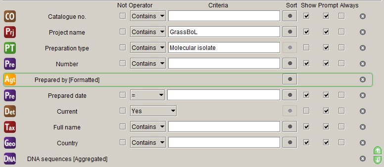

Things to look out for:

1.  Only include the **Project name** field if you want to query on a project. If you include the field and leave it blank you’ll still only get **Collection Objects** that have been assigned to a **Project** in your result.

2.  This query will return one row for each **Collection Object**, because an aggregator on the **DNA** **Sequence** table has been used. A potential drawback of this is that you cannot query for only **Collection Object**s that have sequences. You can get around this to some extent by, in the search result, ordering the rows on the aggregated *DNA sequences* field and selecting only those rows that have a value in this field before you open the **Collection Object** form. If you really want only records with sequences in your result set, you have to include one or more fields from the **DNA Sequence** table in your query, but as soon as you do that you’ll get a separate row for each sequence.

The results of the example query above are displayed below. You can view details of records in the results by clicking on the **Collection Object form** button.

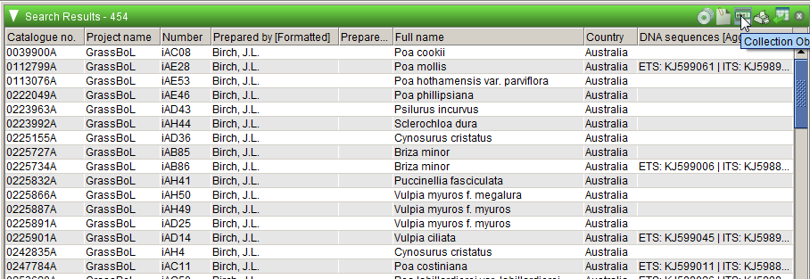

You can’t query for MEL and non-MEL sequences at the same time, as they are stored in different collections in Specify, the MEL collections in the *National Herbarium of Victoria* collection and the non-MEL ones in *Non-MEL loans*. However, if you save a query in one collection, you can use the same query in the other. If you don’t have access to the *Non-MEL loans* collection, ask one of the MELISR administrators to give you access.

### The DNA sequence form

The **DNA Sequence form** can be opened from the **Collection Object form** by clicking on the *DNA* button in the group of buttons near the bottom of the form:

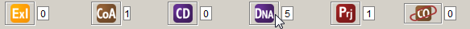

In the **DNA Sequence** form you can link out to the information on the sequence in GenBank by clicking on the **Weblink** button:

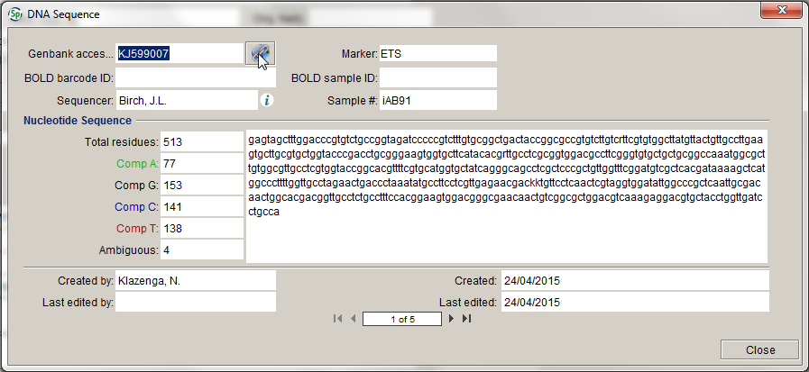

Typically, you won’t need to do any editing in the **DNA Sequence** form, as everything can be done in the CSV file you upload, but, if you have updated a sequence in GenBank, and you want the updated sequence in MELISR, you can ask a MELISR administrator for access. Deletion of sequence records from MELISR is something that can only be done by a MELISR administrator.
