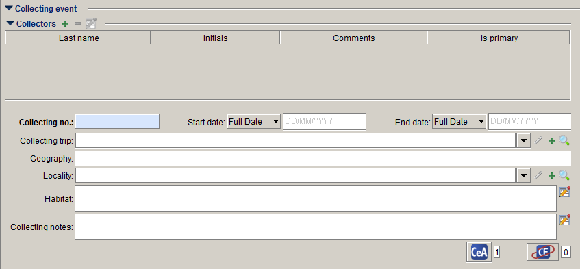

## Collection object

MELISR | AVH
---|---
**Catalogue number** | dwc:catalogNumber
**Descriptive notes** | dwc:occurrenceRemarks
**Miscellaneous notes** | dwc:occurrenceRemarks
**GUID** (not on form) | dwc:occurrenceID

# Determination

MELISR | AVH
---|---
**Determination type** | abcd:IdentifierRole
**Determiner** | dwc:identifiedBy
**Date** | dwc:dateIdentified
**Taxon name** | dwc:scientificName
**Qualifier** | dwc:identificationQualifier (DwC compliant value is stored in Text1)
**Qualifier rank** | dwc:identificationQualifier
**Addendum** | abcd:NameAddendum
**Type status** | dwc:typeStatus (DwC compliant value is stored in co.Description)
**Type qualifier** | If there is a type status qualifier, type status is not delivered
**Extra information** | dwc:identificationRemarks
**Determination notes** | dwc:identificationRemarks
**GUID** (not on form) | dwc:identificationID

{::options parse_block_html="true" /}

**Note** – Non-current determinations are delivered to AVH as dwc:identificationHistory

# Preparations

MELISR | AVH
---|---
**Preparation type** | dwc:preparations
**Loans** | abcd:LoanNumber\abcd:LoanDestination
**MEL duplicates at** | abcd:DuplicatesDistributedTo

{::options parse_block_html="true" /}

**Note** – What we deliver to AVH as abcd:DuplicatesDistributedTo actually comes from the exchange system, not the field on the Preparation form.

# Collecting event

MELISR | AVH
---|---
**Collectors** | dwc:recordedBy
**Collecting number** | dwc:recordNumber
**Start date** | dwc:eventDate
**End date** | dwc:eventDate
**Habitat** | dwc:habitat
**Collecting notes** | dwc:eventRemarks

# Locality

MELISR | AVH
---|---
**Geography** | dwc:country\dwc:stateProvince
**Locality** | dwc:verbatimLocality
**Latitude** | dwc:decimalLatitude\dwc:verbatimLatitude
**Longitude** | dwc:decimalLongitude\dwc:verbatimlongitude
**Datum** | dwc:geodeticDatum
**Source** | dwc:georeferenceProtocol\dwc:georeferencedBy
**Precision** | dwc:coordinateUncertaintyInMeters
**Minimum altitude** | dwc:minimumElevationInMeters
**Maximum altitude** | dwc:maximumAltitudeInMeters
**UTM** | dwc:verbatimCoordinates (proposed)
**Map reference** | dwc:georeferenceSources (proposed)
**IBRA region** | abcd:NamedPlace (IBRA region) (proposed to drop)
**IBRA subregion** | abcd:NamedPlace (IBRA subregion) (proposed to drop)
**Minimum depth** | dwc:minimumDepthInMeters
**Maximum depth** | dwc:maximumDepthInMeters
**Generalised locality** | abcd:NearNamedPlace (proposed to drop)
**Relation** | abcd:NearNamedPlaceRelationTo (proposed to drop)

{::options parse_block_html="true" /}

**Note** – dwc:coordinatePrecision and dwc:verbatimCoordinateSystem are derived from the verbatim latitude and longitude; dwc:verbatimSRS is the same as dwc:geodeticDatum, unless UTM is used, in which case it is the SRS of the MGA, AGM or UTM zone.

# Geocoord. Detail

MELISR | AVH
---|---
**Georeferenced by** | dwc:georeferencedBy
**Georeference date** | dwc:georeferencedDate
**Georeferencing notes** | dwc:georeferenceRemarks
**Not geocoded because** | dwc:georreferenceRemarks

# Collecting Event Attribute

MELISR | AVH
---|---
**Verbatim collecting date** | dwc:verbatimEventDate
**Introduced status** | dwc:establishmentMeans
**Cultivated status** | dwc:establishmentMeans
**Substrate** | dwc:habitat
**Associated taxa** | dwc:associatedTaxa
**Host taxon** | dwc:associatedTaxa (proposed)

# Collection Object Attribute

MELISR | AVH
---|---
**Phenology** | dwc:reproductiveStatus
**Ethnobotanical info.** | ~~dwc:occurrenceRemarks~~
**Toxicity** | ~~dwc:occurrenceRemarks~~

# Other Identifier

MELISR | AVH
---|---
**Institution** | abcd:AcquisitionSourceText
**Catalogue number** | \[abcd:PreviousSourceInstitutionID +\] abcd:PreviousUnitID

**Taxon**

MELISR | AVH
---|---
**Rank** | dwc:taxonRank
**Name** | dwc:kingdom, dwc:phylum, dwc:class, dwc:order, dwc:family, dwc:genus, dwc:specificEpithet, dwc:infraSpecificEpithet
**Author** | dwc:scientificNameAuthorship
