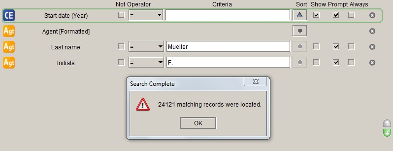
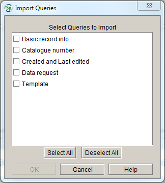
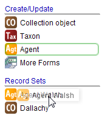
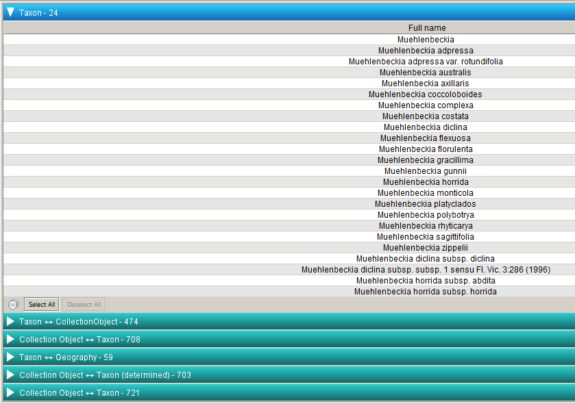

## Querying Specify

One of the benefits of databasing specimens is the ability to query for and retrieve specimen information efficiently and effectively. Specify has two search functions: a **Simple search**, which enables quick searches on pre-indexed fields, and a **Query builder**, which allows for more structured and comprehensive querying of specimen data. Query results can be viewed in the workspace, saved as a record set, printed or exported as a spreadsheet. The main tables that are used for querying are the **Collection object**, **Taxon** and **Agent** tables.

When querying Specify, it is important to bear in mind that several records in some tables in the database (such as **Agent** and **Determinations**) may be linked to the one **Collection object** record, so the one specimen record may appear more than once in your results. If fields from the **Determinations** table are included in the query output, records that match the query terms – and which have more than one determination – will appear more than once in the results grid. For example, MEL 50834 has a det. for *Eucalyptus glaucescens* Maiden & Blakely by J.H. Willis, as well as a conf. by M.I.H. Brooker. A query for **Catalogue number** = ‘0050834A’ that includes the (Taxon) **Full name** in the query output will return two results for the same record in the results grid, because the collection object that matches the search criteria is linked to two records in the **Determinations** table:

If, however, the **Current** (determination) criteria is set to ‘Yes’, the record will only appear once in the results grid, as the query is only searching for the records where the current determination matches the search criteria:

Similarly, if a **Collection object** query includes the collectors’ names in the query output, records for specimens with more than one collector will be duplicated in the results. For example, MEL 241014 was collected by A.C. Beauglehole with E.G. Errey as an additional collector. A query for **Catalogue number** = ‘0241014A’ that includes (Collector) **Last name** in the query output will return two results for the same record in the results grid, because the collection object that matches the search criteria is linked to two records in the **Agent** table:

If the **Is primary** field is included in the query with the **Operator** set to ‘Yes’, the matching collection object record will only appear once in the results, because there is only one primary collector linked to the record:

However, a record with more than one primary collector will always appear more than once in the query results if the (Collector) **Last name** field is in the query output. MEL 696791 was collected by L.A. Craven and C.R. Dunlop, who are both recorded as primary collectors. If (Collector) **Last name** is included in the query output, and **Is primary** is set to ‘Yes’, the record will be duplicated in the query results:

If, however, the collectors are aggregated in the query output (by double-clicking on ‘Collectors’ instead of selecting fields from the **Agent** table), the record will only appear once in the query results:

### Query terms

#### Not

Checking the **Not** box will negate the **Operator**. For example, if the **Operator** is set to ‘=’, and the **Not** box is checked, the query will return records that do not equal the value in the **Criteria** field:

This query will not return records where the collector’s last name is Mueller, but the collector’s initials do not contain ‘F.’:

#### Operator

The **Operator** defines how the value(s) in the **Criteria** field should be interpreted. The following operators can be selected (note that not all operators are available for all field types):

**Expression** | **Result** | **Available for**
----------------|------------|------------------------------------------------------------------------------------
**=** | Finds all records for which the value of the selected field is equal to the specified criterion |Number, date and text fields
**&gt;** | Finds all records for which the value of the selected field is greater than the specified criterion | Number and date fields
**&lt;** | Finds all records for which the value of the selected field is less than the specified criterion | Number and date fields
**&gt; =** | Finds all records for which the value of the selected field is greater than or equal to the specified criterion | Number and date fields
**&lt; =** | Finds all records for which the value of the selected field is less than or equal to the specified criterion | Number and date fields
**Between** | Finds all records for which the value of the selected field is between the specified criteria | Number and date fields
**In** | Finds all records for which the value of the selected field is included in the list of criteria. Criteria in a list should be separated by commas:  | Number and text fields                                                                                                                                                                                                                                 
**Like** | Finds all records for which the value of the selected field contains the pattern specified in the query term. A wildcard character (\*) must be included in the query term to create the desired pattern. For example, the following query will return records for specimens where the collector’s last name begins with ‘adam’:      The following query will return records for taxa where the taxon name ends in ‘folia’:      The following query will return records for all geographic place names that start with ‘I’ and end with ‘land’:     | Text fields
**Contains** | Finds all records for which the value of the selected field contains a specified string of characters. The position of the query term in the field is not important. For example, the following query will find records where the **Taxon name** field contains ‘rosa’ at the start, the middle or the end of the locality description:     | Text fields                                                                                                                                                                                                                                                                                                                    
**Empty** | Finds all records for which the value of the selected field is empty. It is important to note that ‘Empty’ is a condition and not the same as leaving the **Criteria** field blank (if the **Criteria** field is left blank, the field will be included in the results, but not in the query). | Number fields, text fields and check boxes
**Yes** | Finds all records for which the check box for the selected field has been ticked | Check boxes
**No** | ‘No’ is an option for check box fields, but it is not a very useful query term. If you wish to search for records for which a check box has not been ticked, use the ‘Not’ query term in combination with the ‘Yes’ operator. For example, the following query will return records for specimens that don’t have an illustration:   | Check boxes
​**Yes or Empty** | Finds all records for which the check box for the selected field has either been ticked, or is empty | Check boxes
**No or Empty** | Finds all records for which the check box has not been ticked, or is empty (i.e. it includes records that might previously have been ticked, but have since been un-ticked) | Check boxes

#### Criteria

The **Criteria** box is used to enter the search terms for the field that is being queried.

Note that fields that are check boxes do not include **Criteria**, as all the possible values of the check box field are covered in the **Operator**.

#### Sort

The results of each field can be sorted in ascending or descending order, or left unsorted:

 **Symbol**                     |   **Definition**      | **Action**
--------------------------------|-----------------------|----------------------------------------------------------
 |   **Unsorted**        | Query results are unsorted
 |   **Sort ascending**  | Query results are sorted in ascending order (A→Z; 0→99)
 |   **Sort descending** | Query results are sorted in descending order (Z→A; 99→0)

The default for **Sort** is unsorted. Click the **Sort** button to change it to ascending or descending.

#### Show

You can choose whether or not to display a field in the query form in the results. By default, all fields in a new query form are displayed in the results. Un-tick the **Show** box next to a field to exclude it from the results.

Note that the **Show** button has been un-ticked for most fields in the **Basic record info.** and **Template** queries. Remember to tick the **Show** box next to those fields that you want to see in the results grid.

#### Prompt

The **Prompt** command allows query terms to be customised when creating reports. It is not used for querying data.

#### Always

The **Always** command relates to report creation and is not used for querying.

#### Search controls

##### Search synonyms

If **Search synonyms** is ticked, synonyms of the taxon name or geographic area name will be included in the query and the query results. The **Search synonyms** box is ticked by default.

For example: ‘East Timor’ has been added to the **Geography** table and synonymised with Timor-Leste (the blue text indicates that East Timor is a synonym):

A query for either ‘East Timor’ or ‘Timor-Leste’ will return records for both:

##### Distinct

If **Distinct** is ticked, only unique records are returned in the results. For example, the following query will produce a list of distinct years from the collecting date of specimens in MELISR collected by Ferdinand Mueller:

Because only distinct combinations of the values in the **Collector** and **Start date (Year)** fields are being returned, each year only appears once in the results:

If the **Distinct** box is not ticked, the same query returns a list of years from the collecting date of *all* specimens in MELISR collected by Mueller:

When the **Distinct** option is selected, the query results can only be viewed in the workspace; they cannot be used to create a record set, nor can the results be viewed in data entry forms.

##### Count

If **Count** is checked, a count of the matching records will appear in a separate window in the workspace. The results grid will not be displayed when the **Count** function is active.

##### Search

The **Search** button activates the query. Pressing **Enter** will also activate the query.

### Querying dates

Dates that have a date type pick list next to the **Date** field (such as the determination date and the collecting date) can be queried as a full date, or by any combination of day, month and year:

Dates that only allow a full date to be entered (such as the date the record was created) can only be searched as a full date:

If querying by full date, the date entered must be formatted as dd/mm/yyyy (the query will not run if an incomplete date is entered):

Note that partial dates (i.e. a year only, or a month and a year) need to be stored as complete dates in the back end of the database (i.e. as a day, month and year), even though only part of the date is displayed in the front end. ‘01’ is stored in the month and/or day field to complete partial dates. For example, a partial date that displays as ‘07/2007’ is stored in the database as ‘01/07/2007’ and a partial date of ‘2007’ is stored in the database as ‘01/01/2007’. Therefore, if an exact date of ‘01/01/2007’ is queried the partial date (2007) will be included in the results, but you will be able to see which are incomplete and which are complete dates:

### Querying by barcode

Barcode scanners can be used to input MEL numbers into the query form. Multiple MEL numbers can be queried by selecting the ‘In’ operator, and listing the MEL numbers in the **Criteria** field, separated by commas. MEL’s barcode scanners are programmed to append a carriage return after the scanned data (which is equivalent to typing in a barcode and pressing **Enter**, which will activate the query). If you wish to enter more than one barcode in a search string, the barcode will need to be re-programmed to remove the carriage return.

Note that your query won’t work if you scan barcodes into the **Catalogue number** field in the query form; they must be entered in the **Barcode** field.

To stop appending a carriage return to scanned data, scan the following code:

To append a carriage return to scanned data, scan the following codes in the order shown:

### Standard query forms

Four standard **Collection object** query forms have been created. Note that, while the standard query forms are useful for users unfamiliar with the database structure, they can be slow to run because they contain a lot of fields. It will generally be more efficient to build your own query that contains the fields you want to search by.

#### Catalogue number

The **Catalogue number** query allows you to search for records based on **Catalogue number**. If the **Operator** is set to ‘Contains’, you can enter the MEL number in the field (i.e. the **Catalogue number** without any leading zeroes), but be aware that you may get extra records in your results. For an exact match, set the **Operator** to ‘=’ and enter the full **Catalogue number** (seven digits plus one letter).

#### Basic record info.

The **Basic record info.** query allows you to search and retrieve basic record information for collection objects.

Note that, to reduce the chance of getting more than one result for a single collection object record, the **Current** (determination) and the **Is primary** (collector) fields are set to ‘Yes’.

#### Created and Last edited

The **Created and Last edited** query is designed help you query for all the records you databased or edited on a single day, for quality control or label-printing purposes. **Created** and **Last edited** dates must be entered as full dates. You can use the ‘&lt;’, ‘&gt;’ or ‘Between’ operators to query for records databased or edited on more than one day. For example, to query for records that have been edited since the 1^st^ of January 2010, set the **Operator** to ‘&gt;’ and enter ‘01/01/2010’ in the **Criteria** box for the **Last edited** field:

To query for all records edited in January 2010, set the **Operator** to ‘Between’ and ‘01/01/2010’ and ‘31/01/2010’ in the **Criteria** boxes for the **Last edited** field:

#### Data request

The **Data request** query is useful for extracting data to send to visitors or external researchers. Note that the **Current** determination field is set to ‘Yes’, so you will need to change that if you want to include type status determinations in the results.

### Importing standard queries

The standard queries are saved in the S:\\MEL\\Science\\Specify\\Queries folder. To import the queries into Specify:

1.  Open the **Query** module by clicking on the button in the task bar:

    

2.  Right-click in the side bar under ‘Saved Queries’, then select ‘Import Queries’:

    

3.  Navigate to S:\\PS&B\\Specify\\Queries\\standard\_queries.xml and click **Open**:

    

4.  Click **Select All** in the **Import Queries** window, then click **OK**:

    

After being imported, the queries will appear in the side bar.

## Creating queries

Queries can be made using the Specify **Query builder**, or modified from the query template.

### Query builder

The **Query builder** allows you to select query fields from a primary table and its related tables.

To build a new query:

1.  Select the table that you want to query in the side bar. The **Collection object** table is the main table used for querying specimen information. A list of fields and related tables will appear at the top of the workspace:

    

    Related tables are indicated by an arrow to the right of the table name. One dot after the arrow indicates a one-to-many relationship between the related table and the primary table; two dots indicates a many-to-one relationship between the related table and the primary table:

    

    (Many collection objects can be created by the one person, and one collection object can have many determinations.)

2.  Double-click on the fields that you want to include in your query. The field name will appear below the table list(s) in the workspace:

    

    To display fields in other tables, single-click a table name in the field list:

    

    If you double-click on a table name, it will add an field containing aggregated data for that table to the query form. Search criteria cannot be entered for aggregated data fields, but the aggregated data will display in the results.

3.  Bear in mind that for a field to be displayed in the query results, it must be listed in the query

4.  There is no limit on the number of fields that can be added to a query, but larger, more complex queries involving fields from multiple tables will take much longer to run

5.  Modify the query as required – see [**Query** terms](#query-terms) for a guide

6.  Click the **Search** button to activate the query.

#### Saving queries

You can save a query by clicking the **Save** button at the bottom right-hand corner of the query screen.

If you have modified a query you can choose to save it as a new query, rather than overwriting the existing query, by selecting **Save As**:

### Query template

To use the **Query builder** most effectively, you need to have a good knowledge of the Specify data model. Users who are less familiar with the data model may wish to modify the query template. The query template lists most of the fields available in the **Collection object** table and related tables that contain collecting data of most interest to most users.

To modify the query template:

1.  Click on **Template** in the side bar to open the query form

2.  Click on the delete symbol at the right of the field name to delete any unwanted fields:

    

1.  Modify the query syntax as required.

{::options parse_block_html="true" /}

### Tips for querying

#### Querying for major storage groups

Because not all the major storage groups (Fungi, Lichens, Dicots, Hepatics etc.) in the MEL collection are taxonomic groups, you can’t easily search for a major group using the **Taxon** table. Instead, use the **Major group** field in the **Storage** table to search for storage groups:

The major group names are:

- A. Algae          
- ​B. Bryophytes     
- ​D. Dicots         
- ​FER. Ferns        
- ​F. Fungi        
- ​G. Gymnosperms                  
- L. Lichens  
- LYC. Lycophytes
- M. Monocots ​                  

#### Querying for type specimens

The easiest way to query for types is to use the **Det. type** field. Query for the name in the (Taxon) **Full name** field, and set **Det. type** to ‘Type status’:

If the **Current** determination field is in your query form, make sure it isn’t set to ‘Yes’, as Type status dets are never set as the current determination.

## Query results

Query results are limited to 20,000 records. A count of records matching the query term can exceed 20,000, but Specify can only display 20,000 result records at once. Use the **Count** function if you only want to know the number of records that match your query, otherwise break the query into smaller sections by adding more search terms. If you need to view more than 20,000 results, see a database administrator, who can perform a query in MySQL for you.

### Viewing query results

Once a query is activated, the results are displayed in a grid in a separate query results tab. Only fields that were included in the query form are displayed in the results grid. The results can be sorted by clicking on the title bar of the field you wish to order by:

Clicking the column header once will sort the results in ascending order (A→Z; 0→99); clicking the title again will sort the results in descending order (Z→A; 99→0).

#### Selecting records

Records in the results grid can be selected by pressing and holding the **Ctrl** key while clicking on records in the list:

You can select or deselect records by clicking the **Select all** or **Deselect all** buttons at the bottom of the query results:

Once records have been selected, you can use the results controls to perform further actions.

#### Results controls

Query results can be viewed and utilised in a number of ways using the controls on the results bar:

**Symbol**                     | **Definition** | **Action**
-------------------------------|----------------|----------------------------------------------------------------
 | Record set     | Creates a record set from the selected records
 | Attachments    | Displays any attachments for records in the query results that are linked to the table that the query is based on
 | Form           | Opens the selected records in the relevant data form
 | Print          | Prints the selected records
 | Export         | Exports the results as a spreadsheet

### Record set

Query results can be saved as a record set in the side bar. To create a record set:

1.  Select the results that you want to save from the results grid. If you do not select any records, all records will be included in the record set.

2.  Click the **Record set** symbol in the results bar:

    

1.  Enter a name for the record set and click **OK** or press **Enter**:

    

    To add new records to an existing record set:

1.  Select the results that you want to add to an existing record from the results grid

2.  Click the **Record set** symbol at the bottom of the form:

    

1.  Click on the name of the record set that you want to add the records to and click **OK** or press **Enter**:

    

    See [**Using Record sets**](#using-record-sets) for more information about working with record sets.

### Attachments

You can view any attachments associated with the query results by clicking on the **Attachment** symbol:

1.  Select the results that you want to see attachments for from the results grid. If you do not select any records, all records will be included in the record set.

2.  Click the **Attachment** symbol in the results bar:

    

3.  An overview of the attachments associated with the results will open in a new tab:

    

4.  From here you can examine the attachment information within Specify in three ways:

    Double-clicking an image will open it in a new tab:

    

    Clicking on the form icon underneath the image will open the associated record (in this case, the **Collection object** form):

    

    Clicking on the **Information** symbol underneath the image will display a summary of the collecting information associated with the image:

    

    From here you can click on ‘Show Collection Object’ to open the full record in the **Collection object** form.

    If the attachment is a PDF, Excel or Word file, double-clicking the attachment icon will open it in the relevant program.

### Form

Query results can be viewed in form mode by clicking on the **Form** symbol. The query results will open in the form that corresponds to the table that was queried (i.e. the results of a **Collection object** query will open in the **Collection object** form, and the results of an **Agent** query will open in the **Agent** form). To view results in a form:

1.  Select the results that you want to view from the results grid. If you do not select any records, all records will be included in the record set.

2.  Click the **Form** symbol in the results bar:

    

### Print

Query results can be printed by clicking on the **Print** symbol. Note that all records in the results grid will be printed, regardless of whether or not certain records are selected. The results will be printed in the order they were retrieved; any subsequent sorting of the results in the grid will be ignored. To print results:

1.  Select the results that you want to print from the results grid. If you do not select any records, all records will be included in the record set.

2.  Click the **Print** symbol in the results bar:

    

3.  In the **Page setup** window, enter a title, select the paper size and orientation, and click **OK**

    

4.  A preview of the print file will open in the workspace. Only those fields included in the results grid will be printed.

    

5.  Click the print icon to print the results to your local printer.

### Export 

Query results can be exported by clicking on the **Export** symbol. Note that all records in the results grid will be exported, regardless of whether or not certain records are selected. To export results:

1.  Click the **Export** symbol in the results bar:

    

2.  Enter a title for the file in the **Title** field, then click the **Browse** button to navigate to the directory in which you want to save the file:

    

3.  Name the file and click the **Save** button.

## Using Record sets

Record sets can be saved from the results of both a **Simple search** and a **Query** by clicking the **Record set** symbol in the results grid:

See **Record set** (p. 171) for instructions on how to save results as a record set.

Once a record set has been saved, it can be dragged and dropped on to items in the side bar for different modules. If you slightly drag a record set in the side bar, the items in the side bar that can interact with the record set will be highlighted with a coloured outline. For example:

-   If you slightly drag a **Collection object** record set in the **Data** module, the **Collection object** form will be highlighted:

    

-   If you slightly drag an **Agent** record set in the **Data** module, the **Agent** form will be displayed:

    

Dragging and dropping a record set on an item in the side bar will open the records in the record set in the relevant form, interaction or plugin. For example, dragging an **Agent** record set on to the **Agent** form in the **Data** module will open the agent records for the all the agents in the record set:

The number of records in the record set will match the number of records displayed in the navigation bar at the bottom of the form. You can scroll through the records using the navigation controls.

### Record set menu

The record set menu is accessed by right-clicking the record set in the side bar:

Three options are available:

-   Rename – activates a text field in which you can rename the record set. Type the new name into the text field and press **Enter** to save the record set under the new name.

-   Delete – deletes the record set. Record sets can also be deleted by dragging and dropping them on to the trash can.

-   View – opens the record set in a new results grid. Further actions can be taken by using the controls in the results grid.

## Simple search

The **Simple search** is designed to eliminate the need to build complex queries to perform commonly executed searches. All the actions that can be applied to query results are available in the **Simple search**.

### Configuring simple search

**Simple search** can be configured to query on different fields. The fewer fields that are queried, the faster the search will run. To configure **Simple search**, click on the arrow next to the **Simple search** icon, then select ‘Simple Search Config’ from the menu:

There are three configuration tabs: ‘Search fields’, ‘Related searches’ and ‘Results ordering’.

You can configure **Simple search** any way you like, but the following configuration is recommended to begin with.

1.  In the ‘Search fields’ tab, click on **Collecting information** in the ‘Available tables’ panel, and uncheck the **Start date** and **Collecting no.** in the ‘Search fields’ panel:

    

1.  Click on **Determination** in the ‘Available tables’ panel and uncheck the **Date** field in the ‘Search fields’ panel:

    

1.  Click on **Locality** in the ‘Available tables’ panel and un-tick **Locality** in the ‘Search fields’ panel.

    

1.  Under the ‘Related searches’ tab, check that the following relationships are marked ‘Active’:

    -   Collection object ↔ Collectors
    -   Collection object ↔ Geography
    -   Collector ↔ Collecting event
    -   Collection object ↔ Taxon (there are two of these relationships – check that they are both active)
    -   Collection object ↔ Taxon (determined)
    -   Taxon ↔ Collection object
    -   Taxon ↔ Geography

    To activate (or deactivate) a relationship, click on the relationship description in the ‘Related searches’ panel, then tick (or un-tick) the **Activate** box to the right of the panel:

    

1.  No changes need to be made in the ‘Results ordering’ tab.

**Simple search** is now configured to query on the following fields:

A query on one of these fields will return records from the primary table that the search term occurs in (e.g. the **Agent** table for a query on **Last name**) as well as from other tables that contain links to the field being queried (e.g. records from the **Collection object** table for specimens that were collected by the agent, or records from the **Taxon** table that link to determinations by the agent).

Curation staff might also wish to use **Simple search** to query for loan or gift transactions. To configure **Simple search** to query for loan and gift records:

1.  Click on **Loan** in the ‘Available tables’ panel and tick the **Loan number** field in the ‘Search fields’ panel:

    

1.  Click on **Gift** in the ‘Available tables’ panel and tick the **Gift number** field in the ‘Search fields’ panel:

    

#### Wildcards and delimiters

More than one term can be used in a search specification, but the results will vary depending on the use of wildcards and delimiters. For example, if the search string is ‘Lake Bolac’, the **Simple search** results will include records that have either ‘Lake’ OR ‘Bolac’ in any search field. Records that contain the phrase ‘Lake Bolac’ in one field will also be found.

Wildcards and delimiters can be used in the **Simple search** criteria to define queries more narrowly. A wildcard (\*) allows the criteria to be found as part of a string. Single or double quote delimiters (' or ") allow two or more words to be searched as a string rather than as separate criteria. The wildcard and delimiter can also be used together to further limit the search:

  **Query term**                          | **Result**
------------------------------------------|----------------------------------------------------------------------
  \*Clinton                               | Returns any string with Clinton at the end
  Clinton\*                               | Returns any string that begins with Clinton
  \*Clinton\*                             | Returns any string that includes Clinton anywhere in the string
  \*Clinton Lake\*                        | Returns any string that ends with Clinton or begins with Lake
  "Clinton Lake" or 'Clinton Lake'        | Returns any string where Clinton Lake is the entire string
  \*"Clinton Lake"\* or \*'Clinton Lake'\*| Returns any string that includes Clinton Lake anywhere in the string

The search term is queried in all fields that have been selected in the **Simple search** configuration options, so a query for ‘Laur\*’ will return a list of agents whose last name starts with ‘Laur’ (Laurer, Laurie, Laury etc.), as well as a list of all taxon names that begin with ‘Laur’ (Lauraceae, Laurencia, Laurus etc.).

### Simple search examples

**‘Wakefield’**

A search for ‘Wakefield’ will first return results for agents with the last name ‘Wakefield’, and will then return the results for records in the **Taxon** table and **Collection object** table that contain links to the ‘Wakefield’ entries in the **Agent** table:

In this example there are:

-   eight records in the **Agent** table for agents with the last name Wakefield

-   167 records in the **Taxon** table that link to records in the **Collection object** table that have determinations by someone with the last name Wakefield

-   4083 records in the **Collection object** table where one of the collectors has the last name Wakefield.

**‘2145221a’**

A search for a **Catalogue number** will return the results from the **Collection object** table where the **Catalogue number** matches the query term:

Because the **Simple search** is configured to display results from linked tables, a search for **Catalogue number** presents the same result in different ways:

In this example, the same result is described by five different relationships, but because catalogue numbers are unique, they don’t provide any additional information:

-   one record in the **Collection object** table contains the **Catalogue number** 2145221A

-   one record in the **Collection object** table with the **Catalogue number** 2145221A has a determination (either current or non-current) that links to a record in the **Taxon** table

-   one record in the **Collection object** table with the **Catalogue number** 2145221A is linked to one collector in the **Collectors** table

-   one record in the **Collection object** table with the **Catalogue number** 2145221A has a current determination that links to a record in the **Taxon** table

-   one record in the **Collection object** table with the **Catalogue number** 2145221A has a locality that links to a record in the **Geography** table.

**‘China\*’**

A search for ‘China\*’ will first return results for names in the **Geography** table that start with ‘China’, and will then return results for records in the **Taxon** table and **Collection object** table that contain links to the ‘China\*’ records in the **Geography** table:

In this example there are:

-   four records in the **Geography** table that start with ‘China’

-   34 records in the **Taxon** table for taxa that have been collected in China

-   40 records in the **Collection object** table for specimens that were collected in China.

**‘Muehlen\*’**

A search for a taxon name followed by a wildcard will return a list of all records in the **Taxon** table that begin with the search term, followed by records from the **Collection object** and **Geography** tables that contain links to the record in the **Taxon** table:

In this example there are:

-   24 records for taxon names in the **Taxon** table that start with ‘Muehlen’

-   474 records in the **Collection object** table that are currently determined to a taxon name that starts with ‘Muehlen’ (and where the determination agent is known)

-   708 records in the **Collection object** table that contain a determination (either current or non-current) that link to a name in the **Taxon** table that starts with ‘Muehlen’

-   59 records for place names in the **Geography** tree where taxa starting with ‘Muehlen’ have been collected

-   703 records in the **Collection object** table that are currently determined to a taxon name that starts with ‘Muehlen’ (and where the determination agent is either known or unknown)

-   721 **Determinations** in **Collection object** records that link to a name in the **Taxon** table that starts with ‘Muehlen’.
