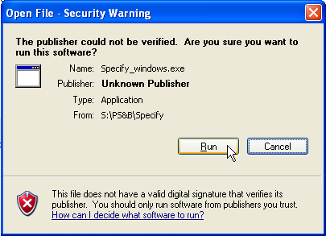
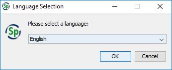
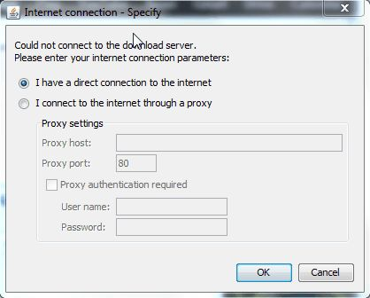
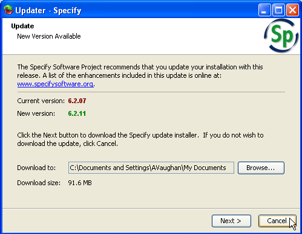
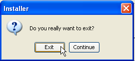
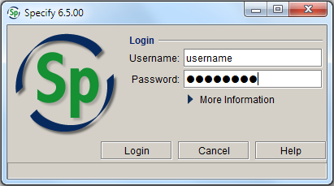
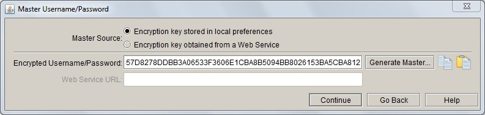
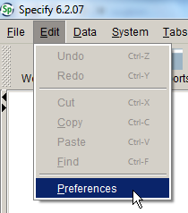
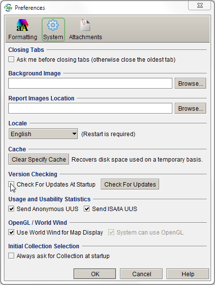

### Installing Specify

To install Specify:

1. Navigate to Q:\Applications\Specify
2. Copy the `Specify_<version>_windows.exe` or `Specify_<version>_windows_64.exe` – depending on your computer's configuration – file to your Desktop
3. Double-click the Specify\_windows.exe file
4. Click **Run** in the **Open File – Security Warning** window:

- If you receive an error message about Java, run the Java runtime environment update file in Q:\SOE, and then try installing Specify again

1. When prompted, click **OK** to select English as the language:

1. Click **Next** for all options in the Specify **Installer** window to accept the default installation settings
2. Click **Done** to close the installer.

### Opening and closing Specify

#### Logging in

1.  Open Specify from the shortcut button or your programs list.

    If you are presented with a window asking about internet connection settings, click **Cancel**. Once you have edited your preferences (see below), you will no longer be presented with this window upon start-up.

    

    If you are presented with an **Updater** window, click **Cancel** to prevent Specify from updating your current installation. Updates to new versions must only be done by database administrators so we can ensure that the new version works properly with our customisation of Specify.

    

    Click **Exit** when asked if you really want to exit (this will only exit you from the update installer, not from logging in to Specify):

    

2.  Enter your user name and password in the login window
3.  Click **Login**

    

    If your login fails, click on **More information** and check that the database settings match those below.

    

##### Configuring the master key

If you have just installed Specify on your computer, or if you are using Specify on a computer other than your own, you will need to enter your master key before you can log in. The master key for your username will have been e-mailed to you by the database administrator.

1.  Click on the arrow next to **More Information** in the **Specify Login** window
2.  Click on the **Configure Master Key** symbol
3.  Enter your master key in the **Encrypted Username/Password** field
4.  Click **Continue**
5.  Click **Login** in the login window.

If you are unsure of your master key, see a database administrator.

##### Choose a collection

There are seven different &#39;collections&#39; within MELISR, which are used to catalogue different types of information and to manage data for curation tasks. All users have access to the main _National Herbarium of Victoria_ collection. If you have access to other collections, you will be presented with a window prompting you to choose which collection you want to use.

-   **Incoming exchange** – a holding database used to manage and check data associated with incoming exchange,    prior to adding the records to the _National Herbarium of Victoria_ collection
-   **MEL Census** – holds the data from the old MEL Census, which contains information on MEL&#39;s holdings
-   **National Herbarium of Victoria** – the principal collection in MELISR, used to catalogue specimens from the main component of the State Botanical Collection
-   **Non-MEL loans** – used to manage incoming loans
-   **Photographs of specimens­** – used to catalogue photographs or cibachromes of specimens held at other herbaria
-   **Victorian Conservation Seed Bank­­** – used to catalogue seed collections and associated seedlings from the Victorian Conservation Seed Bank
-   **Victorian Reference Set**  – used to catalogue specimens stored in the Victorian Reference Set
-   **deBRIs** – a temporary collection used as a holding place for collecting data associated with the backlog of exchange material from BRI, prior to adding the records to the _National Herbarium of Victoria_ collection.

##### Editing preferences

When you first log in to Specify on your computer, you should edit the system preferences to stop Specify checking for updates each time you open the database:

1.  Click on the **Edit** file menu, then select **Preferences** :

    

2.  Under the **System** options, un-tick the **Check for updates at startup** box:

    

3.  Click **OK** to save the changes.

#### Closing Specify

To close Specify, do one of the following:

-   Click on the **Close** symbol in the top right corner of the window
-   Select **Exit** from the **File** menu
-   Press **Alt+F4**.
