## Using Specify

### Specify Help

Specify contains an inbuilt help system that can be opened from anywhere in the application by pressing the **F1** key. The help system is designed to provide an overview of the modules within Specify, as well as context-sensitive help for a given task. When performing a task in Specify, press **F1** to open the **Specify Help** page that corresponds to the current task. **Specify Help** includes a table of contents, and full-text search capabilities.

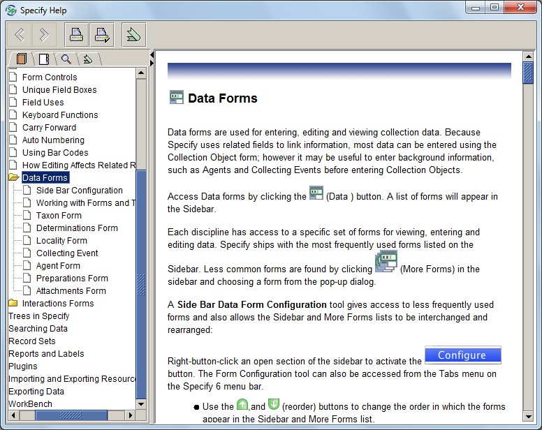

The most relevant information from the **Specify Help** pages has been incorporated into this manual.

### The Specify interface

The main sections of the Specify interface are described below.

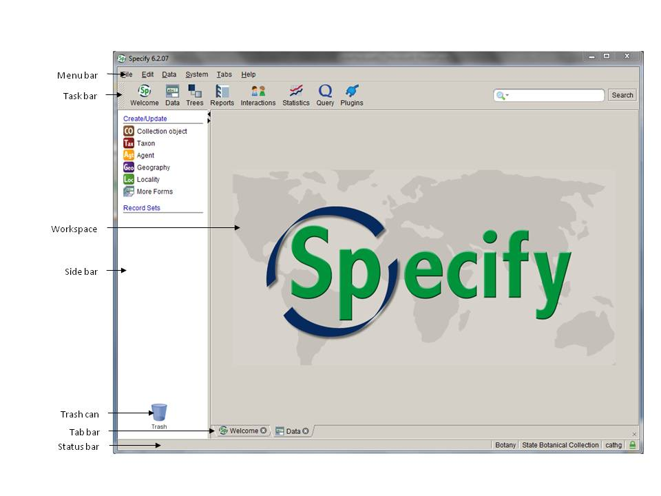

#### Menu bar

The menu bar provides access to user preferences, system configuration settings and data entry settings.

##### File

The file menu contains the **Exit** command. Specify can also be closed by pressing **Alt+F4** or clicking the **Close** symbol in the upper right corner of the window.

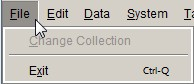

##### Edit

Formatting preferences (including font and font size) can be edited under **Preferences** in the **Edit** menu. Note that the formatting prefernces will apply to all users, not just you, so please see a database administrator if you think the formatting settings should be changed.

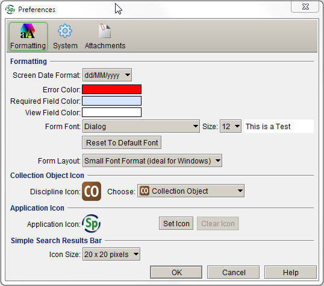

##### Data

The **Data** menu contains options for data entry. Click on an item to activate it, or use the keyboard to select it from the menu and press **Enter**. A tick will appear next to active items. Note that you need to have a data entry form open in the Workspace before you can activate items in the **Data** menu.

**Carry forward** copies data from certain fields from one record to the next during data entry. See **Carry forward** (p. 20) for more information about this feature.

**Save and new** will automatically open a new data entry form once a record has been saved. If **Save and new** is activated, but you have finished databasing, close the **Collection object** tab to remove the unused open form. If you close a data form, and then open a new form in the workspace, **Save and new** will not automatically be activated, even if there is a tick next to the **Save and new** button. To re-activate it, deselect **Save and new** under the **Data** menu, then re-select it. To check if **Save and new** is activated, look at the Save button at the lower right-hand corner of the form: the button will read &#39;Save/New&#39; when **Save and new** is active.

The **Auto numbering** function automatically increments numbers in fields that have been formatted with an auto numbering scheme. **Auto numbering** is turned on by default when a form is opened in the workspace. There are currently no auto-numbered fields in MELISR, so there is no need to turn **Auto numbering** on or off.

**Batch identify** allows you to add new determinations to multiple collection objects at the same time. See for **Batch identify** (p. 38) for instructions on how to use this feature.

##### System

The **System** menu contains system administration functions that can only be accessed by database administrators.

##### Tabs

The **Tabs** menu contains options for closing tabs, and for configuring the side bar.

Tabs that are open in the workspace can be closed under the **Tabs** menu. You can either close the current tab, all tabs, or all tabs except the current tab. Tabs can also be closed by clicking on the **Close** symbol in the **Tab bar** , or by pressing **Ctrl+W**.

The **Configure side bar** tool allows you to add or remove forms from the side bar. By default, the **Collection object** , **Taxon** and **Agent** forms are displayed in the **Data** module, and the **Collection object** , **Taxon** , **Agent** and **Loan** tables are displayed in the **Query** module. The side bar can also be configured by right-clicking the mouse in the side bar.

##### Help

The **Help** menu contains a link to the inbuilt **Specify Help** , plus a range of administrative functions, most of which can only be accessed by database administrators. The **Submit feedback** function allows users to send comments about particular aspects of the database to the Specify Software Project. To ensure that feedback is coordinated, and that bugs are properly documented, please provide feedback to the MELISR database administrators, rather than to Specify Software.

#### Task bar

The task bar contains buttons that are used to initiate database modules. Clicking on a button in the task bar will open a list of the components for that module in the side bar.

##### Welcome

The **Welcome** screen is viewed each time Specify is opened. It contains a summary of current loans and recent data entry activity.

##### Data

The **Data** module contains the forms that are used for entering, editing and viewing collection information. The main data forms used in MELISR are **Collection object** , **Taxon** and **Agent**.

##### Trees

The **Trees** module displays data in the **Geography** , **Taxon** and **Storage** tables as hierarchical trees. The data in these tables can also be viewed in forms.

##### Reports

Specify allows you to create reports that provide overviews of your collecting data. At MEL, we have programmed our reports outside of Specify, so we don&#39;t use any customised **Reports** within Specify; however, the **Reports** module must be enabled in order to print summaries of query results.

##### Interactions

The **Interactions** module is used to create and manage loans, exchange and donations.

##### Statistics

The **Statistics** module provides a summary of the holdings, loans and data entry activity in Specify. Three graphical reports are also available in the side bar when the **Statistics** module is active.

##### Query

The **Query** module allows you to retrieve data stored in MELISR in an organised way. The main forms that are queried in MELISR are the **Collection object** , **Taxon** and **Agent** forms.

##### Workbench

The **Workbench** module allows you to organise and validate data prior to permanently saving it in the database.

##### Plugins

The **Plugins** module contains web services that assist with georeferencing and visualising specimen records.

#### Side bar

The **Side bar** allows a list of components for each module to be activated in the workspace, such as data forms and record sets. The contents of the side bar will change to reflect the tools available within the active module.

The side bar can be resized by guiding the mouse over the line separating the side bar from the workspace until a crossbar appears, then clicking and dragging the side bar to the desired size.

#### Workspace

The **Workspace** is the area within which tasks are completed. Data entry forms, query forms, query results and reports all open in this space. Clicking a module component from the side bar list opens it in the workspace. Up to eleven workspace windows can be opened at one time.

#### Tab bar

The **Tab bar** indicates what tasks are open in the workspace. Tabs are labelled with an icon and module name. If the same module is opened in more than one window, the tab label will reflect the number of modules that are open. Click on the tabs to move between them. Click on the **Close** symbol or press **Ctrl+W** to close a tab. If you close a tab before saving data or saving changes to a query, you will be prompted to save your changes.

#### Status bar

The right-hand side of the **Status bar** displays the current collection database and user name. MELISR currently includes seven collections: _National Herbarium of Victoria_, _Victorian Reference Set, Non-MEL loans_, _Photographs of specimens_, _Incoming exchange_, _MEL Census_ and _deBRIs_.

The left-hand side of the status bar displays status reports for tasks that are being performed in the database, such as warnings for invalid data entry.

#### Trash can

A saved item listed in the side bar (such as a record set, query or report) can be deleted by dragging and dropping it onto the image of the trash can, or by right-clicking the item and selecting &#39;Delete&#39;.

### Related information

The names of the forms in Specify represent the category of information that is stored in the corresponding table: the **Collection object** table stores information about herbarium specimens; the **Taxon** table stores information about taxon names; the **Geography** table stores information about geographic places; and the **Agent** table stores information about people and organisations. However, much of the information in one type of table is linked to information in a related table. For example, a **Collection object** record contains information about taxon names, geographic places and people that is stored in the **Taxon** , **Geography** and **Agent** tables respectively.

These links, or relationships, between different tables prevent users from having to re-type the same information in different records, which increases the efficiency of data entry and reduces the incidence of errors. Separating data into fields within related tables also allows the data to be searched in a more precise way.

#### Relationships between tables

There are four types of relationships between tables in Specify: one-to-one, many-to-one, one-to-many and many-to-many.

##### One-to-one

A one-to-one relationship is a relationship between a primary and related table in which one record in the primary table can only be linked to a single record in the related table. For example, the collecting information for a single specimen is unique to that collection, thus a single record in the primary data table (in this case, **Collection object** ) can only be linked to a single record in each related table that stores collecting information (such as the **Collecting event** table and the **Collection object attributes** table).

##### Many-to-one

A many-to-one relationship is a relationship involving a primary and related table in which many primary records are linked to a single related record in the related table. For example, many specimens are collected on a single collecting trip, thus there are many records in the primary data table (in this case, **Collection object** records) that are linked to a single record in the related table (in this case, the **Collecting trip** table).

Related tables with a many-to-one relationship to the primary table are represented on the form as a query combo box with buttons to edit, add and search for a record within the table:

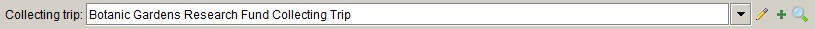

##### One-to-many

A one-to-many relationship is a relationship involving a primary and related table in which a single primary record links to many related records in the related table. For example, there might be more than one determination on a specimen, thus a single record in a primary table (in this case, a **Collection object** record) is linked to many records in a related table (in this case, the **Determinations** table).

Related tables with a one-to-many relationship are represented on the form as a subform (in either a grid or form view) with navigation controls that allow records in the related table to be added to or deleted from the primary table:

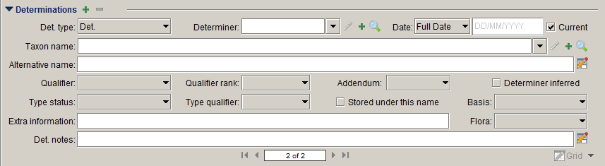

##### Many-to-many

A many-to-many relationship exists where multiple records in one table can be linked to multiple records in a related table. For example, more than one agent can be a collector for a single collection object, and more than one collection object can be collected by the same agent. Many-to-many relationships between tables require an associative table to link the two tables. In this example, the **Collectors** table is the link between the **Collecting event** table and the **Agent** table.

### Form controls

The following controls are used to enter and display data in the forms. Unless otherwise noted, all actions can be performed by clicking on the symbol using the mouse or pressing the spacebar when the symbol is in focus. The **Tab** key can be used to navigate between fields and form controls.

| **Symbol** | **Definition** | **Action** |
| --- | --- | --- |
|  | **Incomplete** | Opens a dialogue box listing the required fields that are incomplete (this action cannot be performed using the keyboard)_Note:_ The shield only appears once a change has been made inside the form and will disappear once all required fields contain data |
|  | **Warning** | Opens a dialogue box listing fields that contain incorrect data (this action cannot be performed using the keyboard)_Note:_ The shield will only display when the form contains errors |
|  | **Collapse** | Hides the form or subform (this action cannot be performed using the keyboard) |
|  | **Expand** | Opens the form or subform (this action cannot be performed using the keyboard) |
|  | **Add** | Opens a new form or subform to add a new record |
|  | **Delete** | Deletes the form or subform record. A record cannot be deleted if it is linked to any other records. |
|  | **Edit** | Opens the related record in a subform for editing |
|  | **Search** | Opens a search dialogue box to search for a record in the form or subform. The fields in the related form will be available to search_Note:_ This search treats all search criteria independently. For example, when searching for an agent &#39;John Smith&#39;, entering &#39;John&#39; in the **First name** field and &#39;Smith&#39; in the **Last name** field will return results for all agents with the last name &#39;Smith&#39;, as well as all agents with the first name &#39;John&#39;. |
|  | **Information** | Opens the associated form in view mode |
|  | **View form** | Displays the data in a table as a form in view mode |
|  | **View grid** | Displays the data in a table as a grid in view mode |
|  | **Edit form** | Displays the data in an editable table as a form in edit mode |
|  | **Edit grid** | Displays the data in an editable table as a grid in edit mode |
|  | **Close** | Closes the window or tab |

#### Navigating between records

Navigation control buttons are found at the bottom of each primary form (e.g. the **Collection object** form), and the bottom of each subform (e.g. the **Determinations** form) when viewed as a form:

Browse through the records by clicking on the appropriate arrow (first, previous, next or last) or press the spacebar when the appropriate button is in focus.

You can also use keyboard controls to navigate between different records (see **Keyboard functions** , p. 19).

### Field types

#### Text box

Text boxes accept any input. The maximum length of text boxes varies between different fields.

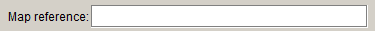

#### Number box

Number boxes look the same as text boxes, but will only accept numeric characters.

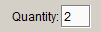

#### Expandable fields

Expandable text fields allow longer strings of text to be entered. To save space, only the first one or two lines of an expandable text field are displayed on the form. In data entry or edit mode, expandable fields are indicated by an **Edit form** symbol to the right of the field:

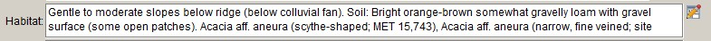

In view mode, an **Information** symbol appears to the right of the field:

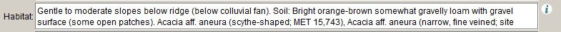

Clicking on the **Edit form** symbol or the **Information** symbol opens the field in a new window for editing or viewing, respectively:

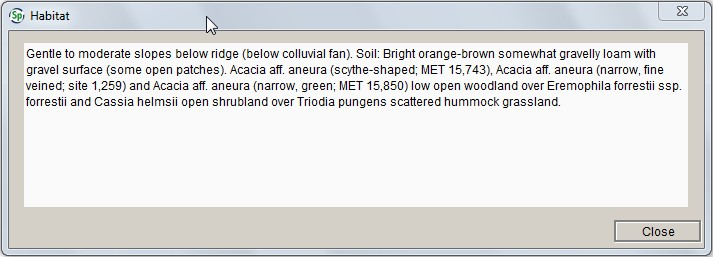

#### Query combo box

A query combo box allows data to be searched and selected from a related table; information cannot be typed directly into the box.

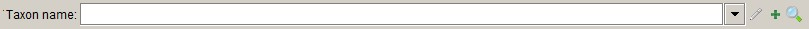

You can select the data in the related table from a drop-down list, or by searching the related table. If there is no corresponding record in the table, a new record needs to be added to the related table before it can be entered in the primary form. Records in related tables can also be edited.

To select data from a list:

1.  Type the first few letters of the term you wish to use in the box, then either press the down-arrow key on the     keyboard, or click on the arrow to the right of the combo box. A list of corresponding records in the related table will appear:

    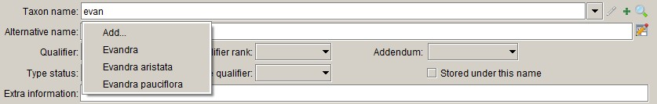

    If the list of matching records is long, it will appear in a separate window:

    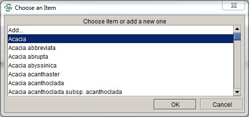

    You can also press the **Tab** key after entering text; if there is only one record in the table that corresponds to the text you entered, the matching record will be selected.

2.  Select a record from the results by clicking on it, or scroll through the list and press **Enter**.

    If a match cannot be found, &#39;Add…&#39; will appear in the drop-down list. Either select &#39;Add...&#39; or press **Enter** to add a new record to the related table. Pressing **Esc** will clear the list.

To search for data in the table:

1.  Click on the **Search** symbol to the right of the combo box. A search window will appear:

    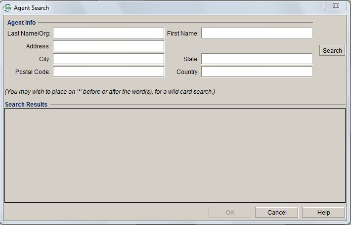

2.  Type in either the entire name, or the first few letters followed by a wildcard (\*):

    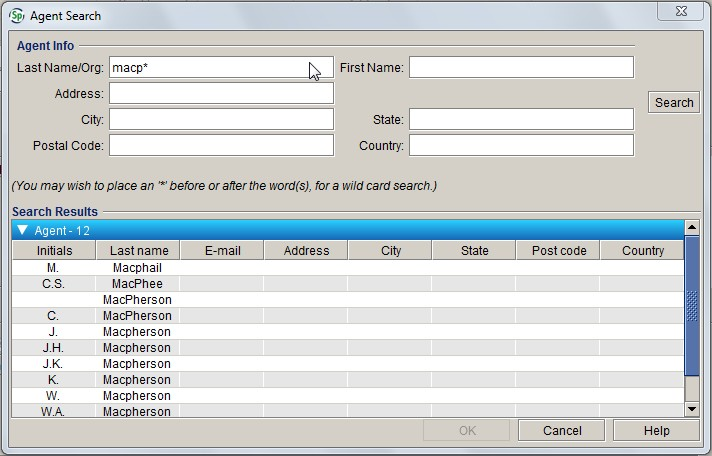

3.  Select a record from the results by clicking on it or scrolling through the list and pressing **Enter**.

    If a match cannot be found, close the search window and click on the **Add** symbol to add a new record.

To edit an existing record:

1.  Select a record from the drop-down list or the search window
2.  Click on the **Edit** symbol to the right of the combo box. The record will open in a new window:

    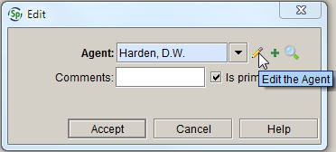

>   #### **Caution!**
>   When editing records, remember that the data changes in each related record that references that record. For example, if the spelling of a name in the **Last name** field is changed in an **Agent** record, the agent&#39;s name will be changed in the **Collectors** field in all **Collection object** records that link to that **Agent** record, and not just in the **Collection object** that is currently open. If the wrong collector was entered, the link to the wrong agent record needs to be deleted and a link to the correct agent needs to be added. |

#### Pick lists

-   A pick list presents a restricted set of values for a field. **The values in a pick list can only be edited by a database administrator.**

    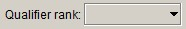

-   Select an entry from the pick list by clicking on it or pressing the down-arrow, scrolling to the appropriate entry, and pressing **Enter** :

    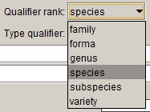

-   Alternatively, enter the first letter of the appropriate pick list entry to select it. If there is more than one value in the pick list that begins with the same letter, press the first letter of the word until the right value is selected.

-   Pick list fields can be cleared by pressing **Esc**.

#### Date fields

Date fields are formatted fields that only allow valid dates to be entered.

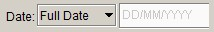

-   Right-clicking inside a date field will allow you to either insert the current date, or clear the field:

    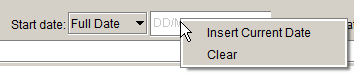

-   Date fields are preceded by a date type pick list, which allows you to choose from a full date, a month and year, or a year only. Use the mouse or press the down-arrow on the keyboard to open the pick list, scroll to the appropriate date type, then press **Enter** to select it:

    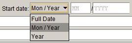

-   If an invalid date is entered, the date field will be highlighted in red, and you won&#39;t be allowed to save the record:

    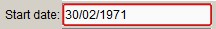

#### Check boxes

Check boxes are used to indicate the presence of an attribute. Click the check box to tick or un-tick the box, or press the space bar when the check box label is in focus. Note that there are three read-only check boxes on the top of the **Collection object** form that are automatically populated.

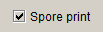

#### Required fields

Fields that are required have a bold label and the text area is shaded blue:

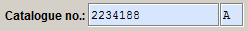

Records cannot be saved until all required fields contain valid data. An **Incomplete** symbol will appear at the bottom of the form if required fields have not been completed.

#### Read-only fields

Read-only fields are used either to display a field in a different form than the one that it is edited in (e.g. the **Geography** field in the **Collecting event** form), or to display data that is automatically filled in (e.g. the **Created by** and **Last edited by** fields).

There is no border around read-only fields:

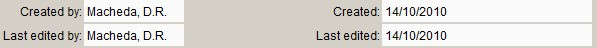

### Form tools

#### Keyboard functions

Specify uses standard keyboard functions for filling out forms via keyboard entry. Keystrokes for the form controls are described in the

**Form controls** section. The following keyboard functions apply to data entry and editing in forms:

- **Ctrl+W**  **will open a record in edit mode**
- **Tab** moves the focus to the next field
- **the spacebar** activates a button or ticks a check box
- **the down-arrow** key opens a query combo box or a pick list and moves focus to the next item in the list
- **Esc** closes a query combo box or pick list
- **Enter** selects a highlighted item within a list
- **Ctrl+S** will save a record or a query
- **Ctrl+C** will copy data within a field
- **Ctrl+P** will paste data into a field
- **Ctrl+X**  **will cut data from a field.**

**The following keyboard shortcuts can be used to navigate between different records in**  **Data**  **view:**

- **Alt+Up**  **will take you to the first record in the set**
- **Alt+Right**  **will take you to the previous record in the set**
- **Alt+Left**  **will take you to the next record in the set**
- **Alt+Down**  **will take you to the last record in the set.**

You can also use keyboard shortcuts to close tabs in the workspace:

- **Ctrl+W** will close the current tab
- **Ctrl+Shift+W** will close all tabs.

#### Carry forward

Specify allows you to carry forward data from certain fields into new **Collection object** , **Taxon** or **Agent** records during data entry. **Carry forward** needs to be configured before it can be selected from the **Data** menu.

To configure **Carry forward** :

1.  Click on the **Data** menu in the menu bar (or right-click the mouse within the form)
2.  Select **Configure carry forward**

    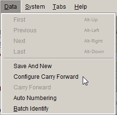

3.  Choose which fields you want to carry forward to the next record
4.  Click **OK**.

    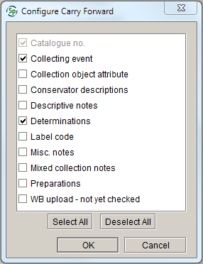

**Carry forward** automatically turns on after it has been configured. When configuring **Carry forward** , bear in mind that, if **Carry forward** is enabled for **Determinations** , _all_ determinations from the previous record will be carried forward, not just the current determination.

The list of items in the **Configure carry forward** list cannot be changed. It includes fields that you would never want to share between different records, such as **Catalogue number** and **Mixed collection notes**.

To turn **Carry forward** on:

1.  Click on the **Data** menu in the menu bar (or right-click the mouse within the form)
2.  Select **Carry forward**. A tick will appear next to **Carry forward** in the menu.

	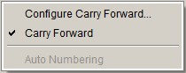

To turn **Carry forward** off:

1.  Click on the **Data** menu in the menu bar (or right-click the mouse within the form)
2.  Select **Carry forward**. The tick next to **Carry forward** will disappear.

    

**Carry forward** (or **Configure carry forward** ) can only be selected from the **Data** menu when a form is being entered or edited in the **Data** module.

>#### **Caution!**
>When carrying forward locality data from one record to another, remember that if a **Locality** record is shared between two or more records, then subsequently edited, the locality will be changed in _all_ **Collection object** records that share that locality, not just in the **Collection object** that is open when the **Locality** record is edited. You should only carry forward locality data if ALL of the details in the **Locality** form (and the associated **Locality details** and **Geocoordinate details** ) are EXACTLY the same for the different collecting events, such as is the case for multisheet collections.

[prev](specify-set-up.html)